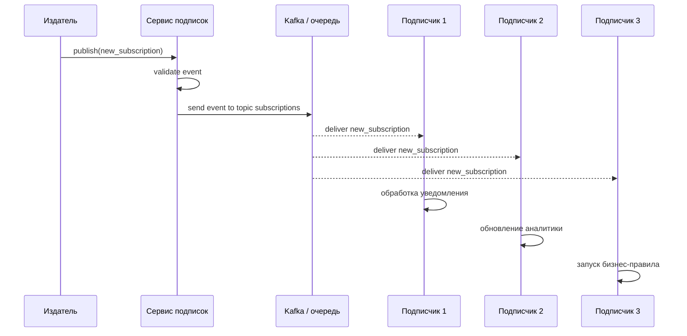
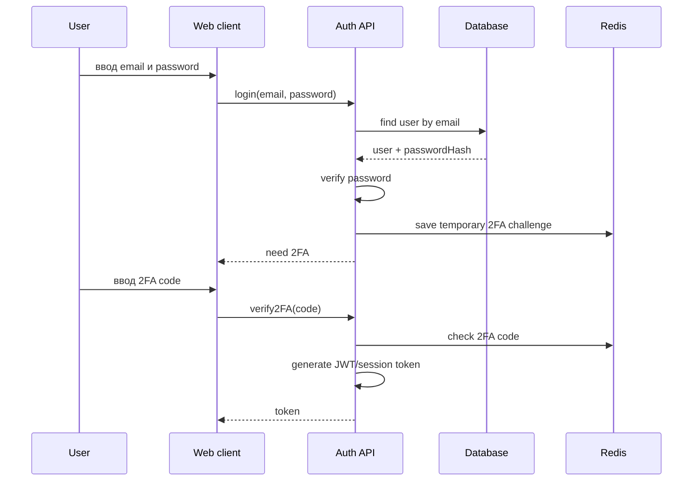
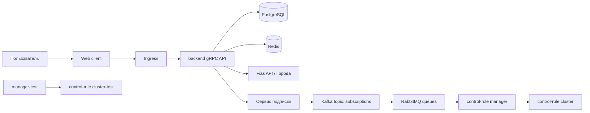

# Основы WEB-инжиниринга — ответы на экзаменационные билеты

Материал подготовлен по roadmap/карте знаний и PDF с экзаменационными билетами. Формат сделан под GitHub: можно загрузить этот файл как `README.md` и учить билеты прямо из репозитория.

---

## Общая картина архитектуры из roadmap

В курсе рассматривается WEB-приложение на базе CRM-кластера с паттерном **Publisher/Subscriber**, то есть «издатель — подписчики».

Главные части системы:

- **Web client**: HTML, CSS, JavaScript/TypeScript, компонентная модель, Input/Output.
- **Связь клиента и сервера**: через gRPC, на клиенте используется обёртка над gRPC.
- **Backend gRPC API**: принимает запросы клиента, реализует CRUD, вызывает бизнес-логику и слой доступа к данным.
- **База данных**: основная — PostgreSQL; также рассматриваются SQLite и SQL Server.
- **Repository**: паттерн, который скрывает конкретную СУБД за интерфейсом.
- **Redis**: кэш, сессии, быстрые временные данные, иногда pub/sub.
- **Fias API / Города**: внешний справочник адресов и городов.
- **Assessment**: бизнес-модуль, где участвуют User и Payment.
- **Logic / Save-1**: слой бизнес-логики и операция сохранения.
- **Log / Audit**: техническое логирование и аудит важных бизнес-операций.
- **Безопасность**: идентификация, аутентификация, авторизация, ACL, REBAC, ABAC.
- **Инфраструктура**: crm-cluster, Kafka, RabbitMQ, очереди, сервис подписок, control-rule cluster/manager.
- **Разработка и деплой**: Git, ветки, commit, PR/MR, review, merge, semver, Kubernetes.

---

## Билет №1. Функциональные требования, Издатель, Подписчики

### Теоретический вопрос 1

**Функциональные требования (ФТ)** — это описание того, что система должна делать для пользователя или внешнего сервиса. В WEB-приложении подписок ФТ описывают действия, связанные с созданием подписок, публикацией событий, доставкой уведомлений, просмотром статусов и обработкой ошибок.

Для роли **«Издатель»** ключевые ФТ такие:

- создавать событие, например `new_subscription`;
- передавать данные события: id подписки, id пользователя, тип подписчика, дату создания;
- публиковать событие в сервис подписок или брокер сообщений;
- получать подтверждение, что событие принято системой;
- логировать факт публикации;
- не знать напрямую всех получателей события.

В архитектуре **pub/sub** издатель не отправляет сообщение каждому подписчику вручную. Он публикует событие в общий канал, topic или exchange. Дальше система доставки сама передаёт событие подписчикам, которые на него подписаны.

### Теоретический вопрос 2

**Подписчик 1, Подписчик 2 и Подписчик 3** — это разные потребители событий. Они могут получать одно и то же событие, но использовать его по-разному.

Пример различий:

| Роль | Что получает | Для чего использует |
|---|---|---|
| Подписчик 1 | событие о новой подписке | отправляет email-уведомление пользователю |
| Подписчик 2 | данные подписки и пользователя | обновляет статистику или аналитику |
| Подписчик 3 | событие и параметры подписки | запускает бизнес-правило или начисление платежа |

То есть отличие не обязательно в техническом формате события, а в назначении обработки. Один подписчик может отвечать за уведомления, второй — за аналитику, третий — за платежи или контрольные правила.

### Практический вопрос

Текстовый sequence-сценарий:



Алгоритм словами:

1. Издатель создаёт событие `new_subscription`.
2. Сервис подписок проверяет корректность события.
3. Сервис публикует событие в Kafka/topic или очередь.
4. Каждый подписчик получает событие независимо.
5. Подписчики выполняют свою бизнес-логику.
6. Ошибки обработки логируются, при необходимости сообщение попадает в retry/dead-letter очередь.

---

## Билет №2. Subscriptions, Kafka, RabbitMQ, SQL-схема

### Теоретический вопрос 1

**Subscriptions** — это сущность подписки в CRM-системе. Она показывает, какой пользователь на что подписан, в каком статусе находится подписка и какой тип подписчика используется.

Модель подписки обычно содержит:

- `id` — уникальный идентификатор подписки;
- `user_id` — связь с пользователем `User`;
- `subscriber_type` — тип подписчика: 1, 2 или 3;
- `status` — статус: active, cancelled, pending, expired;
- `created_at` — дата создания;
- `updated_at` — дата изменения;
- `cancelled_at` — дата отмены, если подписка отменена;
- `source` — источник подписки, например web, admin, api;
- связи с платежами, событиями, аудитом.

Главная связь: один `User` может иметь много `Subscriptions`.

### Теоретический вопрос 2

**Сервис подписок** отвечает за создание, изменение и отмену подписок. При важных изменениях он публикует события в брокер сообщений.

**Kafka** и **RabbitMQ** нужны для асинхронной обработки сообщений.

| Критерий | Kafka | RabbitMQ |
|---|---|---|
| Основная идея | распределённый лог событий | брокер очередей сообщений |
| Лучше подходит для | потоков событий, аналитики, event streaming | задач, команд, очередей обработки |
| Хранение сообщений | хранит события определённое время | обычно сообщение исчезает после обработки |
| Модель | topic + consumer groups | exchange + queue + routing |
| Пример в CRM | поток событий подписок | очередь задач для control-rule manager |

В crm-cluster Kafka удобно использовать как шину событий: «подписка создана», «платёж создан», «статус изменён». RabbitMQ удобно использовать для задач, которые нужно гарантированно выполнить конкретными обработчиками.

### Практический вопрос

DDL PostgreSQL:

```sql
CREATE TABLE users (
    id UUID PRIMARY KEY,
    email VARCHAR(255) NOT NULL UNIQUE
);

CREATE TABLE subscriptions (
    id UUID PRIMARY KEY DEFAULT gen_random_uuid(),
    user_id UUID NOT NULL,
    subscriber_type SMALLINT NOT NULL,
    status VARCHAR(30) NOT NULL DEFAULT 'pending',
    created_at TIMESTAMP NOT NULL DEFAULT CURRENT_TIMESTAMP,
    updated_at TIMESTAMP NOT NULL DEFAULT CURRENT_TIMESTAMP,

    CONSTRAINT fk_subscriptions_user
        FOREIGN KEY (user_id)
        REFERENCES users(id)
        ON DELETE CASCADE,

    CONSTRAINT chk_subscriber_type
        CHECK (subscriber_type IN (1, 2, 3)),

    CONSTRAINT chk_subscription_status
        CHECK (status IN ('pending', 'active', 'cancelled', 'expired'))
);

CREATE INDEX idx_subscriptions_user_id ON subscriptions(user_id);
CREATE INDEX idx_subscriptions_status ON subscriptions(status);
```

---

## Билет №3. Web client, HTML, CSS

### Теоретический вопрос 1

**Web client** — это клиентская часть многослойного WEB-приложения, с которой взаимодействует пользователь через браузер.

По roadmap клиентская часть включает:

- **HTML** — структура страницы;
- **CSS** — оформление и расположение элементов;
- **JavaScript/TypeScript** — логика интерфейса;
- **компоненты** — независимые части UI;
- **Input/Output** — передача данных между компонентами;
- **gRPC wrapper** — клиентская обёртка для обращения к backend API;
- обработку состояний: загрузка, ошибка, успешный ответ.

Типичная структура Web client:

```text
Web client
├── pages
│   └── SubscriptionPage
├── components
│   ├── SubscriptionForm
│   └── SubscriptionCard
├── services
│   └── UserGrpcClient / SubscriptionGrpcClient
├── models
│   └── DTO / interfaces
└── styles
    └── CSS files
```

### Теоретический вопрос 2

**HTML** отвечает за смысловую структуру страницы. Он описывает, какие элементы есть на странице: форма, поле email, select, кнопка.

**CSS** отвечает за внешний вид: цвет, размер, отступы, центрирование, шрифты, состояние кнопки при наведении.

Пример:

- HTML: «здесь находится форма регистрации подписчика»;
- CSS: «форма должна быть по центру, с белым фоном, тенью и синей кнопкой».

Разделение важно, потому что структура и оформление должны быть независимыми.

### Практический вопрос

```html
<!DOCTYPE html>
<html lang="ru">
<head>
    <meta charset="UTF-8" />
    <title>Форма подписки</title>
    <link rel="stylesheet" href="style.css" />
</head>
<body>
    <main class="page">
        <form class="subscription-form">
            <h1>Оформить подписку</h1>

            <label for="email">Email</label>
            <input
                id="email"
                name="email"
                type="email"
                placeholder="user@example.com"
                required
            />

            <label for="subscriberType">Тип подписчика</label>
            <select id="subscriberType" name="subscriberType" required>
                <option value="1">Подписчик 1</option>
                <option value="2">Подписчик 2</option>
                <option value="3">Подписчик 3</option>
            </select>

            <button type="submit">Подписаться</button>
        </form>
    </main>
</body>
</html>
```

```css
* {
    box-sizing: border-box;
}

body {
    margin: 0;
    font-family: Arial, sans-serif;
    background: #f3f5f7;
}

.page {
    min-height: 100vh;
    display: flex;
    justify-content: center;
    align-items: center;
}

.subscription-form {
    width: 360px;
    padding: 24px;
    background: #ffffff;
    border-radius: 12px;
    box-shadow: 0 8px 24px rgba(0, 0, 0, 0.12);
}

.subscription-form h1 {
    margin-top: 0;
    font-size: 24px;
}

.subscription-form label {
    display: block;
    margin-top: 16px;
    margin-bottom: 6px;
}

.subscription-form input,
.subscription-form select {
    width: 100%;
    padding: 10px;
    border: 1px solid #c8c8c8;
    border-radius: 8px;
}

.subscription-form button {
    width: 100%;
    margin-top: 20px;
    padding: 12px;
    border: none;
    border-radius: 8px;
    background: #2563eb;
    color: white;
    font-weight: bold;
    cursor: pointer;
}

.subscription-form button:hover {
    background: #1d4ed8;
}
```

---

## Билет №4. Async, Event Loop, Promise

### Теоретический вопрос 1

**Асинхронное программирование** в JavaScript/TypeScript — это способ выполнять длительные операции без блокировки интерфейса. Например, запрос к backend gRPC API может занять время. Если выполнять его синхронно, страница «замрёт». Асинхронность позволяет отправить запрос, продолжить работу интерфейса, а результат обработать позже.

В Web client async нужен для:

- запросов к backend API;
- загрузки списка подписок;
- отправки формы;
- обработки ошибок сети;
- отображения состояния loading/error/success.

### Теоретический вопрос 2

**Event Loop** — механизм JavaScript, который управляет выполнением синхронного кода и асинхронных задач.

Упрощённо:

1. Синхронный код выполняется в Call Stack.
2. Асинхронные операции передаются во внешнюю среду: браузер или Node.js.
3. После завершения результат попадает в очередь задач.
4. Event Loop проверяет, свободен ли Call Stack.
5. Если свободен, callback или продолжение Promise выполняется.

**Promise** — объект, который представляет результат асинхронной операции. У него есть состояния:

- `pending` — ожидание;
- `fulfilled` — успешно выполнено;
- `rejected` — ошибка.

`async/await` — более читаемый синтаксис над Promise. Он позволяет писать асинхронный код почти как обычный последовательный код.

```ts
// Promise chain
api.getUser(id)
  .then(user => console.log(user))
  .catch(error => console.error(error));

// async/await
try {
  const user = await api.getUser(id);
  console.log(user);
} catch (error) {
  console.error(error);
}
```

### Практический вопрос

```ts
interface Subscription {
    id: string;
    userId: string;
    subscriberType: 1 | 2 | 3;
    status: 'pending' | 'active' | 'cancelled' | 'expired';
    createdAt: string;
}

async function fetchSubscriptions(userId: string): Promise<Subscription[]> {
    try {
        const response = await fetch(`/api/grpc/subscriptions?userId=${userId}`);

        if (!response.ok) {
            throw new Error(`Ошибка backend: ${response.status}`);
        }

        const data = await response.json();
        return data.subscriptions as Subscription[];
    } catch (error) {
        console.error('Не удалось загрузить подписки', error);
        throw new Error('Ошибка сети или backend API');
    }
}
```

Если используется настоящая gRPC-обёртка, вместо `fetch` будет вызов метода клиента, например `subscriptionGrpcClient.getByUserId(userId)`.

---

## Билет №5. Component, Input/Output

### Теоретический вопрос 1

**Component** — это независимая часть пользовательского интерфейса, которая объединяет:

- шаблон HTML;
- стили CSS;
- логику TypeScript/JavaScript;
- входные данные;
- события наружу.

Примеры компонентов:

- `SubscriptionForm` — форма создания подписки;
- `SubscriptionCard` — карточка одной подписки;
- `UserProfile` — профиль пользователя;
- `NotificationList` — список уведомлений.

Преимущества компонентного подхода:

- код проще читать;
- компоненты можно переиспользовать;
- легче тестировать отдельные части;
- проще делить работу между разработчиками;
- UI становится более структурированным.

### Теоретический вопрос 2

**Input/Output** — паттерн взаимодействия родительского и дочернего компонентов.

- **Input** — данные, которые родитель передаёт дочернему компоненту.
- **Output** — событие, которое дочерний компонент отправляет родителю.

Пример для `SubscriptionCard`:

- родитель передаёт в карточку объект подписки через `Input`;
- карточка показывает статус и тип подписки;
- если пользователь нажал «Отменить», карточка отправляет событие `cancel` через `Output`.

```text
ParentComponent
 ├── передаёт subscription -> SubscriptionCard
 └── слушает событие cancel <- SubscriptionCard
```

### Практический вопрос

Angular-подобный пример:

```ts
import { Component, EventEmitter, Input, Output } from '@angular/core';

interface SubscriptionFormData {
    userId: string;
    email: string;
    subscriberType: 1 | 2 | 3;
}

@Component({
    selector: 'app-subscription-form',
    template: `
        <form (submit)="submit($event)">
            <input
                type="email"
                placeholder="Email"
                [(ngModel)]="email"
                name="email"
                required
            />

            <select [(ngModel)]="subscriberType" name="subscriberType">
                <option [value]="1">Подписчик 1</option>
                <option [value]="2">Подписчик 2</option>
                <option [value]="3">Подписчик 3</option>
            </select>

            <button type="submit">Подписаться</button>
        </form>
    `
})
export class SubscriptionFormComponent {
    @Input() userId!: string;
    @Output() onSubmit = new EventEmitter<SubscriptionFormData>();

    email = '';
    subscriberType: 1 | 2 | 3 = 1;

    submit(event: Event): void {
        event.preventDefault();

        this.onSubmit.emit({
            userId: this.userId,
            email: this.email,
            subscriberType: this.subscriberType
        });
    }
}
```

---

## Билет №6. UI/UX и accessibility

### Теоретический вопрос 1

**UI** — это визуальная часть интерфейса: кнопки, формы, цвета, карточки, таблицы.

**UX** — это пользовательский опыт: насколько удобно, понятно и быстро пользователь достигает цели.

Основные принципы UI/UX для WEB-приложений:

- понятная навигация;
- единый стиль элементов;
- минимальное количество лишних действий;
- читаемые тексты и подписи;
- видимая обратная связь после действий;
- корректные сообщения об ошибках;
- адаптивность под разные экраны;
- доступность для пользователей с ограничениями.

Для интерфейса подписчика это означает:

- активные подписки должны быть видны сразу;
- кнопка отмены должна быть понятной, но не случайной;
- ошибки оплаты или подписки должны объясняться простым текстом;
- статус подписки должен быть заметным.

### Теоретический вопрос 2

**Accessibility** — это доступность интерфейса для разных пользователей, включая тех, кто использует клавиатуру, экранные дикторы или имеет ограничения зрения.

Для WEB-форм следует использовать:

- `label` для каждого поля;
- связку `label for="id"` и `input id="id"`;
- правильные типы полей: `email`, `password`, `text`;
- `required`, `aria-required`, если поле обязательно;
- `aria-invalid`, если поле заполнено неверно;
- понятные сообщения об ошибках;
- достаточный контраст текста и фона;
- возможность пройти форму клавишей Tab;
- не использовать только цвет для передачи смысла.

Пример:

```html
<label for="email">Email</label>
<input id="email" type="email" required aria-describedby="emailHelp" />
<small id="emailHelp">Введите email для получения уведомлений.</small>
```

### Практический вопрос

Wireframe личного кабинета подписчика:

```text
+------------------------------------------------------+
| Header                                               |
| Логотип                     Профиль | Выйти           |
+------------------------------------------------------+
| Sidebar              | Main content                  |
| - Мои подписки       |                              |
| - Платежи            | Личный кабинет подписчика    |
| - Настройки          |                              |
|                      | +--------------------------+ |
|                      | | Активные подписки        | |
|                      | |                          | |
|                      | | [Подписка #1] active     | |
|                      | | Тип: 1                   | |
|                      | | [Отменить]               | |
|                      | |                          | |
|                      | | [Подписка #2] active     | |
|                      | | Тип: 2                   | |
|                      | | [Отменить]               | |
|                      | +--------------------------+ |
|                      |                              |
|                      | +--------------------------+ |
|                      | | Уведомления              | |
|                      | | - Подписка создана       | |
|                      | | - Платёж успешно принят  | |
|                      | +--------------------------+ |
+------------------------------------------------------+
```

Логика расположения: слева навигация, сверху общая шапка, в центре основные подписки, справа или ниже — уведомления.

---

## Билет №7. gRPC, REST, Protocol Buffers

### Теоретический вопрос 1

**REST** — архитектурный стиль, чаще всего использующий HTTP и JSON. Ресурсы доступны через URL, например `/users/1`, а операции выражаются HTTP-методами: GET, POST, PUT, DELETE.

**gRPC** — RPC-фреймворк, где клиент вызывает методы сервиса почти как обычные функции. Обычно использует HTTP/2 и Protocol Buffers.

| Критерий | REST | gRPC |
|---|---|---|
| Стиль | работа с ресурсами | вызов методов сервиса |
| Протокол | обычно HTTP/1.1 или HTTP/2 | HTTP/2 |
| Формат | чаще JSON | Protocol Buffers |
| Типизация | слабее, через документацию/OpenAPI | строгий контракт `.proto` |
| Производительность | хорошая, но JSON тяжелее | высокая, бинарный формат |
| Streaming | не основной сценарий | поддерживается встроенно |

Для backend CRM выбран gRPC, потому что он даёт строгий контракт, хорошую производительность и удобен для взаимодействия сервисов внутри кластера.

### Теоретический вопрос 2

**Protocol Buffers** — это формат описания сообщений и сервисов. В `.proto`-файле задаются структуры данных и методы gRPC-сервиса. По этому файлу можно сгенерировать клиентский и серверный код.

gRPC поддерживает 4 типа вызовов:

1. **Unary** — один запрос, один ответ.
2. **Server streaming** — один запрос, поток ответов от сервера.
3. **Client streaming** — поток запросов от клиента, один ответ сервера.
4. **Bidirectional streaming** — поток запросов и поток ответов одновременно.

### Практический вопрос

`user.proto`:

```proto
syntax = "proto3";

package crm.user;

service UserService {
  rpc GetUser (UserRequest) returns (UserResponse);
  rpc CreateUser (CreateUserRequest) returns (UserResponse);
}

message UserRequest {
  string id = 1;
}

message CreateUserRequest {
  string email = 1;
  string first_name = 2;
  string last_name = 3;
}

message UserResponse {
  string id = 1;
  string email = 2;
  string first_name = 3;
  string last_name = 4;
  string created_at = 5;
}
```

---

## Билет №8. Обёртка над gRPC, слои backend API

### Теоретический вопрос 1

**Обёртка над gRPC** на стороне Web client нужна, чтобы UI-компоненты не работали напрямую с низкоуровневыми деталями gRPC.

Она решает задачи:

- скрывает детали создания gRPC-клиента;
- приводит ответы backend к удобным DTO;
- централизованно обрабатывает ошибки;
- добавляет авторизационные заголовки/token;
- преобразует даты, статусы и enum;
- делает код компонентов проще;
- повышает типобезопасность.

Без обёртки каждый компонент сам бы знал, как вызвать gRPC, как обработать ошибку, как распарсить ответ. Это приводит к дублированию и хаосу.

### Теоретический вопрос 2

Слои backend gRPC API:

1. **Transport layer** — слой gRPC. Принимает запросы, преобразует protobuf-сообщения, возвращает gRPC-ответы.
2. **Service layer** — слой бизнес-операций. Здесь проверяются правила: можно ли создать пользователя, валиден ли email, какие права у пользователя.
3. **Repository layer** — слой доступа к данным. Он сохраняет и читает данные из PostgreSQL или другой СУБД.

Организация вызова:

```text
Web client
  -> gRPC wrapper
    -> backend gRPC transport
      -> service
        -> repository
          -> database
```

Ответ идёт обратно по той же цепочке.

### Практический вопрос

```ts
interface UserDto {
    id: string;
    email: string;
    firstName: string;
    lastName: string;
}

class UserGrpcClient {
    constructor(private readonly grpcClient: any) {}

    async getUser(id: string): Promise<UserDto> {
        try {
            const response = await this.grpcClient.getUser({ id });

            return {
                id: response.id,
                email: response.email,
                firstName: response.first_name,
                lastName: response.last_name
            };
        } catch (error) {
            console.error('gRPC GetUser failed', error);
            throw new Error('Не удалось получить пользователя');
        }
    }
}
```

Ключевые шаги:

1. Метод принимает `id`.
2. Формирует gRPC request.
3. Вызывает `GetUser` на backend.
4. Полученный protobuf-response преобразует в `UserDto`.
5. Ошибки обрабатывает централизованно.

---

## Билет №9. CRUD через backend gRPC API

### Теоретический вопрос 1

**CRUD** — базовые операции с сущностью:

- **Create** — создать;
- **Read** — прочитать;
- **Update** — обновить;
- **Delete** — удалить.

Для сущности `User` в backend gRPC API можно сделать методы:

```proto
service UserService {
  rpc CreateUser(CreateUserRequest) returns (UserResponse);
  rpc GetUser(GetUserRequest) returns (UserResponse);
  rpc UpdateUser(UpdateUserRequest) returns (UserResponse);
  rpc DeleteUser(DeleteUserRequest) returns (DeleteUserResponse);
}
```

Логика:

- `CreateUser` валидирует данные и сохраняет пользователя;
- `GetUser` ищет пользователя по id;
- `UpdateUser` проверяет существование и обновляет поля;
- `DeleteUser` удаляет пользователя или помечает как удалённого.

### Теоретический вопрос 2

Прямой доступ Web client к PostgreSQL недопустим.

Причины:

- нельзя отдавать клиенту логин и пароль от БД;
- пользователь может обойти бизнес-логику;
- невозможно нормально проверить права доступа;
- открывается риск SQL-инъекций и утечки данных;
- клиент становится жёстко связан со схемой БД;
- нельзя централизованно логировать и аудитить операции.

Правильный подход:

```text
Web client -> gRPC API -> Service -> Repository -> PostgreSQL
```

Так backend контролирует валидацию, авторизацию, транзакции, аудит и формат ответа.

### Практический вопрос

Псевдокод `CreateUser`:

```ts
interface CreateUserRequest {
    email: string;
    firstName: string;
    lastName: string;
}

interface UserDto {
    id: string;
    email: string;
    firstName: string;
    lastName: string;
    createdAt: string;
}

async function createUser(request: CreateUserRequest): Promise<UserDto> {
    if (!request.email || !request.email.includes('@')) {
        throw new Error('Некорректный email');
    }

    const existingUser = await userRepository.findByEmail(request.email);
    if (existingUser) {
        throw new Error('Пользователь уже существует');
    }

    const user = {
        id: crypto.randomUUID(),
        email: request.email,
        firstName: request.firstName,
        lastName: request.lastName,
        createdAt: new Date()
    };

    const savedUser = await userRepository.save(user);

    await auditService.write({
        action: 'CREATE_USER',
        entityType: 'User',
        entityId: savedUser.id,
        newValue: savedUser
    });

    return {
        id: savedUser.id,
        email: savedUser.email,
        firstName: savedUser.firstName,
        lastName: savedUser.lastName,
        createdAt: savedUser.createdAt.toISOString()
    };
}
```

---

## Билет №10. DTO, Entity, User и Person

### Теоретический вопрос 1

**DTO (Data Transfer Object)** — объект для передачи данных между слоями или сервисами. DTO содержит только те поля, которые нужно передать наружу или получить снаружи.

**Entity** — доменная сущность, которая отражает внутреннюю бизнес-модель. Она может содержать методы, внутренние поля, связи и правила.

Почему DTO отделяют от Entity:

- чтобы не отдавать лишние внутренние поля клиенту;
- чтобы скрыть структуру БД;
- чтобы не связывать API с доменной моделью;
- чтобы безопасно контролировать формат ответа;
- чтобы легче менять внутреннюю реализацию.

Например, Entity `User` может хранить `passwordHash`, но в `UserDto` этого поля быть не должно.

### Теоретический вопрос 2

`Person` и `User` — похожие, но разные сущности.

**Person** — физическое лицо, данные о человеке:

- имя;
- фамилия;
- дата рождения;
- адрес;
- телефон.

**User** — учётная запись в системе:

- email/login;
- passwordHash;
- role;
- status;
- связь с Person.

Пример: человек Иван Иванов — это `Person`. Его аккаунт для входа в CRM — это `User`. Один `Person` может быть связан с одним или несколькими аккаунтами, в зависимости от модели.

### Практический вопрос

```ts
interface PersonDto {
    id: string;
    firstName: string;
    lastName: string;
    birthDate?: string;
}

interface UserDto {
    id: string;
    email: string;
    role: 'admin' | 'subscriber';
    status: 'active' | 'blocked';
    person: PersonDto;
}

interface Person {
    id: string;
    firstName: string;
    lastName: string;
    birthDate?: Date;
}

interface User {
    id: string;
    email: string;
    passwordHash: string;
    role: 'admin' | 'subscriber';
    status: 'active' | 'blocked';
    person: Person;
}

function mapEntityToDto(user: User): UserDto {
    return {
        id: user.id,
        email: user.email,
        role: user.role,
        status: user.status,
        person: {
            id: user.person.id,
            firstName: user.person.firstName,
            lastName: user.person.lastName,
            birthDate: user.person.birthDate?.toISOString()
        }
    };
}
```

Важно: `passwordHash` не попадает в DTO.

---

## Билет №11. Repository, интерфейс, source

### Теоретический вопрос 1

**Repository** — паттерн проектирования, который отделяет бизнес-логику от конкретного способа хранения данных.

Сервис не должен знать, как именно выполняется SQL-запрос. Он работает с интерфейсом:

```text
UserService -> IUserRepository -> PostgresUserRepository -> PostgreSQL
```

**Интерфейс репозитория** задаёт контракт: какие методы доступны. Например:

- `findById(id)`;
- `save(user)`;
- `delete(id)`.

**Source** — источник данных: PostgreSQL, SQLite, SQL Server, внешний API, файл. Реализация репозитория зависит от source, но сервисный слой об этом не знает.

### Теоретический вопрос 2

Repository обеспечивает абстракцию так:

```text
IUserRepository
├── PostgresUserRepository
├── SQLiteUserRepository
└── SqlServerUserRepository
```

Сервис вызывает методы интерфейса. Если нужно заменить PostgreSQL на SQLite для тестов, меняется только реализация репозитория, а бизнес-логика остаётся прежней.

Преимущества:

- меньше связность кода;
- проще тестировать;
- можно менять СУБД;
- SQL изолирован в одном слое;
- бизнес-логика становится чище.

### Практический вопрос

```ts
interface User {
    id: string;
    email: string;
    firstName: string;
    lastName: string;
}

interface IUserRepository {
    findById(id: string): Promise<User | null>;
    save(user: User): Promise<User>;
    delete(id: string): Promise<void>;
}

class PostgresUserRepository implements IUserRepository {
    constructor(private readonly db: any) {}

    async findById(id: string): Promise<User | null> {
        // SELECT id, email, first_name, last_name FROM users WHERE id = $1
        return null;
    }

    async save(user: User): Promise<User> {
        // INSERT INTO users (...) VALUES (...)
        // или UPDATE users SET ... WHERE id = $1
        return user;
    }

    async delete(id: string): Promise<void> {
        // DELETE FROM users WHERE id = $1
    }
}
```

---

## Билет №12. PostgreSQL, SQLite, SQL Server, DB

### Теоретический вопрос 1

Сравнение СУБД:

| СУБД | Где использовать | Плюсы | Ограничения |
|---|---|---|---|
| PostgreSQL | production WEB-приложения | мощная, надёжная, расширяемая, хорошо подходит для backend | требует отдельного сервера |
| SQLite | локальная разработка, тесты, маленькие приложения | простой файл, не нужен сервер | плохо подходит для высокой нагрузки |
| SQL Server | корпоративные системы, Microsoft-экосистема | мощная enterprise-СУБД, интеграция с Windows/.NET | тяжелее и сложнее в настройке |

Когда выбирать:

- PostgreSQL — основной выбор для CRM и WEB backend.
- SQLite — для локальных тестов, прототипов, мобильных/встроенных решений.
- SQL Server — если инфраструктура компании построена на Microsoft-технологиях.

### Теоретический вопрос 2

Узел **DB** на карте знаний означает слой баз данных или источников данных. В системе может быть несколько СУБД, но бизнес-логика не должна зависеть от конкретной.

Унификация делается через слой доступа к данным:

```text
Service / Logic
   -> Repository Interface
      -> Postgres Repository
      -> SQLite Repository
      -> SQL Server Repository
```

Так приложение работает с единым контрактом, а конкретная реализация выбирается конфигурацией.

### Практический вопрос

SQL-запрос PostgreSQL:

```sql
SELECT
    u.id AS user_id,
    u.email,
    p.amount AS payment_amount,
    p.payment_date
FROM users u
JOIN payments p ON p.user_id = u.id
ORDER BY p.payment_date DESC;
```

Если нужно вывести пользователей даже без платежей:

```sql
SELECT
    u.id AS user_id,
    u.email,
    p.amount AS payment_amount,
    p.payment_date
FROM users u
LEFT JOIN payments p ON p.user_id = u.id
ORDER BY p.payment_date DESC;
```

---

## Билет №13. Redis, кэш, сессии, pub/sub, Fias cache

### Теоретический вопрос 1

**Redis** — это быстрое in-memory хранилище ключ-значение. Данные в основном находятся в оперативной памяти, поэтому доступ к ним очень быстрый.

Задачи Redis в WEB-приложении:

- **кэш** часто запрашиваемых данных;
- **сессии** пользователей;
- **rate limiting** — ограничение частоты запросов;
- **pub/sub** — простая публикация и подписка на сообщения;
- временные токены, например код 2FA;
- блокировки и счётчики.

### Теоретический вопрос 2

В crm-cluster Redis может использоваться как быстрый общий сервис для backend-компонентов.

Конфигурация **4G** в контексте карты знаний, вероятнее всего, означает выделенный объём памяти около 4 GB под Redis. Это ограничивает, какие данные стоит туда класть.

Целесообразно кэшировать:

- справочник городов;
- результаты Fias API;
- сессии пользователей;
- временные токены;
- часто читаемые настройки;
- данные, которые можно восстановить из основной БД.

Не стоит хранить в Redis как единственном источнике:

- критически важные платежи;
- аудит;
- единственные копии пользовательских данных.

### Практический вопрос

Стратегия кэширования справочника «Города» через Fias API.

Ключ кэша:

```text
city:{cityId}
```

Пример:

```text
city:7700000000000
```

TTL:

```text
24 часа или 7 дней
```

Алгоритм **cache-aside**:

```ts
async function getCityById(cityId: string): Promise<CityDto> {
    const cacheKey = `city:${cityId}`;

    const cachedCity = await redis.get(cacheKey);
    if (cachedCity) {
        return JSON.parse(cachedCity);
    }

    const city = await fiasApi.getCityById(cityId);

    await redis.set(
        cacheKey,
        JSON.stringify(city),
        'EX',
        60 * 60 * 24
    );

    return city;
}
```

Смысл: сначала смотрим Redis, если данных нет — идём во внешний Fias API, затем сохраняем результат в Redis.

---

## Билет №14. Fias API и справочник городов

### Теоретический вопрос 1

**Fias API** — это API для работы с адресной информацией ФИАС. В CRM-приложении он нужен для нормализации и проверки адресов.

Задачи интеграции с ФИАС:

- проверка существования города;
- получение уникального идентификатора города;
- нормализация адреса;
- автодополнение при вводе адреса;
- уменьшение ошибок в адресных данных;
- связь локальной записи пользователя с официальным справочником.

### Теоретический вопрос 2

Справочник «Города» можно организовать двумя способами:

1. **Полностью внешний справочник**: каждый раз обращаться к Fias API.
2. **Локальная таблица + внешний API**: часто используемые города сохраняются в БД, а Fias API используется для проверки и обновления.

Лучший вариант для CRM:

```text
User address -> local cities table -> fias_id -> Fias API
```

Локальная таблица `cities` может содержать:

- `id` — внутренний id;
- `fias_id` — id из ФИАС;
- `name` — название города;
- `region` — регион;
- `created_at`, `updated_at`.

Если города нет в локальной БД, приложение запрашивает Fias API, получает данные и сохраняет их локально.

### Практический вопрос

Алгоритм нормализации адреса:

```text
Ввод: "Москва, ул. Ленина, 1"
```

Шаги:

1. Пользователь вводит адрес в форму.
2. Frontend отправляет адрес на backend.
3. Backend разбирает строку на части: город, улица, дом.
4. Backend отправляет запрос в Fias API по городу и улице.
5. Fias API возвращает нормализованные данные и `fias_id`.
6. Backend проверяет, есть ли город в локальной таблице `cities`.
7. Если города нет — сохраняет его.
8. В таблицу адресов пользователя сохраняются `city_id`, `street`, `house`.
9. Операция логируется или аудитится, если это важно для бизнес-процесса.

Псевдокод:

```ts
async function normalizeAndSaveAddress(userId: string, rawAddress: string) {
    const parsed = parseAddress(rawAddress);
    // parsed = { city: 'Москва', street: 'Ленина', house: '1' }

    const fiasResult = await fiasApi.normalizeAddress({
        city: parsed.city,
        street: parsed.street,
        house: parsed.house
    });

    let city = await cityRepository.findByFiasId(fiasResult.cityFiasId);

    if (!city) {
        city = await cityRepository.save({
            fiasId: fiasResult.cityFiasId,
            name: fiasResult.cityName,
            region: fiasResult.region
        });
    }

    await addressRepository.save({
        userId,
        cityId: city.id,
        street: fiasResult.street,
        house: fiasResult.house
    });
}
```

---

## Билет №15. Assessment, User, Payment, Logic, Save-1

### Теоретический вопрос 1

**Assessment** — бизнес-модуль, связанный с оценкой, начислением или расчётом платежей. В контексте CRM и подписок он может отвечать за расчёт стоимости подписки.

Связь сущностей:

- `User` — пользователь системы;
- `Subscription` — подписка пользователя;
- `Payment` — платёж или начисление по подписке.

Один пользователь может иметь несколько платежей:

```text
User 1 -> many Payments
```

`Payment` может содержать:

- `id`;
- `user_id`;
- `subscription_id`;
- `amount`;
- `status`;
- `payment_date`;
- `created_at`.

### Теоретический вопрос 2

**Logic** — слой бизнес-логики. Он отвечает за правила системы: как рассчитать платёж, можно ли создать подписку, какой коэффициент применить.

**Save-1** — условное название операции сохранения. Она не должна содержать всю бизнес-логику. Правильнее разделять:

```text
Controller/gRPC method
  -> Logic: рассчитать и проверить
  -> Repository/Save-1: сохранить
  -> Audit: записать важное событие
```

Так бизнес-правила отделены от сохранения в БД. Это упрощает тестирование и поддержку.

### Практический вопрос

Формула:

```text
payment = baseRate × months × coefficient
```

Коэффициенты:

| Тип подписчика | Коэффициент |
|---|---|
| 1 | 1.0 |
| 2 | 1.2 |
| 3 | 1.5 |

Псевдокод:

```ts
function calculatePayment(subscriberType: 1 | 2 | 3, months: number): number {
    const baseRate = 1000;

    if (months <= 0) {
        throw new Error('Количество месяцев должно быть больше 0');
    }

    const coefficients = {
        1: 1.0,
        2: 1.2,
        3: 1.5
    } as const;

    const coefficient = coefficients[subscriberType];

    if (!coefficient) {
        throw new Error('Неизвестный тип подписчика');
    }

    return baseRate * months * coefficient;
}
```

Пример: тип 2 на 3 месяца:

```text
1000 × 3 × 1.2 = 3600
```

---

## Билет №16. Log и Audit

### Теоретический вопрос 1

**Log** — техническое логирование. Оно помогает разработчикам и администраторам понимать, что происходит в системе.

В log записывают:

- ошибки backend;
- время выполнения запроса;
- сетевые ошибки;
- ошибки gRPC;
- debug-информацию;
- информацию о запуске сервиса.

**Audit** — аудит бизнес-событий. Он нужен, чтобы понять, кто, когда и что изменил.

В audit записывают:

- создание платежа;
- изменение подписки;
- смену роли пользователя;
- вход в систему;
- удаление важных данных;
- операцию Save-1.

Главное отличие: log нужен для технической диагностики, audit — для контроля действий и безопасности.

### Теоретический вопрос 2

Для audit trail в WEB-приложении с платежами важно фиксировать:

- время операции;
- id пользователя, который выполнил действие;
- действие;
- тип сущности;
- id сущности;
- старое значение;
- новое значение;
- IP-адрес;
- user-agent;
- результат операции: success/fail.

При операции **Save-1** обязательно фиксировать сам факт сохранения, кто его выполнил, какие данные были сохранены, и какой объект изменился.

Аудит должен быть защищён от незаметного изменения. В идеале обычные пользователи и сервисы не должны иметь права редактировать audit-записи.

### Практический вопрос

JSON-формат аудита для создания платежа:

```json
{
  "timestamp": "2026-06-09T12:30:00Z",
  "userId": "8f7c2a10-1111-4222-9333-a3f8e2d55c10",
  "action": "CREATE_PAYMENT",
  "entityType": "Payment",
  "entityId": "pay_123456",
  "oldValue": null,
  "newValue": {
    "id": "pay_123456",
    "userId": "8f7c2a10-1111-4222-9333-a3f8e2d55c10",
    "subscriptionId": "sub_789",
    "amount": 3600,
    "currency": "RUB",
    "status": "created"
  },
  "ipAddress": "192.168.1.10"
}
```

---

## Билет №17. Идентификация, аутентификация, авторизация

### Теоретический вопрос 1

**Идентификация** — пользователь сообщает системе, кто он. Например, вводит email или login.

**Аутентификация** — система проверяет, действительно ли пользователь тот, за кого себя выдаёт. Например, проверяет пароль, 2FA-код или биометрию.

**Авторизация** — система проверяет, что пользователю разрешено делать. Например, может ли он читать платежи или удалять подписки.

Порядок при входе:

```text
1. Идентификация: пользователь ввёл email
2. Аутентификация: пользователь ввёл пароль и 2FA
3. Авторизация: система определила роль и права
```

### Теоретический вопрос 2

Методы аутентификации:

1. **Password** — пароль. Самый базовый способ. На сервере нельзя хранить пароль в открытом виде, хранится только хэш.
2. **2FA** — двухфакторная аутентификация. Кроме пароля нужен второй фактор: код из приложения, SMS, email-код, push.
3. **Биометрия** — лицо, голос, отпечаток и другие признаки.

Для обычного WEB-приложения применимы:

- password;
- 2FA через приложение или email/SMS;
- WebAuthn/Passkeys как современный вариант.

Биометрия вроде ДНК для WEB-приложения практически не используется. Лицо/отпечаток обычно проверяются не самим сайтом, а устройством пользователя через WebAuthn/Passkeys.

### Практический вопрос

Flow входа `email + password + 2FA`:



Шаги:

1. Пользователь вводит email и пароль.
2. Backend ищет пользователя по email.
3. Backend сравнивает пароль с хэшем.
4. Если пароль верный, создаётся временный 2FA challenge.
5. Пользователь вводит 2FA-код.
6. Backend проверяет код.
7. Если всё верно, создаётся JWT или session token.
8. Клиент сохраняет token и использует его в следующих запросах.

---

## Билет №18. ACL, WL/BL, REBAC, ABAC, linux rwx

### Теоретический вопрос 1

**ACL (Access Control List)** — список правил доступа к ресурсу. В ACL указано, кому и какие действия разрешены или запрещены.

Пример для ресурса `subscriptions`:

```text
admin: read, create, update, delete
subscriber: read own, create own, update own, cancel own
anonymous: no access
```

**WL / White List** — белый список. Разрешено только то, что явно указано.

**BL / Black List** — чёрный список. Запрещено то, что явно указано, остальное может быть разрешено.

Для безопасности чаще используют подход white list: по умолчанию всё запрещено, разрешаем только нужное.

### Теоретический вопрос 2

Сравнение моделей авторизации:

| Модель | Суть | Когда использовать |
|---|---|---|
| ACL | права задаются списком для ресурса | простые системы и конкретные ресурсы |
| REBAC | доступ зависит от отношений | соцсети, CRM, владелец/менеджер/клиент |
| ABAC | доступ зависит от атрибутов | сложные корпоративные политики |
| linux rwx | read/write/execute для владельца, группы и остальных | файловые системы, простые права |

**REBAC** пример: пользователь может видеть подписку, если он её владелец или менеджер владельца.

**ABAC** пример: пользователь может редактировать платёж, если `role=admin`, `department=finance`, `time < 18:00`, `payment.status=pending`.

### Практический вопрос

Матрица прав:

| Роль | Ресурс | read | create | update | delete |
|---|---|---:|---:|---:|---:|
| admin | User | разрешено | разрешено | разрешено | разрешено |
| admin | Payment | разрешено | разрешено | разрешено | разрешено |
| admin | Subscription | разрешено | разрешено | разрешено | разрешено |
| subscriber | User | только свой профиль | запрещено | только свой профиль | запрещено |
| subscriber | Payment | только свои платежи | запрещено | запрещено | запрещено |
| subscriber | Subscription | только свои подписки | разрешено для себя | отмена/изменение своей | запрещено физическое удаление |

В виде правил:

```ts
const permissions = {
    admin: {
        User: ['read', 'create', 'update', 'delete'],
        Payment: ['read', 'create', 'update', 'delete'],
        Subscription: ['read', 'create', 'update', 'delete']
    },
    subscriber: {
        User: ['read:own', 'update:own'],
        Payment: ['read:own'],
        Subscription: ['read:own', 'create:own', 'update:own']
    }
};
```

---

## Билет №19. Git workflow, PR/MR, review, merge, semver

### Теоретический вопрос 1

Git-workflow с feature-ветками:

1. Разработчик получает задачу.
2. От основной ветки `main` создаёт отдельную ветку, например `feat_add_subscription`.
3. Делает изменения и commits.
4. Отправляет ветку в удалённый репозиторий.
5. Создаёт Pull Request или Merge Request.
6. Другие разработчики делают code review.
7. После исправлений и одобрения ветка мержится в `main`.

**Frontender** обычно реализует клиентскую часть: компоненты, HTML/CSS, TypeScript, формы, вызовы API.

**Lead** следит за архитектурой, качеством кода, проводит review, принимает решения по merge и релизам.

### Теоретический вопрос 2

**Merge conflict** — конфликт слияния. Он возникает, когда Git не может автоматически объединить изменения, например два разработчика изменили одну и ту же строку.

Как решать:

1. Получить свежие изменения из `main`.
2. Выполнить merge или rebase.
3. Открыть конфликтные файлы.
4. Убрать маркеры конфликта:

```text
<<<<<<< HEAD
мой код
=======
чужой код
>>>>>>> main
```

5. Оставить правильный вариант.
6. Протестировать.
7. Сделать commit с решением конфликта.

**Semver** — семантическое версионирование:

```text
MAJOR.MINOR.PATCH
```

Пример: `1.0.0`.

- `MAJOR` — несовместимые изменения;
- `MINOR` — новая функциональность без поломки старой;
- `PATCH` — исправления багов.

Предрелизные версии:

- `0.0.0-alfa.1` — ранняя нестабильная версия;
- `0.0.0-beta.1` — тестовая версия ближе к релизу;
- `1.0.0` — стабильный релиз.

В документах часто пишут `alfa`, но в индустрии чаще используется написание `alpha`.

### Практический вопрос

Последовательность команд:

```bash
# 1. Перейти в main и обновить его
git checkout main
git pull origin main

# 2. Создать feature-ветку
git checkout -b feat_add_subscription

# 3. Сделать изменения в файлах
# Например:
# code .

# 4. Первый commit
git add .
git commit -m "feat: add subscription model"

# 5. Второй commit
git add .
git commit -m "feat: add subscription form"

# 6. Отправить ветку на сервер
git push -u origin feat_add_subscription

# 7. Создать Pull Request / Merge Request через GitHub/GitLab UI

# 8. После review обновить main
git checkout main
git pull origin main

# 9. Выполнить merge, если делаем локально
git merge feat_add_subscription

# 10. Отправить main
git push origin main

# 11. Создать tag
git tag 0.0.0-alfa.1
git push origin 0.0.0-alfa.1
```

В реальной командной работе merge чаще выполняют кнопкой в GitHub/GitLab после approve.

---

## Билет №20. Kubernetes deploy и crm-cluster

### Теоретический вопрос 1

Деплой WEB-приложения в Kubernetes строится вокруг нескольких ресурсов.

**Deployment** — описывает, какие контейнеры запускать, сколько реплик нужно, какой образ использовать. Если pod упал, Deployment создаст новый.

**Service** — стабильная внутренняя точка доступа к pod-ам. Pod-ы могут пересоздаваться, а Service остаётся постоянным.

**Ingress** — внешний вход в кластер. Он принимает HTTP/HTTPS-запросы и направляет их к нужному Service.

Типовая схема:

```text
User Browser
  -> Ingress
    -> Web client Service
    -> Backend gRPC Service
      -> Pods
```

Для backend также настраиваются ConfigMap, Secret, переменные окружения, health checks, ресурсы CPU/RAM.

### Теоретический вопрос 2

Архитектура `crm-cluster`:

- **Web client** — пользовательский интерфейс.
- **backend gRPC API** — основной backend.
- **PostgreSQL** — основная база данных.
- **Redis** — кэш, сессии, временные данные.
- **сервис подписок** — управляет подписками и публикует события.
- **Kafka** — поток событий.
- **RabbitMQ** — очередь задач для обработчиков.
- **control-rule cluster** — сервисы, которые выполняют контрольные бизнес-правила.
- **control-rule manager** — управляет выполнением этих правил.

`control-rule cluster-test` и `manager-test` нужны для тестового окружения. Там можно проверять правила, интеграции и новые сценарии без риска сломать production.

### Практический вопрос

Mermaid-схема деплоя:



ASCII-вариант:

```text
[Web client]
     |
     v
[Ingress]
     |
     v
[backend gRPC API] -----> [PostgreSQL]
     |                    [Redis]
     |                    [Fias API]
     v
[Сервис подписок]
     |
     v
[Kafka]
     |
     v
[RabbitMQ]
     |
     v
[control-rule manager] -> [control-rule cluster]

Тестовое окружение:
[manager-test] -> [control-rule cluster-test]
```

---

## Короткая шпаргалка по главным терминам

| Термин | Коротко |
|---|---|
| ФТ | что система должна делать |
| Pub/Sub | издатель публикует событие, подписчики получают |
| Web client | frontend в браузере |
| HTML | структура страницы |
| CSS | оформление страницы |
| TypeScript | типизированный JavaScript |
| Component | независимый блок UI |
| Input | данные в дочерний компонент |
| Output | событие из дочернего компонента наружу |
| async/await | удобная работа с асинхронным кодом |
| gRPC | вызов методов backend через строгий контракт |
| Protobuf | описание сообщений и сервисов gRPC |
| DTO | объект передачи данных |
| Entity | внутренняя доменная сущность |
| Repository | слой доступа к данным через интерфейс |
| PostgreSQL | основная production-СУБД |
| SQLite | лёгкая локальная БД |
| SQL Server | корпоративная СУБД Microsoft |
| Redis | быстрый кэш и временное хранилище |
| Fias API | внешний адресный справочник |
| Logic | слой бизнес-правил |
| Save-1 | операция сохранения |
| Log | технический журнал |
| Audit | журнал важных действий пользователя |
| Identification | пользователь сообщает, кто он |
| Authentication | система проверяет личность |
| Authorization | система проверяет права |
| ACL | список прав доступа |
| REBAC | права через отношения |
| ABAC | права через атрибуты |
| Kafka | поток событий |
| RabbitMQ | очередь задач |
| Kubernetes | платформа деплоя контейнеров |
| Deployment | управляет pod-ами |
| Service | стабильный доступ к pod-ам |
| Ingress | внешний вход в кластер |
| PR/MR | запрос на слияние изменений |
| Review | проверка кода |
| Semver | версионирование MAJOR.MINOR.PATCH |

---

## Как быстро повторять перед экзаменом

1. Сначала выучи общую схему:

```text
Web client -> gRPC wrapper -> backend gRPC API -> Service/Logic -> Repository -> DB
```

2. Потом отдельно выучи инфраструктуру:

```text
Subscriptions -> Kafka -> RabbitMQ -> control-rule manager -> control-rule cluster
```

3. Для каждого билета держи в голове три части:

```text
определение -> зачем нужно -> пример/код/схема
```

4. В практических вопросах важно не написать идеально рабочий production-код, а показать понимание архитектуры: валидация, слой service, repository, DTO, обработка ошибок, audit.

---

## Как загрузить на GitHub

```bash
mkdir web-engineering-exam-prep
cd web-engineering-exam-prep

# положи этот файл как README.md

git init
git add README.md
git commit -m "docs: add web engineering exam answers"
git branch -M main
git remote add origin https://github.com/USERNAME/web-engineering-exam-prep.git
git push -u origin main
```
