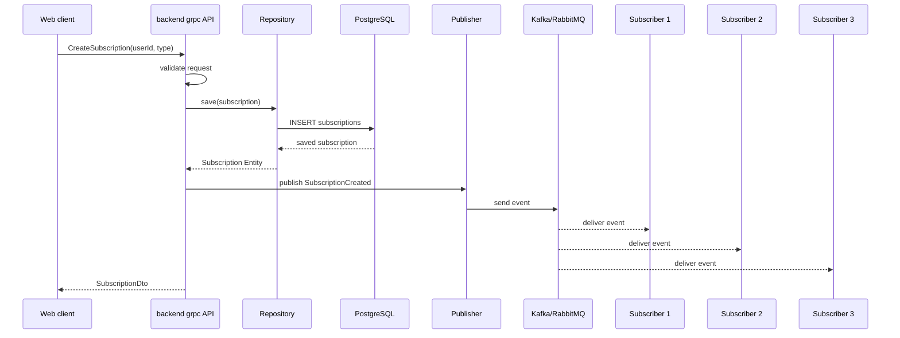
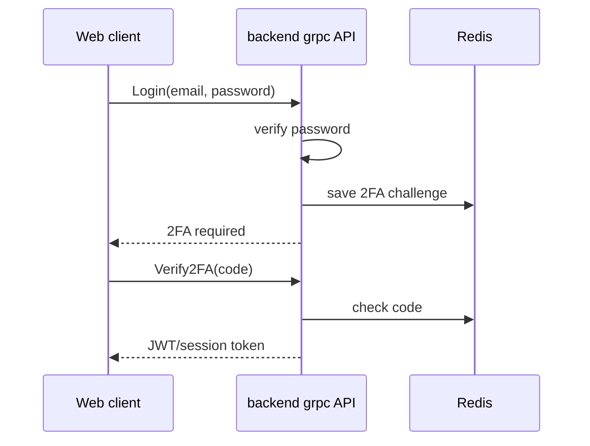
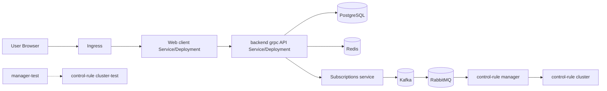

# Ответы к экзамену по дисциплине «Разработка WEB-приложений»

Документ подготовлен по экзаменационным билетам и roadmap/mind map курса. Основная связка: `Web client → gRPC wrapper → backend grpc API → service/logic → Repository → PostgreSQL/Redis/Fias API`. Событийная часть: `Publisher → Subscriptions → Kafka/RabbitMQ → Subscribers/control-rule manager`. Инфраструктура: Git, PR/MR, review, semver, Kubernetes Deployment/Service/Ingress.

---

# Билет №1

## Вопрос 1

**Вопрос:**
Что такое функциональные требования (ФТ) в контексте WEB-приложения подписок? Перечислите ключевые ФТ для роли «Издатель» и опишите его место в архитектуре pub/sub.

**Краткое описание:**
Функциональные требования описывают, что система должна делать: какие сценарии поддерживать, какие данные принимать, какие операции выполнять и какой результат возвращать. В WEB-приложении подписок ФТ фиксируют создание подписки, публикацию события, доставку события подписчикам, сохранение данных, логирование и аудит.

Роль «Издатель» в pub/sub — источник событий. Он не вызывает подписчиков напрямую, а публикует событие в сервис подписок, Kafka topic или очередь. Ключевые ФТ для издателя: сформировать событие, указать тип события, `userId`, `subscriptionId`, время и payload; отправить событие; получить подтверждение; обработать ошибку; записать Log/Audit для важных операций.

**Как ответить преподавателю на экзамене:**
Функциональные требования — это требования к поведению системы. В приложении подписок они описывают, как создаётся подписка, как публикуется событие и как оно доставляется подписчикам. Издатель в архитектуре pub/sub отвечает только за факт публикации события. Например, после создания подписки он формирует событие `SubscriptionCreated` и отправляет его в сервис подписок или брокер сообщений. Он не знает конкретных подписчиков. Это снижает связанность: можно добавить нового подписчика, не меняя код издателя.

---

## Вопрос 2

**Вопрос:**
Чем отличаются роли «Подписчик 1», «Подписчик 2» и «Подписчик 3» в системе? Какие типы событий или данных может получать каждый из них?

**Краткое описание:**
Подписчик — получатель событий в pub/sub. Три подписчика можно рассматривать как разные сервисы или роли с разной бизнес-логикой. Подписчик 1 может получать события по пользователям и подпискам. Подписчик 2 — события по платежам и Assessment. Подписчик 3 — события для Log/Audit, аналитики или `control-rule manager`.

Различие не обязательно в техническом механизме доставки, а в назначении: каждый подписчик слушает свои topic/queue или фильтрует события по типу.

**Как ответить преподавателю на экзамене:**
Подписчики отличаются тем, какие события они получают и как их обрабатывают. Например, первый подписчик может реагировать на создание подписки, второй — на платёжные события, третий — на аудит или контрольные правила. Все они получают события через сервис подписок, Kafka или RabbitMQ. Издатель не должен знать их внутреннюю логику. Это основной смысл pub/sub: отправитель публикует событие, а получатели независимо его обрабатывают.

---

## Практический вопрос

**Вопрос:**
Опишите пошаговый сценарий (sequence diagram или текстовый алгоритм): Издатель публикует событие «новая подписка», событие доставляется трём подписчикам. Укажите участников и направление сообщений.

**Краткое описание:**
Участники: Web client, backend grpc API, Repository, PostgreSQL, Publisher, Kafka/RabbitMQ, Subscriber 1–3. Сначала подписка сохраняется, затем публикуется событие.

**Как ответить преподавателю на экзамене:**
Пользователь отправляет форму подписки с Web client. Backend grpc API валидирует запрос и сохраняет подписку в PostgreSQL через Repository. После успешного сохранения Publisher создаёт событие `SubscriptionCreated` и отправляет его в Kafka/RabbitMQ. Брокер доставляет событие трём подписчикам. Каждый подписчик выполняет свою бизнес-логику.

**Готовое решение:**



## Мини-шпаргалка

* ФТ отвечают на вопрос «что должна делать система».
* Publisher публикует событие, но не вызывает подписчиков напрямую.
* Subscriber получает события по своей теме/очереди.
* Pub/sub снижает связанность компонентов.
* Событие «новая подписка» создаётся после успешного сохранения.

---

# Билет №2

## Вопрос 1

**Вопрос:**
Что представляет собой сущность Subscriptions в CRM-системе? Какие поля и связи должна содержать модель подписки?

**Краткое описание:**
`Subscriptions` — сущность CRM, которая фиксирует факт подписки пользователя. Она связывает `User` с типом подписчика и статусом подписки. Основные поля: `id`, `user_id`, `subscriber_type`, `status`, `created_at`, `updated_at`, возможно `cancelled_at` и `metadata`.

Связи: один `User` может иметь много `Subscriptions`; подписка может быть связана с `Payment`; изменение подписки может порождать события для Kafka/RabbitMQ.

**Как ответить преподавателю на экзамене:**
Сущность `Subscriptions` хранит данные о подписке пользователя: кому принадлежит подписка, какого она типа, активна она или отменена, когда создана. Главная связь — внешний ключ на `User`. Эта сущность важна не только для БД, но и для событийной архитектуры: создание или изменение подписки может публиковаться как событие для подписчиков.

---

## Вопрос 2

**Вопрос:**
Как сервис подписок взаимодействует с Kafka и очередями сообщений? Объясните, зачем нужны RabbitMQ и Kafka в crm-cluster и чем они отличаются по назначению.

**Краткое описание:**
Сервис подписок принимает события от backend/Publisher и передаёт их в брокеры сообщений. Kafka удобна как событийная шина и потоковая платформа: события пишутся в topic, а разные consumer groups читают их независимо. RabbitMQ удобен как очередь задач: сообщение помещается в очередь и обрабатывается worker-ами с подтверждением доставки.

В crm-cluster Kafka можно использовать для событий `SubscriptionCreated`, `PaymentCreated`, `UserUpdated`; RabbitMQ — для задач обработки, уведомлений, control-rule manager.

**Как ответить преподавателю на экзамене:**
Сервис подписок связывает бизнес-логику и асинхронную доставку событий. После создания события он публикует его в Kafka topic или отправляет в RabbitMQ queue. Kafka лучше подходит для event streaming и хранения последовательности событий. RabbitMQ лучше подходит для очередей задач и маршрутизации сообщений обработчикам. Оба инструмента уменьшают прямую зависимость сервисов и позволяют масштабировать обработку.

---

## Практический вопрос

**Вопрос:**
Спроектируйте SQL-схему таблицы subscriptions (PostgreSQL): первичный ключ, внешние ключи на User, статус подписки, дата создания, тип подписчика (1/2/3). Приведите DDL-запрос CREATE TABLE.

**Краткое описание:**
Нужна таблица с PK, FK на `users`, проверкой типа подписчика и статуса.

**Как ответить преподавателю на экзамене:**
Я создам таблицу `subscriptions` с UUID-первичным ключом, `user_id` как внешним ключом, `subscriber_type` с ограничением 1/2/3, `status` с допустимыми значениями и датами создания/обновления. Индекс по `user_id` ускорит поиск подписок пользователя.

**Готовое решение:**

```sql
CREATE EXTENSION IF NOT EXISTS pgcrypto;

CREATE TABLE subscriptions (
    id UUID PRIMARY KEY DEFAULT gen_random_uuid(),
    user_id UUID NOT NULL REFERENCES users(id) ON DELETE CASCADE,
    subscriber_type SMALLINT NOT NULL CHECK (subscriber_type IN (1, 2, 3)),
    status VARCHAR(30) NOT NULL DEFAULT 'active'
        CHECK (status IN ('active', 'cancelled', 'suspended')),
    created_at TIMESTAMPTZ NOT NULL DEFAULT now(),
    updated_at TIMESTAMPTZ NOT NULL DEFAULT now()
);

CREATE INDEX idx_subscriptions_user_id ON subscriptions(user_id);
CREATE INDEX idx_subscriptions_status ON subscriptions(status);
```

## Мини-шпаргалка

* `Subscriptions` связывает пользователя и подписку.
* `subscriber_type` ограничен значениями 1/2/3.
* Kafka — поток событий; RabbitMQ — очередь задач.
* Сервис подписок — промежуточный слой доставки.
* FK на `users(id)` нужен для целостности данных.

---

# Билет №3

## Вопрос 1

**Вопрос:**
Опишите структуру Web client в многослойном WEB-приложении. Какие технологии и слои входят в клиентскую часть согласно карте знаний?

**Краткое описание:**
Web client — клиентская часть, работающая в браузере. По roadmap она включает HTML, CSS, TypeScript/JavaScript, компонентную модель, Input/Output и обёртку над gRPC.

Слои клиента: разметка, оформление, логика, компоненты, модели/DTO, API wrapper. Клиент показывает UI, собирает ввод пользователя, вызывает backend grpc API и обрабатывает ответы/ошибки.

**Как ответить преподавателю на экзамене:**
Web client состоит из HTML-разметки, CSS-оформления, TypeScript/JavaScript-логики и компонентов. Компоненты принимают данные через Input и отдают события через Output. Для обращения к серверу используется gRPC wrapper, чтобы компоненты не работали с транспортными деталями. Клиент не должен обращаться к PostgreSQL напрямую: он работает только через backend API.

---

## Вопрос 2

**Вопрос:**
В чём разница зон ответственности HTML и CSS? Приведите пример: что относится к разметке, а что — к оформлению формы регистрации подписчика.

**Краткое описание:**
HTML отвечает за структуру и смысл: `form`, `label`, `input`, `select`, `button`. CSS отвечает за внешний вид: расположение, цвета, отступы, размеры, рамки, hover/focus.

В форме подписки HTML создаёт поле email, select с типом подписчика и кнопку. CSS центрирует форму, задаёт ширину, фон, стили кнопки.

**Как ответить преподавателю на экзамене:**
HTML описывает, какие элементы есть на странице и что они означают. CSS описывает, как эти элементы выглядят. Например, `<input type="email">` и `<select>` — это HTML-разметка формы. А ширина формы, цвет кнопки, отступы и центрирование — это CSS.

---

## Практический вопрос

**Вопрос:**
Напишите HTML-разметку формы подписки (поля: email, тип подписчика — select, кнопка «Подписаться») и CSS-стили для центрирования формы и оформления кнопки.

**Краткое описание:**
Нужна форма с email, select и button, плюс CSS для центрирования и оформления.

**Как ответить преподавателю на экзамене:**
Я разделяю структуру и стиль. В HTML создаю семантическую форму с `label`. В CSS центрирую её через flex, задаю карточку и оформляю кнопку.

**Готовое решение:**

```html
<form class="subscription-form">
  <h1>Подписка</h1>
  <label for="email">Email</label>
  <input id="email" name="email" type="email" required />
  <label for="subscriberType">Тип подписчика</label>
  <select id="subscriberType" name="subscriberType" required>
    <option value="1">Подписчик 1</option>
    <option value="2">Подписчик 2</option>
    <option value="3">Подписчик 3</option>
  </select>
  <button type="submit">Подписаться</button>
</form>
```

```css
body { margin: 0; min-height: 100vh; display: flex; justify-content: center; align-items: center; font-family: Arial, sans-serif; background: #f4f6f8; }
.subscription-form { width: 360px; padding: 24px; background: white; border-radius: 12px; box-shadow: 0 8px 24px rgba(0,0,0,.08); }
.subscription-form label { display: block; margin-top: 12px; font-weight: 600; }
.subscription-form input, .subscription-form select { width: 100%; padding: 10px; margin-top: 6px; border: 1px solid #ccd3dd; border-radius: 8px; }
.subscription-form button { width: 100%; margin-top: 20px; padding: 12px; border: 0; border-radius: 8px; background: #2563eb; color: white; font-weight: 700; cursor: pointer; }
```

## Мини-шпаргалка

* Web client = HTML + CSS + TypeScript/JavaScript + Components.
* HTML — структура; CSS — внешний вид.
* TypeScript отвечает за поведение и API-вызовы.
* Input/Output связывают компоненты.
* Web client не ходит в БД напрямую.

---

# Билет №4

## Вопрос 1

**Вопрос:**
Что такое асинхронное программирование (async) в JavaScript/TypeScript? Зачем оно необходимо в Web client при обращении к gRPC API?

**Краткое описание:**
Асинхронность позволяет выполнять долгие операции без блокировки интерфейса. Сетевой запрос к backend grpc API занимает время, поэтому Web client должен продолжать реагировать на действия пользователя.

В TypeScript/JavaScript используются `Promise`, `async`, `await`, `try/catch`. Запрос возвращает Promise, а результат обрабатывается позже.

**Как ответить преподавателю на экзамене:**
Асинхронное программирование нужно, чтобы не блокировать основной поток браузера. Когда Web client вызывает backend grpc API, ответ приходит не мгновенно. Поэтому запрос выполняется асинхронно: функция возвращает Promise, а код через `await` ждёт результат без зависания интерфейса. Ошибки сети или сервера обрабатываются через `try/catch`.

---

## Вопрос 2

**Вопрос:**
Объясните работу Event Loop и механизм Promise. Чем async/await отличается от цепочки .then()/.catch()?

**Краткое описание:**
Event Loop управляет выполнением синхронного кода и очередей асинхронных задач. Promise — объект будущего результата со статусами `pending`, `fulfilled`, `rejected`.

`.then()` и `.catch()` обрабатывают результат и ошибку цепочкой. `async/await` — синтаксис поверх Promise, который делает код линейным и читаемым.

**Как ответить преподавателю на экзамене:**
JavaScript выполняет синхронный код в call stack, а асинхронные операции после завершения попадают в очередь и обрабатываются Event Loop. Promise представляет результат, который появится позже. Его можно обработать через `.then().catch()`. `async/await` делает то же самое, но позволяет писать код как последовательность действий, а ошибки ловить обычным `try/catch`.

---

## Практический вопрос

**Вопрос:**
Напишите TypeScript-функцию fetchSubscriptions(userId: string): Promise<Subscription[]> с использованием async/await, которая выполняет HTTP/gRPC-запрос к backend и обрабатывает ошибку сети.

**Краткое описание:**
Функция принимает `userId`, вызывает backend, возвращает массив подписок и обрабатывает ошибки.

**Как ответить преподавателю на экзамене:**
Я проверяю входной параметр, выполняю асинхронный запрос, проверяю статус ответа и возвращаю типизированный массив. Ошибки сети перехватываются и преобразуются в понятное сообщение.

**Готовое решение:**

```ts
type Subscription = { id: string; userId: string; subscriberType: 1 | 2 | 3; status: 'active' | 'cancelled' | 'suspended'; createdAt: string; };

async function fetchSubscriptions(userId: string): Promise<Subscription[]> {
  if (!userId) throw new Error('userId is required');
  try {
    const response = await fetch(`/api/subscriptions?userId=${encodeURIComponent(userId)}`);
    if (!response.ok) throw new Error(`Backend error: ${response.status}`);
    return await response.json() as Subscription[];
  } catch (error) {
    console.error('Network/API error', error);
    throw new Error('Не удалось получить подписки пользователя');
  }
}
```

## Мини-шпаргалка

* Promise — будущий результат.
* `async/await` работает поверх Promise.
* Event Loop не даёт UI зависнуть.
* Сетевые запросы всегда обрабатываются асинхронно.
* Ошибки async-кода ловятся через `try/catch`.

---

# Билет №5

## Вопрос 1

**Вопрос:**
Что такое Component в компонентной архитектуре frontend-приложения? Какие преимущества даёт разбиение UI на компоненты?

**Краткое описание:**
Component — самостоятельный блок интерфейса: форма, карточка, список, кнопка, экран. Он объединяет шаблон, стили, логику и входные/выходные данные.

Преимущества: повторное использование, разделение ответственности, упрощение тестирования, изоляция состояния, читаемая структура приложения, удобная командная разработка.

**Как ответить преподавателю на экзамене:**
Компонент — это независимая часть UI, которая отвечает за конкретный фрагмент экрана. Например, `SubscriptionCard` показывает одну подписку, а `SubscriptionForm` собирает данные формы. Разбиение UI на компоненты делает код поддерживаемым: компонент можно переиспользовать, тестировать отдельно и менять без переписывания всего экрана.

---

## Вопрос 2

**Вопрос:**
Объясните паттерн Input/Output (props/events) при передаче данных между родительским и дочерним компонентами. Приведите пример для компонента «SubscriptionCard».

**Краткое описание:**
Input/props — данные сверху вниз: родитель передаёт дочернему компоненту объект подписки. Output/events — события снизу вверх: дочерний компонент сообщает родителю, что пользователь нажал кнопку.

Для `SubscriptionCard`: `@Input() subscription`; `@Output() cancel`.

**Как ответить преподавателю на экзамене:**
Родительский компонент передаёт данные в `SubscriptionCard` через Input, например id, тип и статус подписки. Если пользователь нажимает «Отменить», карточка не должна сама обращаться к backend. Она эмитит Output-событие `cancel(subscription.id)`, а родитель уже решает, как вызвать backend grpc API и обновить список.

---

## Практический вопрос

**Вопрос:**
Напишите псевдокод или TypeScript-компонент SubscriptionForm с @Input() userId и @Output() onSubmit, который эмитит данные формы родителю при нажатии кнопки.

**Краткое описание:**
Компонент получает `userId`, собирает email и тип подписчика, отправляет payload родителю.

**Как ответить преподавателю на экзамене:**
`SubscriptionForm` отвечает только за форму. Он принимает `userId` через Input и передаёт данные наружу через Output. Сохранение выполняет родитель или сервис.

**Готовое решение:**

```ts
type SubscriberType = 1 | 2 | 3;
type SubscriptionPayload = { userId: string; email: string; subscriberType: SubscriberType; };

class SubscriptionFormComponent {
  // @Input()
  userId!: string;
  // @Output()
  onSubmit = { emit: (payload: SubscriptionPayload) => console.log(payload) };
  email = '';
  subscriberType: SubscriberType = 1;

  submit(): void {
    if (!this.userId || !this.email) throw new Error('Form is invalid');
    this.onSubmit.emit({ userId: this.userId, email: this.email, subscriberType: this.subscriberType });
  }
}
```

## Мини-шпаргалка

* Component — самостоятельный блок UI.
* Input передаёт данные вниз.
* Output передаёт события вверх.
* Компонент формы не должен сам решать всю бизнес-логику.
* `SubscriptionCard` получает подписку и эмитит cancel.

---
# Билет №6

## Вопрос 1

**Вопрос:**
Перечислите основные принципы UI/UX для WEB-приложений. Как они применяются при проектировании интерфейса подписчика?

**Краткое описание:**
UI — визуальная часть интерфейса; UX — удобство сценария пользователя. Основные принципы: ясность, простота, единообразие, обратная связь, предотвращение ошибок, доступность, адаптивность.

В интерфейсе подписчика это означает: понятный список подписок, явный статус, кнопка отмены с подтверждением, уведомления об успехе/ошибке, корректная валидация формы.

**Как ответить преподавателю на экзамене:**
Для подписчика интерфейс должен помогать быстро понять, какие подписки активны, что можно отменить и какие уведомления требуют внимания. UI должен быть единообразным, а UX — предсказуемым. После каждого действия система должна давать обратную связь: загрузка, успех, ошибка. Опасные действия, например отмену подписки, лучше подтверждать.

---

## Вопрос 2

**Вопрос:**
Что такое доступность (accessibility) WEB-форм? Какие атрибуты HTML и практики следует использовать для формы подписки?

**Краткое описание:**
Accessibility — возможность пользоваться формой людям с разными способами взаимодействия: клавиатура, screen reader, увеличенный шрифт. Используются `label for`, `id`, `required`, `type="email"`, `aria-describedby`, `aria-invalid`, видимый focus, правильный порядок Tab.

**Как ответить преподавателю на экзамене:**
Доступная форма — это форма, которую можно понять и заполнить не только мышью, но и клавиатурой или screen reader. Для формы подписки нужно связать `label` и `input`, использовать правильный тип email, обязательные поля, понятные ошибки и атрибуты ARIA для подсказок. Нельзя передавать смысл только цветом; нужно сохранять контраст и видимый фокус.

---

## Практический вопрос

**Вопрос:**
Опишите wireframe (текстовая схема или ASCII-арт) экрана «Личный кабинет подписчика»: список активных подписок, кнопка отмены, блок уведомлений. Укажите расположение элементов.

**Краткое описание:**
Экран должен содержать header, список активных подписок, карточки/таблицу и блок уведомлений.

**Как ответить преподавателю на экзамене:**
Сверху размещается заголовок и данные пользователя. Основная область делится на список подписок и блок уведомлений. В каждой карточке подписки есть тип, статус, дата создания и кнопка отмены.

**Готовое решение:**

```text
+--------------------------------------------------------------+
| Личный кабинет подписчика                         [Выйти]    |
+--------------------------------------------------------------+
| Активные подписки                    | Уведомления           |
|--------------------------------------|-----------------------|
| Подписка #101                        | ✓ Подписка создана    |
| Тип: 1                               | ! Ожидается платёж    |
| Статус: active                       |                       |
| Дата: 2026-06-10        [Отменить]   |                       |
|--------------------------------------|                       |
| Подписка #102                        |                       |
| Тип: 2                               |                       |
| Статус: active          [Отменить]   |                       |
+--------------------------------------------------------------+
```

## Мини-шпаргалка

* UI — внешний вид, UX — удобство.
* Нужна обратная связь после действий.
* Accessibility требует семантических label/input.
* Форма должна работать с клавиатуры.
* В кабинете важны список, статусы, отмена и уведомления.

---

# Билет №7

## Вопрос 1

**Вопрос:**
Сравните gRPC и REST: протокол, формат данных, производительность, типизация. Почему для backend CRM выбран gRPC?

**Краткое описание:**
REST обычно использует HTTP и JSON, строится вокруг ресурсов и HTTP-методов. gRPC описывает сервисы и методы через `.proto`, передаёт данные в Protocol Buffers и обычно работает поверх HTTP/2.

gRPC даёт строгую типизацию, компактный бинарный формат, генерацию клиентского/серверного кода и streaming. REST проще для браузера и внешних публичных API, но в CRM-кластере gRPC удобнее для строгих контрактов между сервисами.

**Как ответить преподавателю на экзамене:**
REST — ресурсный подход: `GET /users/1`, `POST /users`. gRPC — вызов метода сервиса: `UserService.GetUser`. REST часто использует JSON, а gRPC — protobuf. Поэтому gRPC быстрее и строже типизирован. Для backend CRM выбран gRPC, потому что в системе много внутренних вызовов, DTO и CRUD API, а строгий контракт снижает ошибки между Web client wrapper и backend.

---

## Вопрос 2

**Вопрос:**
Что такое Protocol Buffers (protobuf)? Какие типы вызовов поддерживает gRPC (unary, server streaming, client streaming, bidirectional)?

**Краткое описание:**
Protocol Buffers — формат описания сообщений и сервисов в `.proto`-файле, а также компактная бинарная сериализация. Из `.proto` генерируются типы и клиенты.

Типы gRPC-вызовов: unary — один запрос/один ответ; server streaming — один запрос/поток ответов; client streaming — поток запросов/один ответ; bidirectional streaming — поток в обе стороны.

**Как ответить преподавателю на экзамене:**
Protobuf задаёт контракт данных: какие поля есть в request и response, какие методы есть в сервисе. gRPC использует этот контракт для типизированных вызовов. Чаще всего для CRUD используется unary. Streaming нужен, когда данные приходят потоком, например уведомления или большие наборы событий.

---

## Практический вопрос

**Вопрос:**
Напишите файл user.proto с сообщениями UserRequest, UserResponse и сервисом UserService с методами GetUser и CreateUser.

**Краткое описание:**
Нужно описать protobuf-контракт для пользователя.

**Как ответить преподавателю на экзамене:**
Я указываю `syntax = "proto3"`, package, сообщения запроса/ответа и сервис с двумя unary-методами.

**Готовое решение:**

```proto
syntax = "proto3";

package crm.user.v1;

message UserRequest {
  string id = 1;
}

message CreateUserRequest {
  string email = 1;
  string first_name = 2;
  string last_name = 3;
}

message UserResponse {
  string id = 1;
  string email = 2;
  string first_name = 3;
  string last_name = 4;
  string created_at = 5;
}

service UserService {
  rpc GetUser(UserRequest) returns (UserResponse);
  rpc CreateUser(CreateUserRequest) returns (UserResponse);
}
```

## Мини-шпаргалка

* REST — ресурсы и JSON.
* gRPC — методы сервиса и protobuf.
* Protobuf — строгий контракт.
* Unary = один запрос/один ответ.
* gRPC выбран для типизации и производительности.

---

# Билет №8

## Вопрос 1

**Вопрос:**
Зачем нужна обёртка над gRPC на стороне Web client? Какие задачи она решает (скрытие деталей протокола, обработка ошибок, типизация)?

**Краткое описание:**
gRPC wrapper на клиенте — слой между UI-компонентами и низкоуровневым gRPC-клиентом. Он скрывает транспорт, protobuf-детали, metadata, обработку ошибок и маппинг в DTO.

Компонент вызывает простой метод `getUser(id)` или `createSubscription(dto)`, а wrapper формирует request, добавляет token, вызывает backend и возвращает типизированный результат.

**Как ответить преподавателю на экзамене:**
Обёртка нужна, чтобы компоненты не зависели от gRPC-технических деталей. Она централизует авторизацию, обработку ошибок, преобразование protobuf response в DTO и логирование. Это упрощает frontend: UI работает с понятными методами и типами.

---

## Вопрос 2

**Вопрос:**
Опишите слои backend grpc API: transport (gRPC), service, repository. Как организованы «вызовы» от клиента к серверу?

**Краткое описание:**
Слои backend: transport принимает gRPC request и отдаёт response; service содержит бизнес-логику; repository работает с источником данных; DB хранит данные.

Путь вызова: `Web client → gRPC wrapper → transport → service → repository → PostgreSQL → DTO response`.

**Как ответить преподавателю на экзамене:**
Клиент вызывает метод через gRPC wrapper. Transport layer на backend принимает protobuf request. Далее service выполняет бизнес-логику: валидацию, правила, авторизацию. Для данных service вызывает repository. Repository обращается к PostgreSQL/SQLite/SQL Server. После этого результат маппится в DTO и возвращается клиенту.

---

## Практический вопрос

**Вопрос:**
Напишите TypeScript-класс UserGrpcClient — обёртку с методом getUser(id: string), который вызывает gRPC-метод и возвращает DTO пользователя. Допустим псевдокод с указанием ключевых шагов.

**Краткое описание:**
Класс должен проверять id, вызывать gRPC-клиент, обрабатывать ошибку и вернуть DTO.

**Как ответить преподавателю на экзамене:**
Метод `getUser` получает id, формирует request, добавляет token в metadata, вызывает `GetUser`, затем маппит response в `UserDto`.

**Готовое решение:**

```ts
type UserDto = { id: string; email: string; firstName: string; lastName: string; createdAt: string; };

class UserGrpcClient {
  constructor(private readonly grpcClient: any) {}

  async getUser(id: string): Promise<UserDto> {
    if (!id) throw new Error('id is required');
    try {
      const response = await this.grpcClient.getUser({ id });
      return { id: response.id, email: response.email, firstName: response.firstName, lastName: response.lastName, createdAt: response.createdAt };
    } catch (error) {
      console.error('gRPC GetUser failed', error);
      throw new Error('Не удалось получить пользователя');
    }
  }
}
```

## Мини-шпаргалка

* Wrapper скрывает gRPC-детали от UI.
* Transport принимает request.
* Service содержит бизнес-логику.
* Repository работает с БД.
* Клиент получает DTO.

---

# Билет №9

## Вопрос 1

**Вопрос:**
Как реализовать CRUD-операции через backend grpc API? Опишите методы Create, Read, Update, Delete для сущности User.

**Краткое описание:**
CRUD — Create, Read, Update, Delete. В gRPC это методы сервиса: `CreateUser`, `GetUser`, `UpdateUser`, `DeleteUser`. Каждый метод проходит через transport, service, repository.

Create валидирует данные и сохраняет User. Read получает пользователя по id. Update проверяет существование и меняет разрешённые поля. Delete удаляет или помечает запись удалённой.

**Как ответить преподавателю на экзамене:**
CRUD через backend grpc API реализуется как типизированные методы сервиса. Web client вызывает не SQL, а gRPC-метод. Backend проверяет request, права доступа, бизнес-правила, затем обращается к Repository и возвращает User DTO. Это безопаснее и правильнее, чем прямой доступ клиента к базе.

---

## Вопрос 2

**Вопрос:**
Сравните два подхода: прямая работа Web client с PostgreSQL и работа через gRPC. Почему прямой доступ к БД с клиента недопустим?

**Краткое описание:**
Прямой доступ из браузера к PostgreSQL недопустим: нужно раскрыть credentials, невозможно надёжно контролировать права, обходится бизнес-логика, нет централизованного Audit, высокий риск утечек.

Правильный подход: Web client → backend grpc API → Repository → PostgreSQL.

**Как ответить преподавателю на экзамене:**
Web client — недоверенная среда. Если дать ему доступ к PostgreSQL, пользователь сможет пытаться читать или изменять чужие данные, а параметры подключения окажутся раскрыты. Backend нужен как контролируемый слой: он выполняет аутентификацию, авторизацию, валидацию, бизнес-логику, Log/Audit и только потом обращается к БД.

---

## Практический вопрос

**Вопрос:**
Напишите псевдокод gRPC-метода CreateUser: валидация входных данных, сохранение в PostgreSQL через Repository, возврат созданного User DTO.

**Краткое описание:**
Нужно показать порядок: request → validation → entity → repository.save → dto.

**Как ответить преподавателю на экзамене:**
Я проверяю email и имя, проверяю уникальность email, создаю Entity, сохраняю через Repository и возвращаю DTO. После сохранения можно записать Audit.

**Готовое решение:**

```ts
async function CreateUser(request: CreateUserRequest): Promise<UserDto> {
  if (!request.email.includes('@')) throw new Error('INVALID_ARGUMENT: email');
  const existing = await userRepository.findByEmail(request.email);
  if (existing) throw new Error('ALREADY_EXISTS');

  const user: User = { id: crypto.randomUUID(), email: request.email.toLowerCase(), firstName: request.firstName, lastName: request.lastName, createdAt: new Date() };
  const saved = await userRepository.save(user);
  await audit.write({ action: 'CREATE', entityType: 'User', entityId: saved.id, newValue: saved });
  return { id: saved.id, email: saved.email, firstName: saved.firstName, lastName: saved.lastName, createdAt: saved.createdAt.toISOString() };
}
```

## Мини-шпаргалка

* CRUD реализуется методами backend grpc API.
* Web client не работает с PostgreSQL напрямую.
* Валидация и авторизация выполняются на backend.
* Repository сохраняет Entity.
* Клиент получает DTO.

---

# Билет №10

## Вопрос 1

**Вопрос:**
Что такое DTO (Data Transfer Object)? Зачем отделять DTO от доменных сущностей Entity при передаче данных между слоями?

**Краткое описание:**
DTO — объект передачи данных между слоями. Entity — внутренняя доменная сущность. DTO содержит только те поля, которые можно и нужно передавать клиенту или другому сервису.

Разделение нужно, чтобы не отдавать лишние поля, например `passwordHash`; не привязывать API к структуре БД; упростить версионирование; контролировать формат ответа.

**Как ответить преподавателю на экзамене:**
DTO — это внешний контракт данных. Entity — внутренняя модель приложения. Их нельзя смешивать, потому что Entity может содержать служебные и чувствительные поля. Backend должен маппить Entity в DTO и отдавать клиенту только безопасные данные.

---

## Вопрос 2

**Вопрос:**
В чём различие сущностей User и Person в доменной модели? Когда используется каждая из них?

**Краткое описание:**
`User` — учётная запись для входа, ролей, статуса и авторизации. `Person` — данные физического лица: ФИО, телефон, адрес, город.

`User` используется в безопасности и системных операциях. `Person` используется в CRM-профиле и предметной области. Один User может быть связан с одной Person.

**Как ответить преподавателю на экзамене:**
User отвечает за аккаунт: email, пароль, роль, статус. Person отвечает за человека: имя, телефон, адрес, `city_id`. Разделение нужно, потому что данные для входа и персональные данные имеют разные задачи и жизненный цикл. Например, авторизация смотрит на User, а нормализация адреса через Fias API относится к Person.

---

## Практический вопрос

**Вопрос:**
Опишите TypeScript-интерфейсы UserDto, PersonDto и функцию mapEntityToDto(user: User): UserDto, выполняющую маппинг Entity → DTO.

**Краткое описание:**
Нужно показать DTO и исключить внутренние поля.

**Как ответить преподавателю на экзамене:**
В `UserDto` не включается `passwordHash`. Дата преобразуется в строку, а вложенная `Person` маппится в `PersonDto`.

**Готовое решение:**

```ts
interface PersonDto { id: string; firstName: string; lastName: string; phone?: string; cityId?: string; }
interface UserDto { id: string; email: string; role: 'admin' | 'subscriber'; person?: PersonDto; createdAt: string; }

function mapEntityToDto(user: User): UserDto {
  return {
    id: user.id,
    email: user.email,
    role: user.role,
    person: user.person ? { id: user.person.id, firstName: user.person.firstName, lastName: user.person.lastName, phone: user.person.phone, cityId: user.person.cityId } : undefined,
    createdAt: user.createdAt.toISOString()
  };
}
```

## Мини-шпаргалка

* DTO — объект передачи данных.
* Entity — внутренняя модель.
* DTO не должен содержать `passwordHash`.
* User — аккаунт и доступ.
* Person — персональные/CRM-данные.

---
# Билет №11

## Вопрос 1

**Вопрос:**
Объясните паттерн Repository. Какую роль играет интерфейс репозитория (I) и чем source отличается от реализации?

**Краткое описание:**
Repository — слой доступа к данным. Он скрывает SQL и конкретный источник данных от бизнес-логики. Интерфейс `IUserRepository` задаёт контракт: `findById`, `save`, `delete`.

`source` — источник данных: PostgreSQL, SQLite, SQL Server, API, файл. Реализация — код, который работает с этим source, например `PostgresUserRepository`.

**Как ответить преподавателю на экзамене:**
Repository отделяет service/logic от базы данных. Service вызывает интерфейс, а не пишет SQL. Интерфейс описывает, что можно сделать, а реализация описывает, как это сделать в конкретной СУБД. Это позволяет заменить PostgreSQL на SQLite или SQL Server без переписывания бизнес-логики.

---

## Вопрос 2

**Вопрос:**
Как Repository обеспечивает абстракцию над разными источниками данных (Postgres, SQLite, SQL Server)?

**Краткое описание:**
Абстракция достигается через общий интерфейс и разные реализации. `IUserRepository` один, но реализации разные: `PostgresUserRepository`, `SQLiteUserRepository`, `SqlServerUserRepository`.

Service layer зависит от интерфейса. Конкретная реализация выбирается конфигурацией.

**Как ответить преподавателю на экзамене:**
Repository даёт единый набор методов для работы с данными. Для service нет разницы, откуда берутся данные. Разница находится внутри реализации: разные драйверы, SQL-диалекты и подключения. Поэтому Repository — основной способ унифицировать работу с Postgres, SQLite и SQL Server.

---

## Практический вопрос

**Вопрос:**
Напишите интерфейс IUserRepository с методами findById, save, delete и класс PostgresUserRepository, реализующий этот интерфейс (сигнатуры методов, без полной реализации SQL).

**Краткое описание:**
Нужно показать контракт и класс PostgreSQL-реализации.

**Как ответить преподавателю на экзамене:**
Я объявляю интерфейс и класс, который его реализует. Service будет принимать `IUserRepository`, а не `PostgresUserRepository`.

**Готовое решение:**

```ts
interface IUserRepository {
  findById(id: string): Promise<User | null>;
  save(user: User): Promise<User>;
  delete(id: string): Promise<void>;
}

class PostgresUserRepository implements IUserRepository {
  constructor(private readonly db: { query: Function }) {}
  async findById(id: string): Promise<User | null> { /* SELECT * FROM users WHERE id = $1 */ throw new Error('not implemented'); }
  async save(user: User): Promise<User> { /* INSERT/UPDATE users RETURNING * */ throw new Error('not implemented'); }
  async delete(id: string): Promise<void> { /* DELETE FROM users WHERE id = $1 */ throw new Error('not implemented'); }
}
```

## Мини-шпаргалка

* Repository скрывает источник данных.
* `I` — интерфейс/контракт.
* Source — конкретное хранилище.
* Реализация работает с конкретной СУБД.
* Service зависит от интерфейса.

---

# Билет №12

## Вопрос 1

**Вопрос:**
Сравните PostgreSQL, SQLite и SQL Server: область применения, масштабируемость, поддержка в WEB-приложениях. Когда какую СУБД выбрать?

**Краткое описание:**
PostgreSQL — серверная СУБД для production WEB-приложений, хорошо подходит для CRM, транзакций, связей, индексов. SQLite — файловая лёгкая СУБД для локальной разработки, тестов и прототипов. SQL Server — корпоративная СУБД, часто используется в Microsoft-инфраструктуре.

Для курса основная БД — PostgreSQL, а SQLite/SQL Server могут поддерживаться через Repository.

**Как ответить преподавателю на экзамене:**
PostgreSQL подходит как основная БД WEB-приложения: она серверная и рассчитана на многопользовательскую работу. SQLite проще и хранит данные в файле, поэтому хороша для тестов и небольших локальных сценариев. SQL Server выбирают в корпоративной Microsoft-среде. Через Repository можно скрыть различия между ними.

---

## Вопрос 2

**Вопрос:**
Что означает узел «DB» на карте знаний? Как унифицировать работу с разными СУБД через единый слой доступа к данным?

**Краткое описание:**
`DB` — слой хранения данных. На карте он связан с PostgreSQL, SQLite и SQL Server. Унификация выполняется через Repository, интерфейсы, маппинг Entity/DTO и отдельные реализации под каждую СУБД.

**Как ответить преподавателю на экзамене:**
Узел DB обозначает, что приложение работает с хранилищем данных. Чтобы не привязывать бизнес-логику к конкретной СУБД, вводится слой доступа к данным. Service вызывает `IUserRepository`, а реализация выбирается под PostgreSQL, SQLite или SQL Server.

---

## Практический вопрос

**Вопрос:**
Напишите SQL-запрос (PostgreSQL): получить список пользователей с их платежами — JOIN таблиц users и payments, вывести user_id, email, payment_amount, payment_date.

**Краткое описание:**
Нужен `JOIN` по `payments.user_id = users.id`.

**Как ответить преподавателю на экзамене:**
Я использую `JOIN`, потому что платеж принадлежит пользователю через внешний ключ.

**Готовое решение:**

```sql
SELECT
    u.id AS user_id,
    u.email,
    p.amount AS payment_amount,
    p.created_at AS payment_date
FROM users u
JOIN payments p ON p.user_id = u.id
ORDER BY p.created_at DESC;
```

## Мини-шпаргалка

* PostgreSQL — основной production-вариант.
* SQLite — тесты/локальное хранение.
* SQL Server — enterprise/Microsoft.
* DB — слой хранения.
* Repository унифицирует доступ.

---

# Билет №13

## Вопрос 1

**Вопрос:**
Какие задачи решает Redis в WEB-приложении? Перечислите сценарии: кэш, сессии, pub/sub.

**Краткое описание:**
Redis — in-memory key-value хранилище. Оно используется для быстрого доступа к временным данным. Сценарии: кэш справочников, сессии, 2FA-коды, rate limiting, pub/sub, временные данные с TTL.

Redis снижает нагрузку на PostgreSQL и внешние API, например Fias API.

**Как ответить преподавателю на экзамене:**
Redis нужен для ускорения WEB-приложения. В него кладут данные, которые часто читаются и могут быть восстановлены из основной БД или внешнего API. Например, справочник городов, сессии, временные токены. Redis не должен быть единственным источником истины для платежей и audit trail.

---

## Вопрос 2

**Вопрос:**
Как Redis используется в crm-cluster (конфигурация 4G)? Какие данные целесообразно кэшировать?

**Краткое описание:**
При ограниченной памяти, например 4G, в Redis нужно хранить только полезные и временные данные: города Fias API, активные подписки, сессии, 2FA-коды, настройки, результаты частых запросов.

Критичные данные — User, Payment, Audit — должны храниться в PostgreSQL, а в Redis может быть только кэш.

**Как ответить преподавателю на экзамене:**
В crm-cluster Redis выполняет роль кэша и временного хранилища. Конфигурация 4G означает, что память ограничена, поэтому нужно задавать TTL и не хранить лишние данные. Лучшие кандидаты — справочники, сессии и часто читаемые данные. Источником истины остаётся PostgreSQL.

---

## Практический вопрос

**Вопрос:**
Опишите стратегию кэширования справочника «Города» (Fias API): ключ кэша, TTL, алгоритм «cache-aside» при запросе города по ID.

**Краткое описание:**
Cache-aside: сначала проверить Redis, при miss запросить Fias API, сохранить результат с TTL и вернуть клиенту.

**Как ответить преподавателю на экзамене:**
Ключ можно сделать `fias:city:{cityId}`. TTL — например 24 часа или 7 дней. Если в Redis есть значение, возвращаем его. Если нет — идём в Fias API, нормализуем город, кладём в Redis и возвращаем.

**Готовое решение:**

```ts
async function getCity(cityId: string): Promise<CityDto> {
  const key = `fias:city:${cityId}`;
  const cached = await redis.get(key);
  if (cached) return JSON.parse(cached);
  const city = await fiasApi.getCityById(cityId);
  const dto = { id: cityId, fiasId: city.fiasId, name: city.name, region: city.region };
  await redis.set(key, JSON.stringify(dto), 'EX', 86400);
  return dto;
}
```

## Мини-шпаргалка

* Redis — быстрое хранилище в памяти.
* TTL обязателен для временных данных.
* Cache-aside: Redis → source → Redis.
* Fias cities удобно кэшировать.
* PostgreSQL остаётся источником истины.

---

# Билет №14

## Вопрос 1

**Вопрос:**
Что такое Fias API? Для каких задач используется интеграция с ФИАС в CRM-приложении?

**Краткое описание:**
Fias API — внешний API адресного справочника. В CRM он нужен для нормализации адресов и справочника городов: поиск города, получение `fias_id`, проверка корректности адреса, уменьшение ошибок ручного ввода.

**Как ответить преподавателю на экзамене:**
Fias API помогает хранить адреса не как произвольный текст, а как нормализованные данные. Например, пользователь вводит город, backend запрашивает Fias API, получает правильный идентификатор и сохраняет `city_id` или `fias_id`. Это улучшает поиск, фильтрацию и качество CRM-данных.

---

## Вопрос 2

**Вопрос:**
Как организован справочник «Города» в приложении? Как связаны локальная таблица городов и внешний Fias API?

**Краткое описание:**
Справочник городов можно организовать через три уровня: Fias API как внешний источник, PostgreSQL-таблица `cities` как локальная копия используемых городов, Redis как кэш.

`cities` хранит `id`, `fias_id`, `name`, `region`, `updated_at`. В `Person` или адресе хранится `city_id`.

**Как ответить преподавателю на экзамене:**
Когда город нужен впервые, backend обращается к Fias API, получает нормализованные данные и сохраняет их в локальную таблицу `cities`. Следующие запросы можно обслуживать из PostgreSQL или Redis. Так приложение меньше зависит от внешнего API и хранит единые ссылки на города.

---

## Практический вопрос

**Вопрос:**
Напишите алгоритм нормализации адреса пользователя: ввод «Москва, ул. Ленина, 1» → запрос к Fias API → сохранение city_id, street, house в БД. Опишите шаги или псевдокод.

**Краткое описание:**
Нужно распарсить строку, найти город, сохранить адресные поля.

**Как ответить преподавателю на экзамене:**
Сначала строка делится на город, улицу и дом. Потом backend ищет город через Fias API. Если город найден, локальная таблица `cities` проверяется по `fias_id`. Если записи нет, она создаётся. Затем в адрес пользователя сохраняются `city_id`, `street`, `house`.

**Готовое решение:**

```ts
async function saveNormalizedAddress(userId: string, raw: string): Promise<void> {
  const [cityName, streetRaw, house] = raw.split(',').map(x => x.trim());
  const street = streetRaw.replace(/^ул\.\s*/i, '');
  const fiasCity = await fiasApi.findCityByName(cityName);
  if (!fiasCity) throw new Error('City not found');
  let city = await cityRepository.findByFiasId(fiasCity.fiasId);
  if (!city) city = await cityRepository.save({ fiasId: fiasCity.fiasId, name: fiasCity.name, region: fiasCity.region });
  await addressRepository.save({ userId, cityId: city.id, street, house });
}
```

## Мини-шпаргалка

* Fias API нормализует адреса.
* Города лучше хранить через `city_id`.
* Redis кэширует частые запросы.
* PostgreSQL хранит локальную таблицу `cities`.
* Address = city_id + street + house.

---

# Билет №15

## Вопрос 1

**Вопрос:**
Что включает модуль Assessment? Опишите связь сущностей User и Payment в контексте оценки/начисления.

**Краткое описание:**
Assessment — модуль расчёта оценки/начисления. В контексте подписок он рассчитывает `Payment` для `User`: сумма, период, тип подписчика, статус, дата.

Связь: один `User` имеет много `Payment`; `payments.user_id` ссылается на `users.id`.

**Как ответить преподавателю на экзамене:**
Assessment берёт данные пользователя и подписки, применяет бизнес-правила и рассчитывает платёж. User показывает, кому принадлежит начисление. Payment фиксирует результат расчёта: сумму, дату и статус. Расчёт выполняется в Logic, а сохранение — через Save-1 и Repository.

---

## Вопрос 2

**Вопрос:**
Что означают узлы Logic и Save-1 на карте? Как бизнес-логика отделена от слоя сохранения данных?

**Краткое описание:**
Logic — слой бизнес-правил: расчёт платежа, проверка статуса, выбор коэффициента. Save-1 — операция сохранения результата в БД.

Разделение: Logic считает и принимает решение, Repository сохраняет, DB хранит, Audit/Log фиксируют события.

**Как ответить преподавателю на экзамене:**
Бизнес-логика не должна содержать SQL, а Repository не должен рассчитывать бизнес-правила. Например, Logic рассчитывает сумму Payment, а Save-1 вызывает Repository для сохранения. После сохранения можно записать Log и Audit. Так слои остаются независимыми.

---

## Практический вопрос

**Вопрос:**
Напишите алгоритм расчёта платежа (Payment) для подписчика: базовая ставка × количество месяцев × коэффициент типа подписчика (1/2/3). Приведите псевдокод функции calculatePayment(subscriberType, months).

**Краткое описание:**
Формула: `amount = baseRate * months * coefficient`.

**Как ответить преподавателю на экзамене:**
Я проверяю тип подписчика и количество месяцев. Затем беру коэффициент из таблицы и рассчитываю сумму. Результат используется для создания Payment.

**Готовое решение:**

```ts
function calculatePayment(subscriberType: 1 | 2 | 3, months: number): number {
  const baseRate = 1000;
  const coefficients = { 1: 1.0, 2: 1.5, 3: 2.0 };
  if (!coefficients[subscriberType]) throw new Error('Invalid subscriber type');
  if (months <= 0) throw new Error('Invalid months');
  return baseRate * months * coefficients[subscriberType];
}
```

## Мини-шпаргалка

* Assessment рассчитывает начисления.
* User связан с Payment как 1:N.
* Logic содержит правила.
* Save-1 сохраняет результат.
* Audit фиксирует важное сохранение.

---
# Билет №16

## Вопрос 1

**Вопрос:**
В чём разница между Log (логирование) и Audit (аудит)? Какие события записываются в каждый из журналов?

**Краткое описание:**
Log — технический журнал для диагностики: ошибки, stack trace, время запроса, проблемы Kafka/Redis/Fias API. Audit — журнал значимых действий: кто, когда, что изменил, какая сущность, старое и новое значение.

В Log пишутся события уровня эксплуатации и разработки. В Audit пишутся действия, важные для безопасности, платежей и восстановления истории операций.

**Как ответить преподавателю на экзамене:**
Log нужен разработчикам и администраторам для поиска технических проблем. Audit нужен для контроля действий пользователей и системы. Например, ошибка подключения к Redis — это Log. Создание Payment или изменение Subscription — это Audit, потому что важно знать автора, время и содержание изменения.

---

## Вопрос 2

**Вопрос:**
Какие требования предъявляются к audit trail в WEB-приложении с платежами? Что обязательно фиксировать при операции Save-1?

**Краткое описание:**
Audit trail должен фиксировать `timestamp`, `userId`, `action`, `entityType`, `entityId`, `oldValue`, `newValue`, `ipAddress`, `requestId`, `result`. Для платежей это особенно важно, потому что операции финансово значимы.

При Save-1 фиксируется факт сохранения, инициатор, старые/новые данные и результат операции.

**Как ответить преподавателю на экзамене:**
При создании платежа `oldValue` будет `null`, а `newValue` будет содержать сумму, пользователя, статус и дату. Audit должен позволять восстановить историю: кто создал платёж, когда, с какого IP и какие данные были сохранены. Это отличается от Log, потому что Audit имеет бизнес- и security-значение.

---

## Практический вопрос

**Вопрос:**
Опишите JSON-формат записи аудита для операции «создание платежа»: timestamp, userId, action, entityType, entityId, oldValue, newValue, ipAddress.

**Краткое описание:**
Нужно показать audit JSON для создания Payment.

**Как ответить преподавателю на экзамене:**
Я указываю `CREATE`, `Payment`, id платежа, `oldValue: null`, новые данные платежа и IP-адрес.

**Готовое решение:**

```json
{
  "timestamp": "2026-06-10T12:30:00.000Z",
  "userId": "user-123",
  "action": "CREATE",
  "entityType": "Payment",
  "entityId": "payment-789",
  "oldValue": null,
  "newValue": {
    "userId": "user-123",
    "amount": 4500,
    "currency": "RUB",
    "status": "created",
    "subscriberType": 2,
    "months": 3
  },
  "ipAddress": "192.168.1.10"
}
```

## Мини-шпаргалка

* Log — технические события.
* Audit — значимые действия.
* Audit для платежей обязателен.
* `oldValue = null` при создании.
* Save-1 должен быть отражён в audit trail.

---

# Билет №17

## Вопрос 1

**Вопрос:**
Дайте определения: идентификация, аутентификация, авторизация. В каком порядке они выполняются при входе пользователя в систему?

**Краткое описание:**
Идентификация — пользователь сообщает, кто он: email/login. Аутентификация — система проверяет подлинность: password, 2FA, биометрия. Авторизация — система проверяет права на ресурсы.

Порядок: идентификация → аутентификация → авторизация.

**Как ответить преподавателю на экзамене:**
Сначала пользователь вводит email — это идентификация. Затем backend проверяет пароль и второй фактор — это аутентификация. После успешного входа система проверяет, какие действия ему разрешены: читать User, создавать Subscription, смотреть Payment. Это авторизация.

---

## Вопрос 2

**Вопрос:**
Опишите методы аутентификации с карты знаний: password, двухфакторная аутентификация (2FA), биометрия (2D/4D лицо, голос, ДНК). Какие из них применимы в WEB-приложении?

**Краткое описание:**
Password — проверка пароля по hash. 2FA — второй фактор: код, приложение, email/SMS/push. Биометрия — лицо, голос и другие признаки. В обычном WEB-приложении практически применимы password + 2FA. Биометрию лучше использовать только через защищённые платформенные механизмы, а не хранить биометрические данные в CRM.

**Как ответить преподавателю на экзамене:**
Для WEB-приложения базовый вариант — email/password. Более безопасный — password плюс 2FA. Биометрия теоретически возможна, но требует особой защиты и обычно реализуется через платформенные механизмы вроде passkeys/WebAuthn. В учебной CRM логично описывать пароль и 2FA как основные методы.

---

## Практический вопрос

**Вопрос:**
Опишите flow входа пользователя (login/email + password + 2FA): шаги от формы входа до получения JWT/session token. Схема или нумерованный список.

**Краткое описание:**
Нужно показать login, проверку пароля, 2FA и выдачу токена.

**Как ответить преподавателю на экзамене:**
После проверки пароля backend создаёт 2FA challenge. После успешной проверки 2FA выдаётся JWT или session token. Токен затем отправляется в gRPC metadata.

**Готовое решение:**

```text
1. Web client показывает форму login.
2. Пользователь вводит email и password.
3. Backend ищет User по email.
4. Backend проверяет password hash.
5. Если пароль неверный — ошибка.
6. Если пароль верный — создаётся 2FA challenge с TTL.
7. Пользователь вводит 2FA-код.
8. Backend проверяет код.
9. Backend создаёт JWT/session token.
10. Web client использует token в Authorization metadata.
```



## Мини-шпаргалка

* Identification — кто пользователь.
* Authentication — доказательство личности.
* Authorization — проверка прав.
* Password + 2FA — базовый WEB-сценарий.
* Token используется в следующих API-вызовах.

---

# Билет №18

## Вопрос 1

**Вопрос:**
Что такое ACL (Access Control List) и списки WL/BL (white list / black list)? Приведите пример для ресурса «подписки».

**Краткое описание:**
ACL — список прав доступа к ресурсу: кто и какие операции может выполнять. Для `Subscription`: admin может read/create/update/delete; subscriber может читать и отменять только свои подписки.

WL — список разрешённых субъектов или условий. BL — список запрещённых. Например, WL IP-адресов для admin API и BL заблокированных пользователей.

**Как ответить преподавателю на экзамене:**
ACL отвечает на вопрос: кому разрешена конкретная операция над ресурсом. Для подписок можно указать, что admin управляет всеми подписками, а subscriber только своими. WL и BL используются как дополнительные фильтры доступа: белый список разрешает, чёрный список запрещает.

---

## Вопрос 2

**Вопрос:**
Сравните модели авторизации: REBAC (Relationship-Based), ABAC (Attribute-Based) и linux rwx. Когда какую модель предпочтительнее использовать?

**Краткое описание:**
REBAC проверяет отношения: владелец ресурса, менеджер клиента, участник группы. ABAC проверяет атрибуты: роль, статус, IP, время, тип ресурса. Linux rwx — права read/write/execute для owner/group/others.

Для CRM лучше REBAC + ABAC. REBAC — для «пользователь владеет подпиской». ABAC — для гибких условий. Linux rwx — для файловой модели.

**Как ответить преподавателю на экзамене:**
REBAC удобен, когда доступ зависит от связи пользователя с объектом. ABAC удобен, когда доступ зависит от набора атрибутов и контекста. Linux rwx проще и подходит для файлов, но для CRM недостаточен. В подписках часто используется REBAC: subscriber может читать только свои записи.

---

## Практический вопрос

**Вопрос:**
Составьте матрицу прав для ролей admin и subscriber: ресурсы «User», «Payment», «Subscription»; операции read/create/update/delete. Формат: таблица «Роль × Ресурс × Операция → разрешено/запрещено».

**Краткое описание:**
Нужно указать полные права admin и ограниченные права subscriber.

**Как ответить преподавателю на экзамене:**
Admin имеет полный доступ. Subscriber работает только со своими ресурсами и не может создавать/изменять платежи напрямую.

**Готовое решение:**

| Роль | Ресурс | Read | Create | Update | Delete |
|---|---|---|---|---|---|
| admin | User | да | да | да | да |
| admin | Payment | да | да | да | да |
| admin | Subscription | да | да | да | да |
| subscriber | User | только свой | нет | только свой | нет |
| subscriber | Payment | только свои | нет | нет | нет |
| subscriber | Subscription | только свои | только для себя | только свои | отмена своей подписки |

## Мини-шпаргалка

* ACL — права на ресурс.
* WL — разрешённый список.
* BL — запрещённый список.
* REBAC — доступ через отношения.
* ABAC — доступ через атрибуты.

---

# Билет №19

## Вопрос 1

**Вопрос:**
Опишите Git-workflow с feature-ветками: создание ветки, commits, Pull Request (PR) / Merge Request (MR), code review. Какова роль lead и frontender?

**Краткое описание:**
Workflow: обновить `main`, создать feature-ветку, сделать commits, push, открыть PR/MR, пройти review, исправить замечания, выполнить merge.

Frontender реализует UI, компоненты, формы, gRPC wrapper. Lead контролирует архитектуру, качество, review, merge policy и соответствие задаче.

**Как ответить преподавателю на экзамене:**
Feature-ветка нужна, чтобы изменения не попадали сразу в main. Разработчик делает задачу в отдельной ветке, отправляет её в удалённый репозиторий и создаёт PR/MR. На review проверяются стиль, архитектура, ошибки и тесты. После approve ветка сливается в main.

---

## Вопрос 2

**Вопрос:**
Что такое конфликты слияния (merge conflicts) и как их разрешать? Объясните семантическое версионирование (semver): alfa, beta, release (1.0.0).

**Краткое описание:**
Merge conflict возникает, когда Git не может автоматически объединить изменения в одном участке файла. Нужно открыть конфликт, выбрать правильный вариант, удалить маркеры, запустить тесты и сделать commit.

Semver: `MAJOR.MINOR.PATCH`. Alpha/alfa — ранняя нестабильная версия, beta — тестовая, release/1.0.0 — стабильная.

**Как ответить преподавателю на экзамене:**
Конфликт слияния — это ситуация, когда два разработчика изменили один и тот же фрагмент. Git показывает конфликтные маркеры, а разработчик вручную объединяет код. Semver помогает понимать совместимость версии: major ломает совместимость, minor добавляет функциональность, patch исправляет ошибки.

---

## Практический вопрос

**Вопрос:**
Перечислите последовательность Git-команд для сценария: создать ветку feat_add_subscription, сделать 2 commit, отправить PR, после review выполнить merge в main, создать tag 0.0.0-alfa.1.

**Краткое описание:**
Нужны команды branch/commit/push/merge/tag.

**Как ответить преподавателю на экзамене:**
PR обычно создаётся через GitHub/GitLab UI. После review можно выполнить merge через UI или локально.

**Готовое решение:**

```bash
git checkout main
git pull origin main

git checkout -b feat_add_subscription

git add src/subscriptions/form.ts
git commit -m "feat: add subscription form"

git add src/subscriptions/api.ts
git commit -m "feat: add subscription api client"

git push -u origin feat_add_subscription

# PR/MR создаётся в GitHub/GitLab, затем review и approve

git checkout main
git pull origin main
git merge --no-ff feat_add_subscription
git push origin main

git tag 0.0.0-alfa.1
git push origin 0.0.0-alfa.1
```

## Мини-шпаргалка

* Feature branch — отдельная ветка задачи.
* PR/MR нужен для review.
* Merge conflict решается вручную.
* Semver = major.minor.patch.
* alfa/beta — prerelease, release — стабильная версия.

---

# Билет №20

## Вопрос 1

**Вопрос:**
Как организован деплой WEB-приложения в Kubernetes? Опишите основные ресурсы: Deployment, Service, Ingress.

**Краткое описание:**
Kubernetes управляет контейнерами в кластере. Deployment описывает Pod, image, replicas и стратегию обновления. Service даёт стабильный внутренний адрес для Pod. Ingress принимает внешний HTTP/HTTPS-трафик и маршрутизирует его к Service.

Типовой путь: `User → Ingress → Service → Web client/backend Pod`.

**Как ответить преподавателю на экзамене:**
Deployment отвечает за запуск и обновление приложения. Service нужен, потому что Pod могут пересоздаваться, а адрес сервиса должен оставаться стабильным. Ingress открывает приложение наружу и направляет запросы по домену или path. Backend grpc API через Service обращается к PostgreSQL, Redis и другим сервисам crm-cluster.

---

## Вопрос 2

**Вопрос:**
Опишите архитектуру crm-cluster: взаимодействие Kafka, RabbitMQ, Redis, сервиса подписок, control-rule cluster и control-rule manager. Зачем нужны control-rule cluster-test и manager-test?

**Краткое описание:**
crm-cluster включает backend-сервисы и инфраструктуру. Сервис подписок публикует события. Kafka хранит поток событий. RabbitMQ доставляет задачи обработчикам. Redis хранит кэш и временные данные. Control-rule manager управляет правилами, control-rule cluster применяет их. Test-контуры нужны для проверки правил без влияния на production.

**Как ответить преподавателю на экзамене:**
В crm-cluster события от сервиса подписок попадают в Kafka, затем задачи могут передаваться через RabbitMQ в control-rule manager. Redis используется для кэша и временных данных. Control-rule manager управляет правилами контроля, а cluster выполняет их. `manager-test` и `cluster-test` нужны, чтобы безопасно тестировать новые правила и интеграции.

---

## Практический вопрос

**Вопрос:**
Нарисуйте схему деплоя (текстовая/ASCII или mermaid): Web client → Ingress → backend grpc API → Postgres/Redis; параллельно — сервис подписок → Kafka → RabbitMQ → control-rule manager.

**Краткое описание:**
Нужно показать пользовательский поток и событийный поток.

**Как ответить преподавателю на экзамене:**
Пользователь идёт через Ingress к Web client. Web client вызывает backend grpc API. Backend работает с PostgreSQL и Redis. Сервис подписок публикует события в Kafka, далее RabbitMQ доставляет задачи control-rule manager.

**Готовое решение:**



## Мини-шпаргалка

* Deployment управляет Pod.
* Service даёт стабильный адрес.
* Ingress открывает внешний доступ.
* Kafka — поток событий.
* RabbitMQ — очередь задач для обработчиков.

---

# Как готовиться к экзамену

1. Сначала выучить общую архитектуру: `Web client → gRPC wrapper → backend grpc API → service/logic → Repository → PostgreSQL/Redis/Fias API`.

2. Затем повторить frontend: HTML, CSS, TypeScript/JavaScript, async/await, Event Loop, Promise, Component, Input/Output, UI/UX, accessibility. Эти темы связаны: компоненты строят интерфейс, async нужен для API-вызовов.

3. После этого разобрать backend: gRPC, Protocol Buffers, DTO, Entity, Repository, CRUD, PostgreSQL, SQLite, SQL Server. Главная связь: transport принимает вызов, service выполняет правила, repository работает с БД, DTO возвращается клиенту.

4. Отдельно повторить инфраструктуру: Redis, Fias API, Subscriptions, Publisher, Subscriber, Kafka, RabbitMQ, crm-cluster, control-rule manager.

5. Повторить безопасность: идентификация, аутентификация, авторизация, password, 2FA, биометрия, ACL, WL/BL, REBAC, ABAC, linux rwx. Не путать порядок: сначала идентификация, потом аутентификация, потом авторизация.

6. Повторить бизнес-логику и наблюдаемость: Assessment, User, Person, Payment, Logic, Save-1, Log, Audit. Log — техническая диагностика; Audit — история значимых действий.

7. В конце повторить процесс разработки и деплой: Git, ветки, commit, PR/MR, review, merge, merge conflicts, semver, Kubernetes Deployment, Service, Ingress.

8. Готовиться по каждому билету так: прочитать вопрос, выучить краткое описание, проговорить устный ответ за 1–2 минуты, затем отдельно переписать практическое решение. Для практики важно понимать алгоритм, а не только помнить код.
