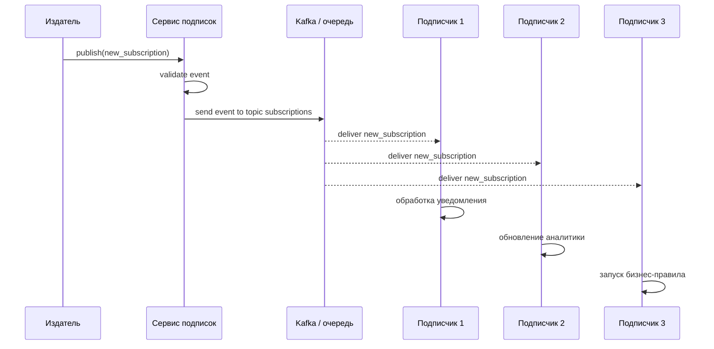
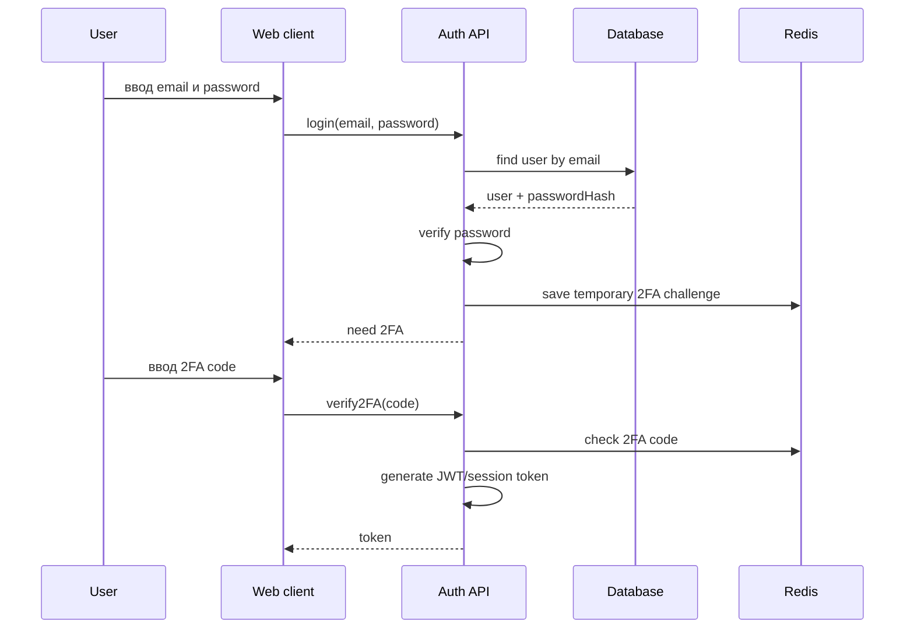
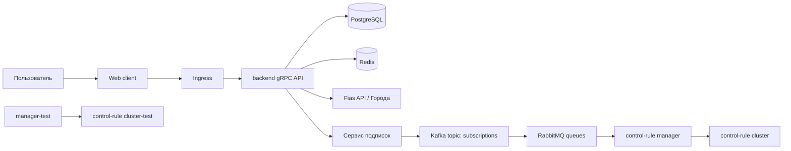

# Все билеты одним файлом

Этот файл дублирует содержимое отдельных файлов, чтобы можно было искать по всему материалу через Ctrl+F.

# Билет №1. Функциональные требования, Издатель, Подписчики

[← Назад к списку билетов](../README.md)

---

## 1. Сам билет

### Теоретический вопрос 1

Что такое функциональные требования (ФТ) в контексте WEB-приложения подписок? Перечислите ключевые ФТ для роли «Издатель» и опишите его место в архитектуре pub/sub.

### Теоретический вопрос 2

Чем отличаются роли «Подписчик 1», «Подписчик 2» и «Подписчик 3» в системе? Какие типы событий или данных может получать каждый из них?

### Практический вопрос

Опишите пошаговый сценарий: Издатель публикует событие «новая подписка», событие доставляется трём подписчикам. Укажите участников и направление сообщений.

---

## 2. Ответы на вопросы

### Теоретический вопрос 1

#### Пояснение

**Функциональные требования (ФТ)** — это описание того, что система должна делать для пользователя или внешнего сервиса. В WEB-приложении подписок ФТ описывают действия, связанные с созданием подписок, публикацией событий, доставкой уведомлений, просмотром статусов и обработкой ошибок.

Для роли **«Издатель»** ключевые ФТ такие:

- создавать событие, например `new_subscription`;
- передавать данные события: id подписки, id пользователя, тип подписчика, дату создания;
- публиковать событие в сервис подписок или брокер сообщений;
- получать подтверждение, что событие принято системой;
- логировать факт публикации;
- не знать напрямую всех получателей события.

В архитектуре **pub/sub** издатель не отправляет сообщение каждому подписчику вручную. Он публикует событие в общий канал, topic или exchange. Дальше система доставки сама передаёт событие подписчикам, которые на него подписаны.

#### Как лучше ответить преподавателю

Функциональные требования — это конкретные действия, которые система должна выполнять. Для издателя главное — создать событие, заполнить данные события, опубликовать его в канал/очередь и получить подтверждение. В pub/sub издатель не знает подписчиков напрямую: он отправляет событие в брокер или сервис подписок, а доставка дальше выполняется инфраструктурой.

### Теоретический вопрос 2

#### Пояснение

**Подписчик 1, Подписчик 2 и Подписчик 3** — это разные потребители событий. Они могут получать одно и то же событие, но использовать его по-разному.

Пример различий:

| Роль | Что получает | Для чего использует |
|---|---|---|
| Подписчик 1 | событие о новой подписке | отправляет email-уведомление пользователю |
| Подписчик 2 | данные подписки и пользователя | обновляет статистику или аналитику |
| Подписчик 3 | событие и параметры подписки | запускает бизнес-правило или начисление платежа |

То есть отличие не обязательно в техническом формате события, а в назначении обработки. Один подписчик может отвечать за уведомления, второй — за аналитику, третий — за платежи или контрольные правила.

#### Как лучше ответить преподавателю

Подписчики 1, 2 и 3 — это разные потребители одного события. Они могут получать одинаковое событие `new_subscription`, но обрабатывать его по-разному: один отправляет уведомление, второй обновляет аналитику, третий запускает бизнес-правило или платёжную операцию. То есть различие в роли и бизнес-назначении обработки.

---

## 3. Практика

### Что важно показать

На практике важно показать участников и направление сообщений: издатель не вызывает подписчиков напрямую, а передаёт событие в сервис/брокер.

### Готовое решение

Текстовый sequence-сценарий:



Алгоритм словами:

1. Издатель создаёт событие `new_subscription`.
2. Сервис подписок проверяет корректность события.
3. Сервис публикует событие в Kafka/topic или очередь.
4. Каждый подписчик получает событие независимо.
5. Подписчики выполняют свою бизнес-логику.
6. Ошибки обработки логируются, при необходимости сообщение попадает в retry/dead-letter очередь.

---

## Мини-шпаргалка перед ответом

- Сначала дай определение ключевого термина из билета.
- Потом свяжи тему с общей архитектурой: **Web client → gRPC → backend → Repository/DB/Redis/Kafka**.
- На практике проговори не только код или схему, но и зачем нужен каждый шаг.


---

# Билет №2. Subscriptions, Kafka, RabbitMQ, SQL-схема

[← Назад к списку билетов](../README.md)

---

## 1. Сам билет

### Теоретический вопрос 1

Что представляет собой сущность Subscriptions в CRM-системе? Какие поля и связи должна содержать модель подписки?

### Теоретический вопрос 2

Как сервис подписок взаимодействует с Kafka и очередями сообщений? Объясните, зачем нужны RabbitMQ и Kafka в crm-cluster и чем они отличаются по назначению.

### Практический вопрос

Спроектируйте SQL-схему таблицы subscriptions (PostgreSQL): первичный ключ, внешние ключи на User, статус подписки, дата создания, тип подписчика (1/2/3). Приведите DDL-запрос CREATE TABLE.

---

## 2. Ответы на вопросы

### Теоретический вопрос 1

#### Пояснение

**Subscriptions** — это сущность подписки в CRM-системе. Она показывает, какой пользователь на что подписан, в каком статусе находится подписка и какой тип подписчика используется.

Модель подписки обычно содержит:

- `id` — уникальный идентификатор подписки;
- `user_id` — связь с пользователем `User`;
- `subscriber_type` — тип подписчика: 1, 2 или 3;
- `status` — статус: active, cancelled, pending, expired;
- `created_at` — дата создания;
- `updated_at` — дата изменения;
- `cancelled_at` — дата отмены, если подписка отменена;
- `source` — источник подписки, например web, admin, api;
- связи с платежами, событиями, аудитом.

Главная связь: один `User` может иметь много `Subscriptions`.

#### Как лучше ответить преподавателю

Subscriptions — это доменная сущность подписки: она связывает пользователя, тип подписчика, статус и даты жизненного цикла. Минимально в ней должны быть id, user_id, subscriber_type, status, created_at и updated_at; дополнительно могут быть cancelled_at, source и связи с платежами/аудитом.

### Теоретический вопрос 2

#### Пояснение

**Сервис подписок** отвечает за создание, изменение и отмену подписок. При важных изменениях он публикует события в брокер сообщений.

**Kafka** и **RabbitMQ** нужны для асинхронной обработки сообщений.

| Критерий | Kafka | RabbitMQ |
|---|---|---|
| Основная идея | распределённый лог событий | брокер очередей сообщений |
| Лучше подходит для | потоков событий, аналитики, event streaming | задач, команд, очередей обработки |
| Хранение сообщений | хранит события определённое время | обычно сообщение исчезает после обработки |
| Модель | topic + consumer groups | exchange + queue + routing |
| Пример в CRM | поток событий подписок | очередь задач для control-rule manager |

В crm-cluster Kafka удобно использовать как шину событий: «подписка создана», «платёж создан», «статус изменён». RabbitMQ удобно использовать для задач, которые нужно гарантированно выполнить конкретными обработчиками.

#### Как лучше ответить преподавателю

Сервис подписок при изменении подписки публикует событие в брокер. Kafka удобна как поток событий и журнал для многих подписчиков, RabbitMQ — как очередь задач с маршрутизацией, retry и dead-letter. В crm-cluster они помогают развязать сервисы и не выполнять все операции синхронно.

---

## 3. Практика

### Что важно показать

В DDL нужно показать первичный ключ, связь с пользователем, ограничение типа подписчика и статус жизненного цикла подписки.

### Готовое решение

DDL PostgreSQL:

```sql
CREATE TABLE users (
    id UUID PRIMARY KEY,
    email VARCHAR(255) NOT NULL UNIQUE
);

CREATE TABLE subscriptions (
    id UUID PRIMARY KEY DEFAULT gen_random_uuid(),
    user_id UUID NOT NULL,
    subscriber_type SMALLINT NOT NULL,
    status VARCHAR(30) NOT NULL DEFAULT 'pending',
    created_at TIMESTAMP NOT NULL DEFAULT CURRENT_TIMESTAMP,
    updated_at TIMESTAMP NOT NULL DEFAULT CURRENT_TIMESTAMP,

    CONSTRAINT fk_subscriptions_user
        FOREIGN KEY (user_id)
        REFERENCES users(id)
        ON DELETE CASCADE,

    CONSTRAINT chk_subscriber_type
        CHECK (subscriber_type IN (1, 2, 3)),

    CONSTRAINT chk_subscription_status
        CHECK (status IN ('pending', 'active', 'cancelled', 'expired'))
);

CREATE INDEX idx_subscriptions_user_id ON subscriptions(user_id);
CREATE INDEX idx_subscriptions_status ON subscriptions(status);
```

---

## Мини-шпаргалка перед ответом

- Сначала дай определение ключевого термина из билета.
- Потом свяжи тему с общей архитектурой: **Web client → gRPC → backend → Repository/DB/Redis/Kafka**.
- На практике проговори не только код или схему, но и зачем нужен каждый шаг.


---

# Билет №3. Web client, HTML, CSS

[← Назад к списку билетов](../README.md)

---

## 1. Сам билет

### Теоретический вопрос 1

Опишите структуру Web client в многослойном WEB-приложении. Какие технологии и слои входят в клиентскую часть согласно карте знаний?

### Теоретический вопрос 2

В чём разница зон ответственности HTML и CSS? Приведите пример: что относится к разметке, а что — к оформлению формы регистрации подписчика.

### Практический вопрос

Напишите HTML-разметку формы подписки (поля: email, тип подписчика — select, кнопка «Подписаться») и CSS-стили для центрирования формы и оформления кнопки.

---

## 2. Ответы на вопросы

### Теоретический вопрос 1

#### Пояснение

**Web client** — это клиентская часть многослойного WEB-приложения, с которой взаимодействует пользователь через браузер.

По roadmap клиентская часть включает:

- **HTML** — структура страницы;
- **CSS** — оформление и расположение элементов;
- **JavaScript/TypeScript** — логика интерфейса;
- **компоненты** — независимые части UI;
- **Input/Output** — передача данных между компонентами;
- **gRPC wrapper** — клиентская обёртка для обращения к backend API;
- обработку состояний: загрузка, ошибка, успешный ответ.

Типичная структура Web client:

```text
Web client
├── pages
│   └── SubscriptionPage
├── components
│   ├── SubscriptionForm
│   └── SubscriptionCard
├── services
│   └── UserGrpcClient / SubscriptionGrpcClient
├── models
│   └── DTO / interfaces
└── styles
    └── CSS files
```

#### Как лучше ответить преподавателю

Web client — это клиентский слой приложения: HTML задаёт структуру страницы, CSS отвечает за внешний вид, TypeScript/JavaScript реализует поведение, компоненты делят интерфейс на части, а обёртка над gRPC изолирует работу с backend API.

### Теоретический вопрос 2

#### Пояснение

**HTML** отвечает за смысловую структуру страницы. Он описывает, какие элементы есть на странице: форма, поле email, select, кнопка.

**CSS** отвечает за внешний вид: цвет, размер, отступы, центрирование, шрифты, состояние кнопки при наведении.

Пример:

- HTML: «здесь находится форма регистрации подписчика»;
- CSS: «форма должна быть по центру, с белым фоном, тенью и синей кнопкой».

Разделение важно, потому что структура и оформление должны быть независимыми.

#### Как лучше ответить преподавателю

HTML отвечает за смысловую разметку: форма, input, label, select, button. CSS отвечает за оформление: размеры, цвета, отступы, центрирование, состояния кнопки. Например, поле email — это HTML, а его ширина, рамка и цвет кнопки — CSS.

---

## 3. Практика

### Что важно показать

Нужно разделить HTML и CSS: HTML создаёт форму и поля, CSS центрирует блок и оформляет кнопку.

### Готовое решение

```html
<!DOCTYPE html>
<html lang="ru">
<head>
    <meta charset="UTF-8" />
    <title>Форма подписки</title>
    <link rel="stylesheet" href="style.css" />
</head>
<body>
    <main class="page">
        <form class="subscription-form">
            <h1>Оформить подписку</h1>

            <label for="email">Email</label>
            <input
                id="email"
                name="email"
                type="email"
                placeholder="user@example.com"
                required
            />

            <label for="subscriberType">Тип подписчика</label>
            <select id="subscriberType" name="subscriberType" required>
                <option value="1">Подписчик 1</option>
                <option value="2">Подписчик 2</option>
                <option value="3">Подписчик 3</option>
            </select>

            <button type="submit">Подписаться</button>
        </form>
    </main>
</body>
</html>
```

```css
* {
    box-sizing: border-box;
}

body {
    margin: 0;
    font-family: Arial, sans-serif;
    background: #f3f5f7;
}

.page {
    min-height: 100vh;
    display: flex;
    justify-content: center;
    align-items: center;
}

.subscription-form {
    width: 360px;
    padding: 24px;
    background: #ffffff;
    border-radius: 12px;
    box-shadow: 0 8px 24px rgba(0, 0, 0, 0.12);
}

.subscription-form h1 {
    margin-top: 0;
    font-size: 24px;
}

.subscription-form label {
    display: block;
    margin-top: 16px;
    margin-bottom: 6px;
}

.subscription-form input,
.subscription-form select {
    width: 100%;
    padding: 10px;
    border: 1px solid #c8c8c8;
    border-radius: 8px;
}

.subscription-form button {
    width: 100%;
    margin-top: 20px;
    padding: 12px;
    border: none;
    border-radius: 8px;
    background: #2563eb;
    color: white;
    font-weight: bold;
    cursor: pointer;
}

.subscription-form button:hover {
    background: #1d4ed8;
}
```

---

## Мини-шпаргалка перед ответом

- Сначала дай определение ключевого термина из билета.
- Потом свяжи тему с общей архитектурой: **Web client → gRPC → backend → Repository/DB/Redis/Kafka**.
- На практике проговори не только код или схему, но и зачем нужен каждый шаг.


---

# Билет №4. Async, Event Loop, Promise

[← Назад к списку билетов](../README.md)

---

## 1. Сам билет

### Теоретический вопрос 1

Что такое асинхронное программирование (async) в JavaScript/TypeScript? Зачем оно необходимо в Web client при обращении к gRPC API?

### Теоретический вопрос 2

Объясните работу Event Loop и механизм Promise. Чем async/await отличается от цепочки .then()/.catch()?

### Практический вопрос

Напишите TypeScript-функцию fetchSubscriptions(userId: string): Promise<Subscription[]> с использованием async/await, которая выполняет HTTP/gRPC-запрос к backend и обрабатывает ошибку сети.

---

## 2. Ответы на вопросы

### Теоретический вопрос 1

#### Пояснение

**Асинхронное программирование** в JavaScript/TypeScript — это способ выполнять длительные операции без блокировки интерфейса. Например, запрос к backend gRPC API может занять время. Если выполнять его синхронно, страница «замрёт». Асинхронность позволяет отправить запрос, продолжить работу интерфейса, а результат обработать позже.

В Web client async нужен для:

- запросов к backend API;
- загрузки списка подписок;
- отправки формы;
- обработки ошибок сети;
- отображения состояния loading/error/success.

#### Как лучше ответить преподавателю

Асинхронность в JS/TS позволяет запускать сетевые запросы без блокировки интерфейса. Когда Web client обращается к gRPC API, ответ может прийти не сразу, поэтому код должен ждать результат через Promise/async-await и при этом не замораживать страницу.

### Теоретический вопрос 2

#### Пояснение

**Event Loop** — механизм JavaScript, который управляет выполнением синхронного кода и асинхронных задач.

Упрощённо:

1. Синхронный код выполняется в Call Stack.
2. Асинхронные операции передаются во внешнюю среду: браузер или Node.js.
3. После завершения результат попадает в очередь задач.
4. Event Loop проверяет, свободен ли Call Stack.
5. Если свободен, callback или продолжение Promise выполняется.

**Promise** — объект, который представляет результат асинхронной операции. У него есть состояния:

- `pending` — ожидание;
- `fulfilled` — успешно выполнено;
- `rejected` — ошибка.

`async/await` — более читаемый синтаксис над Promise. Он позволяет писать асинхронный код почти как обычный последовательный код.

```ts
// Promise chain
api.getUser(id)
  .then(user => console.log(user))
  .catch(error => console.error(error));

// async/await
try {
  const user = await api.getUser(id);
  console.log(user);
} catch (error) {
  console.error(error);
}
```

#### Как лучше ответить преподавателю

Event Loop управляет выполнением: синхронный код идёт в call stack, а результаты асинхронных операций попадают в очереди и выполняются позже. Promise — объект будущего результата. async/await делает работу с Promise похожей на обычный последовательный код, а ошибки удобно ловятся через try/catch; `.then()`/`.catch()` — более цепочный стиль.

---

## 3. Практика

### Что важно показать

Главное — вернуть Promise, использовать async/await, сделать запрос через клиентскую обёртку и обработать сетевую ошибку.

### Готовое решение

```ts
interface Subscription {
    id: string;
    userId: string;
    subscriberType: 1 | 2 | 3;
    status: 'pending' | 'active' | 'cancelled' | 'expired';
    createdAt: string;
}

async function fetchSubscriptions(userId: string): Promise<Subscription[]> {
    try {
        const response = await fetch(`/api/grpc/subscriptions?userId=${userId}`);

        if (!response.ok) {
            throw new Error(`Ошибка backend: ${response.status}`);
        }

        const data = await response.json();
        return data.subscriptions as Subscription[];
    } catch (error) {
        console.error('Не удалось загрузить подписки', error);
        throw new Error('Ошибка сети или backend API');
    }
}
```

Если используется настоящая gRPC-обёртка, вместо `fetch` будет вызов метода клиента, например `subscriptionGrpcClient.getByUserId(userId)`.

---

## Мини-шпаргалка перед ответом

- Сначала дай определение ключевого термина из билета.
- Потом свяжи тему с общей архитектурой: **Web client → gRPC → backend → Repository/DB/Redis/Kafka**.
- На практике проговори не только код или схему, но и зачем нужен каждый шаг.


---

# Билет №5. Component, Input/Output

[← Назад к списку билетов](../README.md)

---

## 1. Сам билет

### Теоретический вопрос 1

Что такое Component в компонентной архитектуре frontend-приложения? Какие преимущества даёт разбиение UI на компоненты?

### Теоретический вопрос 2

Объясните паттерн Input/Output (props/events) при передаче данных между родительским и дочерним компонентами. Приведите пример для компонента «SubscriptionCard».

### Практический вопрос

Напишите псевдокод или TypeScript-компонент SubscriptionForm с @Input() userId и @Output() onSubmit, который эмитит данные формы родителю при нажатии кнопки.

---

## 2. Ответы на вопросы

### Теоретический вопрос 1

#### Пояснение

**Component** — это независимая часть пользовательского интерфейса, которая объединяет:

- шаблон HTML;
- стили CSS;
- логику TypeScript/JavaScript;
- входные данные;
- события наружу.

Примеры компонентов:

- `SubscriptionForm` — форма создания подписки;
- `SubscriptionCard` — карточка одной подписки;
- `UserProfile` — профиль пользователя;
- `NotificationList` — список уведомлений.

Преимущества компонентного подхода:

- код проще читать;
- компоненты можно переиспользовать;
- легче тестировать отдельные части;
- проще делить работу между разработчиками;
- UI становится более структурированным.

#### Как лучше ответить преподавателю

Component — это самостоятельный блок интерфейса со своим шаблоном, стилями, состоянием и логикой. Компоненты позволяют переиспользовать UI, легче тестировать код, разделять ответственность и собирать сложный экран из простых частей.

### Теоретический вопрос 2

#### Пояснение

**Input/Output** — паттерн взаимодействия родительского и дочернего компонентов.

- **Input** — данные, которые родитель передаёт дочернему компоненту.
- **Output** — событие, которое дочерний компонент отправляет родителю.

Пример для `SubscriptionCard`:

- родитель передаёт в карточку объект подписки через `Input`;
- карточка показывает статус и тип подписки;
- если пользователь нажал «Отменить», карточка отправляет событие `cancel` через `Output`.

```text
ParentComponent
 ├── передаёт subscription -> SubscriptionCard
 └── слушает событие cancel <- SubscriptionCard
```

#### Как лучше ответить преподавателю

Input передаёт данные от родителя к дочернему компоненту, а Output передаёт событие от дочернего компонента родителю. Например, родитель передаёт в `SubscriptionCard` объект подписки через Input, а карточка отправляет событие `cancel` через Output при нажатии кнопки отмены.

---

## 3. Практика

### Что важно показать

Покажи направление данных: userId приходит в компонент через Input, а данные формы уходят родителю через Output/event emitter.

### Готовое решение

Angular-подобный пример:

```ts
import { Component, EventEmitter, Input, Output } from '@angular/core';

interface SubscriptionFormData {
    userId: string;
    email: string;
    subscriberType: 1 | 2 | 3;
}

@Component({
    selector: 'app-subscription-form',
    template: `
        <form (submit)="submit($event)">
            <input
                type="email"
                placeholder="Email"
                [(ngModel)]="email"
                name="email"
                required
            />

            <select [(ngModel)]="subscriberType" name="subscriberType">
                <option [value]="1">Подписчик 1</option>
                <option [value]="2">Подписчик 2</option>
                <option [value]="3">Подписчик 3</option>
            </select>

            <button type="submit">Подписаться</button>
        </form>
    `
})
export class SubscriptionFormComponent {
    @Input() userId!: string;
    @Output() onSubmit = new EventEmitter<SubscriptionFormData>();

    email = '';
    subscriberType: 1 | 2 | 3 = 1;

    submit(event: Event): void {
        event.preventDefault();

        this.onSubmit.emit({
            userId: this.userId,
            email: this.email,
            subscriberType: this.subscriberType
        });
    }
}
```

---

## Мини-шпаргалка перед ответом

- Сначала дай определение ключевого термина из билета.
- Потом свяжи тему с общей архитектурой: **Web client → gRPC → backend → Repository/DB/Redis/Kafka**.
- На практике проговори не только код или схему, но и зачем нужен каждый шаг.


---

# Билет №6. UI/UX и accessibility

[← Назад к списку билетов](../README.md)

---

## 1. Сам билет

### Теоретический вопрос 1

Перечислите основные принципы UI/UX для WEB-приложений. Как они применяются при проектировании интерфейса подписчика?

### Теоретический вопрос 2

Что такое доступность (accessibility) WEB-форм? Какие атрибуты HTML и практики следует использовать для формы подписки?

### Практический вопрос

Опишите wireframe экрана «Личный кабинет подписчика»: список активных подписок, кнопка отмены, блок уведомлений. Укажите расположение элементов.

---

## 2. Ответы на вопросы

### Теоретический вопрос 1

#### Пояснение

**UI** — это визуальная часть интерфейса: кнопки, формы, цвета, карточки, таблицы.

**UX** — это пользовательский опыт: насколько удобно, понятно и быстро пользователь достигает цели.

Основные принципы UI/UX для WEB-приложений:

- понятная навигация;
- единый стиль элементов;
- минимальное количество лишних действий;
- читаемые тексты и подписи;
- видимая обратная связь после действий;
- корректные сообщения об ошибках;
- адаптивность под разные экраны;
- доступность для пользователей с ограничениями.

Для интерфейса подписчика это означает:

- активные подписки должны быть видны сразу;
- кнопка отмены должна быть понятной, но не случайной;
- ошибки оплаты или подписки должны объясняться простым текстом;
- статус подписки должен быть заметным.

#### Как лучше ответить преподавателю

UI/UX — это удобство и понятность интерфейса. Для личного кабинета подписчика важны ясная структура, видимые статусы подписок, понятные кнопки, подтверждения опасных действий, сообщения об ошибках и адаптивность под разные экраны.

### Теоретический вопрос 2

#### Пояснение

**Accessibility** — это доступность интерфейса для разных пользователей, включая тех, кто использует клавиатуру, экранные дикторы или имеет ограничения зрения.

Для WEB-форм следует использовать:

- `label` для каждого поля;
- связку `label for="id"` и `input id="id"`;
- правильные типы полей: `email`, `password`, `text`;
- `required`, `aria-required`, если поле обязательно;
- `aria-invalid`, если поле заполнено неверно;
- понятные сообщения об ошибках;
- достаточный контраст текста и фона;
- возможность пройти форму клавишей Tab;
- не использовать только цвет для передачи смысла.

Пример:

```html
<label for="email">Email</label>
<input id="email" type="email" required aria-describedby="emailHelp" />
<small id="emailHelp">Введите email для получения уведомлений.</small>
```

#### Как лучше ответить преподавателю

Accessibility — это доступность формы для всех пользователей, включая тех, кто использует клавиатуру или screen reader. Нужно использовать label для каждого поля, семантические элементы, правильные типы input, aria-атрибуты только где нужно, видимый focus и понятные тексты ошибок.

---

## 3. Практика

### Что важно показать

В wireframe оценивают не красоту, а структуру экрана: где список подписок, где действия, где уведомления и статусные блоки.

### Готовое решение

Wireframe личного кабинета подписчика:

```text
+------------------------------------------------------+
| Header                                               |
| Логотип                     Профиль | Выйти           |
+------------------------------------------------------+
| Sidebar              | Main content                  |
| - Мои подписки       |                              |
| - Платежи            | Личный кабинет подписчика    |
| - Настройки          |                              |
|                      | +--------------------------+ |
|                      | | Активные подписки        | |
|                      | |                          | |
|                      | | [Подписка #1] active     | |
|                      | | Тип: 1                   | |
|                      | | [Отменить]               | |
|                      | |                          | |
|                      | | [Подписка #2] active     | |
|                      | | Тип: 2                   | |
|                      | | [Отменить]               | |
|                      | +--------------------------+ |
|                      |                              |
|                      | +--------------------------+ |
|                      | | Уведомления              | |
|                      | | - Подписка создана       | |
|                      | | - Платёж успешно принят  | |
|                      | +--------------------------+ |
+------------------------------------------------------+
```

Логика расположения: слева навигация, сверху общая шапка, в центре основные подписки, справа или ниже — уведомления.

---

## Мини-шпаргалка перед ответом

- Сначала дай определение ключевого термина из билета.
- Потом свяжи тему с общей архитектурой: **Web client → gRPC → backend → Repository/DB/Redis/Kafka**.
- На практике проговори не только код или схему, но и зачем нужен каждый шаг.


---

# Билет №7. gRPC, REST, Protocol Buffers

[← Назад к списку билетов](../README.md)

---

## 1. Сам билет

### Теоретический вопрос 1

Сравните gRPC и REST: протокол, формат данных, производительность, типизация. Почему для backend CRM выбран gRPC?

### Теоретический вопрос 2

Что такое Protocol Buffers (protobuf)? Какие типы вызовов поддерживает gRPC (unary, server streaming, client streaming, bidirectional)?

### Практический вопрос

Напишите файл user.proto с сообщениями UserRequest, UserResponse и сервисом UserService с методами GetUser и CreateUser.

---

## 2. Ответы на вопросы

### Теоретический вопрос 1

#### Пояснение

**REST** — архитектурный стиль, чаще всего использующий HTTP и JSON. Ресурсы доступны через URL, например `/users/1`, а операции выражаются HTTP-методами: GET, POST, PUT, DELETE.

**gRPC** — RPC-фреймворк, где клиент вызывает методы сервиса почти как обычные функции. Обычно использует HTTP/2 и Protocol Buffers.

| Критерий | REST | gRPC |
|---|---|---|
| Стиль | работа с ресурсами | вызов методов сервиса |
| Протокол | обычно HTTP/1.1 или HTTP/2 | HTTP/2 |
| Формат | чаще JSON | Protocol Buffers |
| Типизация | слабее, через документацию/OpenAPI | строгий контракт `.proto` |
| Производительность | хорошая, но JSON тяжелее | высокая, бинарный формат |
| Streaming | не основной сценарий | поддерживается встроенно |

Для backend CRM выбран gRPC, потому что он даёт строгий контракт, хорошую производительность и удобен для взаимодействия сервисов внутри кластера.

#### Как лучше ответить преподавателю

REST обычно использует HTTP и JSON, он проще и удобен для публичных API. gRPC использует контракт protobuf, бинарную сериализацию и HTTP/2, поэтому он быстрее и строже типизирован. Для внутреннего backend CRM gRPC удобен из-за контракта, производительности и автогенерации клиентов/серверов.

### Теоретический вопрос 2

#### Пояснение

**Protocol Buffers** — это формат описания сообщений и сервисов. В `.proto`-файле задаются структуры данных и методы gRPC-сервиса. По этому файлу можно сгенерировать клиентский и серверный код.

gRPC поддерживает 4 типа вызовов:

1. **Unary** — один запрос, один ответ.
2. **Server streaming** — один запрос, поток ответов от сервера.
3. **Client streaming** — поток запросов от клиента, один ответ сервера.
4. **Bidirectional streaming** — поток запросов и поток ответов одновременно.

#### Как лучше ответить преподавателю

Protocol Buffers — это формат описания сообщений и сервисов для gRPC. В `.proto` файле задаются структуры данных и RPC-методы. gRPC поддерживает unary-вызов, server streaming, client streaming и bidirectional streaming.

---

## 3. Практика

### Что важно показать

В `.proto` важно указать syntax, package, сообщения request/response и service с RPC-методами.

### Готовое решение

`user.proto`:

```proto
syntax = "proto3";

package crm.user;

service UserService {
  rpc GetUser (UserRequest) returns (UserResponse);
  rpc CreateUser (CreateUserRequest) returns (UserResponse);
}

message UserRequest {
  string id = 1;
}

message CreateUserRequest {
  string email = 1;
  string first_name = 2;
  string last_name = 3;
}

message UserResponse {
  string id = 1;
  string email = 2;
  string first_name = 3;
  string last_name = 4;
  string created_at = 5;
}
```

---

## Мини-шпаргалка перед ответом

- Сначала дай определение ключевого термина из билета.
- Потом свяжи тему с общей архитектурой: **Web client → gRPC → backend → Repository/DB/Redis/Kafka**.
- На практике проговори не только код или схему, но и зачем нужен каждый шаг.


---

# Билет №8. Обёртка над gRPC, слои backend API

[← Назад к списку билетов](../README.md)

---

## 1. Сам билет

### Теоретический вопрос 1

Зачем нужна обёртка над gRPC на стороне Web client? Какие задачи она решает (скрытие деталей протокола, обработка ошибок, типизация)?

### Теоретический вопрос 2

Опишите слои backend grpc API: transport (gRPC), service, repository. Как организованы «вызовы» от клиента к серверу?

### Практический вопрос

Напишите TypeScript-класс UserGrpcClient — обёртку с методом getUser(id: string), который вызывает gRPC-метод и возвращает DTO пользователя. Допустим псевдокод с указанием ключевых шагов.

---

## 2. Ответы на вопросы

### Теоретический вопрос 1

#### Пояснение

**Обёртка над gRPC** на стороне Web client нужна, чтобы UI-компоненты не работали напрямую с низкоуровневыми деталями gRPC.

Она решает задачи:

- скрывает детали создания gRPC-клиента;
- приводит ответы backend к удобным DTO;
- централизованно обрабатывает ошибки;
- добавляет авторизационные заголовки/token;
- преобразует даты, статусы и enum;
- делает код компонентов проще;
- повышает типобезопасность.

Без обёртки каждый компонент сам бы знал, как вызвать gRPC, как обработать ошибку, как распарсить ответ. Это приводит к дублированию и хаосу.

#### Как лучше ответить преподавателю

Обёртка над gRPC нужна, чтобы frontend не работал с низкоуровневыми деталями транспорта. Она скрывает создание клиента, преобразует ответы в DTO, централизованно обрабатывает ошибки, токены авторизации и типизацию.

### Теоретический вопрос 2

#### Пояснение

Слои backend gRPC API:

1. **Transport layer** — слой gRPC. Принимает запросы, преобразует protobuf-сообщения, возвращает gRPC-ответы.
2. **Service layer** — слой бизнес-операций. Здесь проверяются правила: можно ли создать пользователя, валиден ли email, какие права у пользователя.
3. **Repository layer** — слой доступа к данным. Он сохраняет и читает данные из PostgreSQL или другой СУБД.

Организация вызова:

```text
Web client
  -> gRPC wrapper
    -> backend gRPC transport
      -> service
        -> repository
          -> database
```

Ответ идёт обратно по той же цепочке.

#### Как лучше ответить преподавателю

В backend gRPC API есть transport-слой, который принимает RPC-запрос, service-слой с бизнес-логикой и repository-слой для работы с БД. Вызов идёт так: Web client → gRPC wrapper → transport → service → repository → DB, затем ответ возвращается обратно как DTO.

---

## 3. Практика

### Что важно показать

Покажи класс-обёртку: метод принимает простой id, вызывает gRPC, обрабатывает ошибку и возвращает понятный UserDto.

### Готовое решение

```ts
interface UserDto {
    id: string;
    email: string;
    firstName: string;
    lastName: string;
}

class UserGrpcClient {
    constructor(private readonly grpcClient: any) {}

    async getUser(id: string): Promise<UserDto> {
        try {
            const response = await this.grpcClient.getUser({ id });

            return {
                id: response.id,
                email: response.email,
                firstName: response.first_name,
                lastName: response.last_name
            };
        } catch (error) {
            console.error('gRPC GetUser failed', error);
            throw new Error('Не удалось получить пользователя');
        }
    }
}
```

Ключевые шаги:

1. Метод принимает `id`.
2. Формирует gRPC request.
3. Вызывает `GetUser` на backend.
4. Полученный protobuf-response преобразует в `UserDto`.
5. Ошибки обрабатывает централизованно.

---

## Мини-шпаргалка перед ответом

- Сначала дай определение ключевого термина из билета.
- Потом свяжи тему с общей архитектурой: **Web client → gRPC → backend → Repository/DB/Redis/Kafka**.
- На практике проговори не только код или схему, но и зачем нужен каждый шаг.


---

# Билет №9. CRUD через backend gRPC API

[← Назад к списку билетов](../README.md)

---

## 1. Сам билет

### Теоретический вопрос 1

Как реализовать CRUD-операции через backend grpc API? Опишите методы Create, Read, Update, Delete для сущности User.

### Теоретический вопрос 2

Сравните два подхода: прямая работа Web client с PostgreSQL и работа через gRPC. Почему прямой доступ к БД с клиента недопустим?

### Практический вопрос

Напишите псевдокод gRPC-метода CreateUser: валидация входных данных, сохранение в PostgreSQL через Repository, возврат созданного User DTO.

---

## 2. Ответы на вопросы

### Теоретический вопрос 1

#### Пояснение

**CRUD** — базовые операции с сущностью:

- **Create** — создать;
- **Read** — прочитать;
- **Update** — обновить;
- **Delete** — удалить.

Для сущности `User` в backend gRPC API можно сделать методы:

```proto
service UserService {
  rpc CreateUser(CreateUserRequest) returns (UserResponse);
  rpc GetUser(GetUserRequest) returns (UserResponse);
  rpc UpdateUser(UpdateUserRequest) returns (UserResponse);
  rpc DeleteUser(DeleteUserRequest) returns (DeleteUserResponse);
}
```

Логика:

- `CreateUser` валидирует данные и сохраняет пользователя;
- `GetUser` ищет пользователя по id;
- `UpdateUser` проверяет существование и обновляет поля;
- `DeleteUser` удаляет пользователя или помечает как удалённого.

#### Как лучше ответить преподавателю

CRUD через backend gRPC API — это набор методов Create, Read, Update и Delete. Каждый метод принимает DTO/request, проверяет права и валидность данных, вызывает сервис/репозиторий и возвращает результат или ошибку.

### Теоретический вопрос 2

#### Пояснение

Прямой доступ Web client к PostgreSQL недопустим.

Причины:

- нельзя отдавать клиенту логин и пароль от БД;
- пользователь может обойти бизнес-логику;
- невозможно нормально проверить права доступа;
- открывается риск SQL-инъекций и утечки данных;
- клиент становится жёстко связан со схемой БД;
- нельзя централизованно логировать и аудитить операции.

Правильный подход:

```text
Web client -> gRPC API -> Service -> Repository -> PostgreSQL
```

Так backend контролирует валидацию, авторизацию, транзакции, аудит и формат ответа.

#### Как лучше ответить преподавателю

Клиент не должен подключаться к PostgreSQL напрямую, потому что тогда раскрываются доступы к БД, обходится авторизация и бизнес-логика, сложнее контролировать валидацию и аудит. Правильный вариант — клиент вызывает backend через gRPC, а backend уже безопасно работает с БД.

---

## 3. Практика

### Что важно показать

В псевдокоде важно показать валидацию, проверку существования, вызов Repository, сохранение и возврат DTO.

### Готовое решение

Псевдокод `CreateUser`:

```ts
interface CreateUserRequest {
    email: string;
    firstName: string;
    lastName: string;
}

interface UserDto {
    id: string;
    email: string;
    firstName: string;
    lastName: string;
    createdAt: string;
}

async function createUser(request: CreateUserRequest): Promise<UserDto> {
    if (!request.email || !request.email.includes('@')) {
        throw new Error('Некорректный email');
    }

    const existingUser = await userRepository.findByEmail(request.email);
    if (existingUser) {
        throw new Error('Пользователь уже существует');
    }

    const user = {
        id: crypto.randomUUID(),
        email: request.email,
        firstName: request.firstName,
        lastName: request.lastName,
        createdAt: new Date()
    };

    const savedUser = await userRepository.save(user);

    await auditService.write({
        action: 'CREATE_USER',
        entityType: 'User',
        entityId: savedUser.id,
        newValue: savedUser
    });

    return {
        id: savedUser.id,
        email: savedUser.email,
        firstName: savedUser.firstName,
        lastName: savedUser.lastName,
        createdAt: savedUser.createdAt.toISOString()
    };
}
```

---

## Мини-шпаргалка перед ответом

- Сначала дай определение ключевого термина из билета.
- Потом свяжи тему с общей архитектурой: **Web client → gRPC → backend → Repository/DB/Redis/Kafka**.
- На практике проговори не только код или схему, но и зачем нужен каждый шаг.


---

# Билет №10. DTO, Entity, User и Person

[← Назад к списку билетов](../README.md)

---

## 1. Сам билет

### Теоретический вопрос 1

Что такое DTO (Data Transfer Object)? Зачем отделять DTO от доменных сущностей Entity при передаче данных между слоями?

### Теоретический вопрос 2

В чём различие сущностей User и Person в доменной модели? Когда используется каждая из них?

### Практический вопрос

Опишите TypeScript-интерфейсы UserDto, PersonDto и функцию mapEntityToDto(user: User): UserDto, выполняющую маппинг Entity → DTO.

---

## 2. Ответы на вопросы

### Теоретический вопрос 1

#### Пояснение

**DTO (Data Transfer Object)** — объект для передачи данных между слоями или сервисами. DTO содержит только те поля, которые нужно передать наружу или получить снаружи.

**Entity** — доменная сущность, которая отражает внутреннюю бизнес-модель. Она может содержать методы, внутренние поля, связи и правила.

Почему DTO отделяют от Entity:

- чтобы не отдавать лишние внутренние поля клиенту;
- чтобы скрыть структуру БД;
- чтобы не связывать API с доменной моделью;
- чтобы безопасно контролировать формат ответа;
- чтобы легче менять внутреннюю реализацию.

Например, Entity `User` может хранить `passwordHash`, но в `UserDto` этого поля быть не должно.

#### Как лучше ответить преподавателю

DTO — это объект передачи данных между слоями или сервисами. Его отделяют от Entity, потому что Entity отражает внутреннюю доменную модель и может содержать лишние поля, связи и служебную логику. DTO отдаёт наружу только нужные безопасные данные.

### Теоретический вопрос 2

#### Пояснение

`Person` и `User` — похожие, но разные сущности.

**Person** — физическое лицо, данные о человеке:

- имя;
- фамилия;
- дата рождения;
- адрес;
- телефон.

**User** — учётная запись в системе:

- email/login;
- passwordHash;
- role;
- status;
- связь с Person.

Пример: человек Иван Иванов — это `Person`. Его аккаунт для входа в CRM — это `User`. Один `Person` может быть связан с одним или несколькими аккаунтами, в зависимости от модели.

#### Как лучше ответить преподавателю

User — это системная сущность учётной записи: логин, email, роль, статус, id. Person — это данные о человеке: имя, фамилия, адрес, дата рождения. User нужен для входа и прав доступа, Person — для персональной информации в CRM.

---

## 3. Практика

### Что важно показать

Практика проверяет, понимаешь ли ты разницу между внутренней Entity и внешним DTO, поэтому покажи маппинг и не отдавай лишние поля.

### Готовое решение

```ts
interface PersonDto {
    id: string;
    firstName: string;
    lastName: string;
    birthDate?: string;
}

interface UserDto {
    id: string;
    email: string;
    role: 'admin' | 'subscriber';
    status: 'active' | 'blocked';
    person: PersonDto;
}

interface Person {
    id: string;
    firstName: string;
    lastName: string;
    birthDate?: Date;
}

interface User {
    id: string;
    email: string;
    passwordHash: string;
    role: 'admin' | 'subscriber';
    status: 'active' | 'blocked';
    person: Person;
}

function mapEntityToDto(user: User): UserDto {
    return {
        id: user.id,
        email: user.email,
        role: user.role,
        status: user.status,
        person: {
            id: user.person.id,
            firstName: user.person.firstName,
            lastName: user.person.lastName,
            birthDate: user.person.birthDate?.toISOString()
        }
    };
}
```

Важно: `passwordHash` не попадает в DTO.

---

## Мини-шпаргалка перед ответом

- Сначала дай определение ключевого термина из билета.
- Потом свяжи тему с общей архитектурой: **Web client → gRPC → backend → Repository/DB/Redis/Kafka**.
- На практике проговори не только код или схему, но и зачем нужен каждый шаг.


---

# Билет №11. Repository, интерфейс, source

[← Назад к списку билетов](../README.md)

---

## 1. Сам билет

### Теоретический вопрос 1

Объясните паттерн Repository. Какую роль играет интерфейс репозитория (I) и чем source отличается от реализации?

### Теоретический вопрос 2

Как Repository обеспечивает абстракцию над разными источниками данных (Postgres, SQLite, SQL Server)?

### Практический вопрос

Напишите интерфейс IUserRepository с методами findById, save, delete и класс PostgresUserRepository, реализующий этот интерфейс (сигнатуры методов, без полной реализации SQL).

---

## 2. Ответы на вопросы

### Теоретический вопрос 1

#### Пояснение

**Repository** — паттерн проектирования, который отделяет бизнес-логику от конкретного способа хранения данных.

Сервис не должен знать, как именно выполняется SQL-запрос. Он работает с интерфейсом:

```text
UserService -> IUserRepository -> PostgresUserRepository -> PostgreSQL
```

**Интерфейс репозитория** задаёт контракт: какие методы доступны. Например:

- `findById(id)`;
- `save(user)`;
- `delete(id)`.

**Source** — источник данных: PostgreSQL, SQLite, SQL Server, внешний API, файл. Реализация репозитория зависит от source, но сервисный слой об этом не знает.

#### Как лучше ответить преподавателю

Repository — это паттерн, который скрывает работу с БД за интерфейсом. Интерфейс `IUserRepository` задаёт контракт методов, например findById/save/delete. Source — это источник данных, например PostgreSQL или SQLite, а реализация — конкретный класс, который умеет обращаться к этому source.

### Теоретический вопрос 2

#### Пояснение

Repository обеспечивает абстракцию так:

```text
IUserRepository
├── PostgresUserRepository
├── SQLiteUserRepository
└── SqlServerUserRepository
```

Сервис вызывает методы интерфейса. Если нужно заменить PostgreSQL на SQLite для тестов, меняется только реализация репозитория, а бизнес-логика остаётся прежней.

Преимущества:

- меньше связность кода;
- проще тестировать;
- можно менять СУБД;
- SQL изолирован в одном слое;
- бизнес-логика становится чище.

#### Как лучше ответить преподавателю

Repository даёт единый интерфейс для разных СУБД. Service работает с `IUserRepository` и не знает, где лежат данные. Можно подставить `PostgresUserRepository`, `SqliteUserRepository` или `SqlServerUserRepository`, не меняя бизнес-логику.

---

## 3. Практика

### Что важно показать

Нужно показать интерфейс и одну конкретную реализацию под PostgreSQL, без обязательной полной SQL-реализации.

### Готовое решение

```ts
interface User {
    id: string;
    email: string;
    firstName: string;
    lastName: string;
}

interface IUserRepository {
    findById(id: string): Promise<User | null>;
    save(user: User): Promise<User>;
    delete(id: string): Promise<void>;
}

class PostgresUserRepository implements IUserRepository {
    constructor(private readonly db: any) {}

    async findById(id: string): Promise<User | null> {
        // SELECT id, email, first_name, last_name FROM users WHERE id = $1
        return null;
    }

    async save(user: User): Promise<User> {
        // INSERT INTO users (...) VALUES (...)
        // или UPDATE users SET ... WHERE id = $1
        return user;
    }

    async delete(id: string): Promise<void> {
        // DELETE FROM users WHERE id = $1
    }
}
```

---

## Мини-шпаргалка перед ответом

- Сначала дай определение ключевого термина из билета.
- Потом свяжи тему с общей архитектурой: **Web client → gRPC → backend → Repository/DB/Redis/Kafka**.
- На практике проговори не только код или схему, но и зачем нужен каждый шаг.


---

# Билет №12. PostgreSQL, SQLite, SQL Server, DB

[← Назад к списку билетов](../README.md)

---

## 1. Сам билет

### Теоретический вопрос 1

Сравните PostgreSQL, SQLite и SQL Server: область применения, масштабируемость, поддержка в WEB-приложениях. Когда какую СУБД выбрать?

### Теоретический вопрос 2

Что означает узел «DB» на карте знаний? Как унифицировать работу с разными СУБД через единый слой доступа к данным?

### Практический вопрос

Напишите SQL-запрос (PostgreSQL): получить список пользователей с их платежами — JOIN таблиц users и payments, вывести user_id, email, payment_amount, payment_date.

---

## 2. Ответы на вопросы

### Теоретический вопрос 1

#### Пояснение

Сравнение СУБД:

| СУБД | Где использовать | Плюсы | Ограничения |
|---|---|---|---|
| PostgreSQL | production WEB-приложения | мощная, надёжная, расширяемая, хорошо подходит для backend | требует отдельного сервера |
| SQLite | локальная разработка, тесты, маленькие приложения | простой файл, не нужен сервер | плохо подходит для высокой нагрузки |
| SQL Server | корпоративные системы, Microsoft-экосистема | мощная enterprise-СУБД, интеграция с Windows/.NET | тяжелее и сложнее в настройке |

Когда выбирать:

- PostgreSQL — основной выбор для CRM и WEB backend.
- SQLite — для локальных тестов, прототипов, мобильных/встроенных решений.
- SQL Server — если инфраструктура компании построена на Microsoft-технологиях.

#### Как лучше ответить преподавателю

PostgreSQL подходит для серьёзных web-приложений и высокой нагрузки, SQLite — для локальной разработки, тестов и небольших приложений, SQL Server — для корпоративной Windows/.NET-инфраструктуры. В CRM основная СУБД — PostgreSQL.

### Теоретический вопрос 2

#### Пояснение

Узел **DB** на карте знаний означает слой баз данных или источников данных. В системе может быть несколько СУБД, но бизнес-логика не должна зависеть от конкретной.

Унификация делается через слой доступа к данным:

```text
Service / Logic
   -> Repository Interface
      -> Postgres Repository
      -> SQLite Repository
      -> SQL Server Repository
```

Так приложение работает с единым контрактом, а конкретная реализация выбирается конфигурацией.

#### Как лучше ответить преподавателю

Узел DB на карте — это слой хранения данных. Унифицировать работу с разными СУБД можно через Repository/DAO: сервисы вызывают общий интерфейс, а конкретная реализация внутри использует нужный SQL-драйвер и диалект.

---

## 3. Практика

### Что важно показать

В JOIN нужно связать users и payments по user_id и вывести только требуемые поля.

### Готовое решение

SQL-запрос PostgreSQL:

```sql
SELECT
    u.id AS user_id,
    u.email,
    p.amount AS payment_amount,
    p.payment_date
FROM users u
JOIN payments p ON p.user_id = u.id
ORDER BY p.payment_date DESC;
```

Если нужно вывести пользователей даже без платежей:

```sql
SELECT
    u.id AS user_id,
    u.email,
    p.amount AS payment_amount,
    p.payment_date
FROM users u
LEFT JOIN payments p ON p.user_id = u.id
ORDER BY p.payment_date DESC;
```

---

## Мини-шпаргалка перед ответом

- Сначала дай определение ключевого термина из билета.
- Потом свяжи тему с общей архитектурой: **Web client → gRPC → backend → Repository/DB/Redis/Kafka**.
- На практике проговори не только код или схему, но и зачем нужен каждый шаг.


---

# Билет №13. Redis, кэш, сессии, pub/sub, Fias cache

[← Назад к списку билетов](../README.md)

---

## 1. Сам билет

### Теоретический вопрос 1

Какие задачи решает Redis в WEB-приложении? Перечислите сценарии: кэш, сессии, pub/sub.

### Теоретический вопрос 2

Как Redis используется в crm-cluster (конфигурация 4G)? Какие данные целесообразно кэшировать?

### Практический вопрос

Опишите стратегию кэширования справочника «Города» (Fias API): ключ кэша, TTL, алгоритм «cache-aside» при запросе города по ID.

---

## 2. Ответы на вопросы

### Теоретический вопрос 1

#### Пояснение

**Redis** — это быстрое in-memory хранилище ключ-значение. Данные в основном находятся в оперативной памяти, поэтому доступ к ним очень быстрый.

Задачи Redis в WEB-приложении:

- **кэш** часто запрашиваемых данных;
- **сессии** пользователей;
- **rate limiting** — ограничение частоты запросов;
- **pub/sub** — простая публикация и подписка на сообщения;
- временные токены, например код 2FA;
- блокировки и счётчики.

#### Как лучше ответить преподавателю

Redis — это быстрое in-memory хранилище. В web-приложении он используется для кэша, сессий, временных токенов, rate limiting, pub/sub и быстрых справочников. Его задача — снизить нагрузку на БД и ускорить частые запросы.

### Теоретический вопрос 2

#### Пояснение

В crm-cluster Redis может использоваться как быстрый общий сервис для backend-компонентов.

Конфигурация **4G** в контексте карты знаний, вероятнее всего, означает выделенный объём памяти около 4 GB под Redis. Это ограничивает, какие данные стоит туда класть.

Целесообразно кэшировать:

- справочник городов;
- результаты Fias API;
- сессии пользователей;
- временные токены;
- часто читаемые настройки;
- данные, которые можно восстановить из основной БД.

Не стоит хранить в Redis как единственном источнике:

- критически важные платежи;
- аудит;
- единственные копии пользовательских данных.

#### Как лучше ответить преподавателю

В crm-cluster Redis можно использовать как выделенный быстрый кэш, например с ограничением памяти 4G. Кэшировать стоит часто читаемые и редко меняющиеся данные: города, настройки, права, сессии, результаты Fias API и временные состояния.

---

## 3. Практика

### Что важно показать

Алгоритм cache-aside: сначала читаем Redis, при промахе идём во внешний API/БД, кладём в кэш с TTL и возвращаем результат.

### Готовое решение

Стратегия кэширования справочника «Города» через Fias API.

Ключ кэша:

```text
city:{cityId}
```

Пример:

```text
city:7700000000000
```

TTL:

```text
24 часа или 7 дней
```

Алгоритм **cache-aside**:

```ts
async function getCityById(cityId: string): Promise<CityDto> {
    const cacheKey = `city:${cityId}`;

    const cachedCity = await redis.get(cacheKey);
    if (cachedCity) {
        return JSON.parse(cachedCity);
    }

    const city = await fiasApi.getCityById(cityId);

    await redis.set(
        cacheKey,
        JSON.stringify(city),
        'EX',
        60 * 60 * 24
    );

    return city;
}
```

Смысл: сначала смотрим Redis, если данных нет — идём во внешний Fias API, затем сохраняем результат в Redis.

---

## Мини-шпаргалка перед ответом

- Сначала дай определение ключевого термина из билета.
- Потом свяжи тему с общей архитектурой: **Web client → gRPC → backend → Repository/DB/Redis/Kafka**.
- На практике проговори не только код или схему, но и зачем нужен каждый шаг.


---

# Билет №14. Fias API и справочник городов

[← Назад к списку билетов](../README.md)

---

## 1. Сам билет

### Теоретический вопрос 1

Что такое Fias API? Для каких задач используется интеграция с ФИАС в CRM-приложении?

### Теоретический вопрос 2

Как организован справочник «Города» в приложении? Как связаны локальная таблица городов и внешний Fias API?

### Практический вопрос

Напишите алгоритм нормализации адреса пользователя: ввод «Москва, ул. Ленина, 1» → запрос к Fias API → сохранение city_id, street, house в БД. Опишите шаги или псевдокод.

---

## 2. Ответы на вопросы

### Теоретический вопрос 1

#### Пояснение

**Fias API** — это API для работы с адресной информацией ФИАС. В CRM-приложении он нужен для нормализации и проверки адресов.

Задачи интеграции с ФИАС:

- проверка существования города;
- получение уникального идентификатора города;
- нормализация адреса;
- автодополнение при вводе адреса;
- уменьшение ошибок в адресных данных;
- связь локальной записи пользователя с официальным справочником.

#### Как лучше ответить преподавателю

Fias API — это внешний сервис/справочник адресной информации. В CRM он нужен для проверки и нормализации адресов: город, улица, дом, идентификаторы адресных объектов. Это уменьшает ошибки ручного ввода.

### Теоретический вопрос 2

#### Пояснение

Справочник «Города» можно организовать двумя способами:

1. **Полностью внешний справочник**: каждый раз обращаться к Fias API.
2. **Локальная таблица + внешний API**: часто используемые города сохраняются в БД, а Fias API используется для проверки и обновления.

Лучший вариант для CRM:

```text
User address -> local cities table -> fias_id -> Fias API
```

Локальная таблица `cities` может содержать:

- `id` — внутренний id;
- `fias_id` — id из ФИАС;
- `name` — название города;
- `region` — регион;
- `created_at`, `updated_at`.

Если города нет в локальной БД, приложение запрашивает Fias API, получает данные и сохраняет их локально.

#### Как лучше ответить преподавателю

Справочник городов можно хранить локально в таблице `cities`, но источник истины по адресам — Fias API. Если города нет в локальной БД или данные устарели, backend обращается к Fias, нормализует данные и сохраняет локальный `city_id`/fias_id для дальнейшей работы.

---

## 3. Практика

### Что важно показать

В алгоритме нормализации важно показать этапы: разобрать строку, найти адрес через Fias, взять нормализованные части и сохранить их в БД.

### Готовое решение

Алгоритм нормализации адреса:

```text
Ввод: "Москва, ул. Ленина, 1"
```

Шаги:

1. Пользователь вводит адрес в форму.
2. Frontend отправляет адрес на backend.
3. Backend разбирает строку на части: город, улица, дом.
4. Backend отправляет запрос в Fias API по городу и улице.
5. Fias API возвращает нормализованные данные и `fias_id`.
6. Backend проверяет, есть ли город в локальной таблице `cities`.
7. Если города нет — сохраняет его.
8. В таблицу адресов пользователя сохраняются `city_id`, `street`, `house`.
9. Операция логируется или аудитится, если это важно для бизнес-процесса.

Псевдокод:

```ts
async function normalizeAndSaveAddress(userId: string, rawAddress: string) {
    const parsed = parseAddress(rawAddress);
    // parsed = { city: 'Москва', street: 'Ленина', house: '1' }

    const fiasResult = await fiasApi.normalizeAddress({
        city: parsed.city,
        street: parsed.street,
        house: parsed.house
    });

    let city = await cityRepository.findByFiasId(fiasResult.cityFiasId);

    if (!city) {
        city = await cityRepository.save({
            fiasId: fiasResult.cityFiasId,
            name: fiasResult.cityName,
            region: fiasResult.region
        });
    }

    await addressRepository.save({
        userId,
        cityId: city.id,
        street: fiasResult.street,
        house: fiasResult.house
    });
}
```

---

## Мини-шпаргалка перед ответом

- Сначала дай определение ключевого термина из билета.
- Потом свяжи тему с общей архитектурой: **Web client → gRPC → backend → Repository/DB/Redis/Kafka**.
- На практике проговори не только код или схему, но и зачем нужен каждый шаг.


---

# Билет №15. Assessment, User, Payment, Logic, Save-1

[← Назад к списку билетов](../README.md)

---

## 1. Сам билет

### Теоретический вопрос 1

Что включает модуль Assessment? Опишите связь сущностей User и Payment в контексте оценки/начисления.

### Теоретический вопрос 2

Что означают узлы Logic и Save-1 на карте? Как бизнес-логика отделена от слоя сохранения данных?

### Практический вопрос

Напишите алгоритм расчёта платежа (Payment) для подписчика: базовая ставка × количество месяцев × коэффициент типа подписчика (1/2/3). Приведите псевдокод функции calculatePayment(subscriberType, months).

---

## 2. Ответы на вопросы

### Теоретический вопрос 1

#### Пояснение

**Assessment** — бизнес-модуль, связанный с оценкой, начислением или расчётом платежей. В контексте CRM и подписок он может отвечать за расчёт стоимости подписки.

Связь сущностей:

- `User` — пользователь системы;
- `Subscription` — подписка пользователя;
- `Payment` — платёж или начисление по подписке.

Один пользователь может иметь несколько платежей:

```text
User 1 -> many Payments
```

`Payment` может содержать:

- `id`;
- `user_id`;
- `subscription_id`;
- `amount`;
- `status`;
- `payment_date`;
- `created_at`.

#### Как лучше ответить преподавателю

Assessment — это бизнес-модуль оценки/начислений. В нём User связан с Payment: пользователь имеет подписку, по её параметрам рассчитывается платёж, а результат сохраняется как Payment с суммой, датой и статусом.

### Теоретический вопрос 2

#### Пояснение

**Logic** — слой бизнес-логики. Он отвечает за правила системы: как рассчитать платёж, можно ли создать подписку, какой коэффициент применить.

**Save-1** — условное название операции сохранения. Она не должна содержать всю бизнес-логику. Правильнее разделять:

```text
Controller/gRPC method
  -> Logic: рассчитать и проверить
  -> Repository/Save-1: сохранить
  -> Audit: записать важное событие
```

Так бизнес-правила отделены от сохранения в БД. Это упрощает тестирование и поддержку.

#### Как лучше ответить преподавателю

Logic — это слой бизнес-правил: расчёты, проверки, коэффициенты. Save-1 — операция сохранения результата. Важно, что бизнес-логика не должна сама писать SQL: она готовит данные и передаёт их в слой сохранения через сервис или repository.

---

## 3. Практика

### Что важно показать

Покажи формулу расчёта и проверку входных данных: тип подписчика должен быть 1/2/3, количество месяцев — положительное.

### Готовое решение

Формула:

```text
payment = baseRate × months × coefficient
```

Коэффициенты:

| Тип подписчика | Коэффициент |
|---|---|
| 1 | 1.0 |
| 2 | 1.2 |
| 3 | 1.5 |

Псевдокод:

```ts
function calculatePayment(subscriberType: 1 | 2 | 3, months: number): number {
    const baseRate = 1000;

    if (months <= 0) {
        throw new Error('Количество месяцев должно быть больше 0');
    }

    const coefficients = {
        1: 1.0,
        2: 1.2,
        3: 1.5
    } as const;

    const coefficient = coefficients[subscriberType];

    if (!coefficient) {
        throw new Error('Неизвестный тип подписчика');
    }

    return baseRate * months * coefficient;
}
```

Пример: тип 2 на 3 месяца:

```text
1000 × 3 × 1.2 = 3600
```

---

## Мини-шпаргалка перед ответом

- Сначала дай определение ключевого термина из билета.
- Потом свяжи тему с общей архитектурой: **Web client → gRPC → backend → Repository/DB/Redis/Kafka**.
- На практике проговори не только код или схему, но и зачем нужен каждый шаг.


---

# Билет №16. Log и Audit

[← Назад к списку билетов](../README.md)

---

## 1. Сам билет

### Теоретический вопрос 1

В чём разница между Log (логирование) и Audit (аудит)? Какие события записываются в каждый из журналов?

### Теоретический вопрос 2

Какие требования предъявляются к audit trail в WEB-приложении с платежами? Что обязательно фиксировать при операции Save-1?

### Практический вопрос

Опишите JSON-формат записи аудита для операции «создание платежа»: timestamp, userId, action, entityType, entityId, oldValue, newValue, ipAddress.

---

## 2. Ответы на вопросы

### Теоретический вопрос 1

#### Пояснение

**Log** — техническое логирование. Оно помогает разработчикам и администраторам понимать, что происходит в системе.

В log записывают:

- ошибки backend;
- время выполнения запроса;
- сетевые ошибки;
- ошибки gRPC;
- debug-информацию;
- информацию о запуске сервиса.

**Audit** — аудит бизнес-событий. Он нужен, чтобы понять, кто, когда и что изменил.

В audit записывают:

- создание платежа;
- изменение подписки;
- смену роли пользователя;
- вход в систему;
- удаление важных данных;
- операцию Save-1.

Главное отличие: log нужен для технической диагностики, audit — для контроля действий и безопасности.

#### Как лучше ответить преподавателю

Log — это техническое логирование для разработчиков и эксплуатации: ошибки, stack trace, время ответа, предупреждения. Audit — это бизнес-журнал значимых действий: кто, когда и что изменил. Для платежей audit важнее с точки зрения контроля и расследования.

### Теоретический вопрос 2

#### Пояснение

Для audit trail в WEB-приложении с платежами важно фиксировать:

- время операции;
- id пользователя, который выполнил действие;
- действие;
- тип сущности;
- id сущности;
- старое значение;
- новое значение;
- IP-адрес;
- user-agent;
- результат операции: success/fail.

При операции **Save-1** обязательно фиксировать сам факт сохранения, кто его выполнил, какие данные были сохранены, и какой объект изменился.

Аудит должен быть защищён от незаметного изменения. В идеале обычные пользователи и сервисы не должны иметь права редактировать audit-записи.

#### Как лучше ответить преподавателю

Audit trail должен быть полным и неизменяемым. При Save-1 нужно фиксировать timestamp, пользователя, действие, тип и id сущности, старое и новое значение, ip, результат операции и correlation/request id. Это позволяет восстановить историю платежа.

---

## 3. Практика

### Что важно показать

JSON должен быть самодостаточным: кто сделал действие, когда, над какой сущностью, что было до и что стало после.

### Готовое решение

JSON-формат аудита для создания платежа:

```json
{
  "timestamp": "2026-06-09T12:30:00Z",
  "userId": "8f7c2a10-1111-4222-9333-a3f8e2d55c10",
  "action": "CREATE_PAYMENT",
  "entityType": "Payment",
  "entityId": "pay_123456",
  "oldValue": null,
  "newValue": {
    "id": "pay_123456",
    "userId": "8f7c2a10-1111-4222-9333-a3f8e2d55c10",
    "subscriptionId": "sub_789",
    "amount": 3600,
    "currency": "RUB",
    "status": "created"
  },
  "ipAddress": "192.168.1.10"
}
```

---

## Мини-шпаргалка перед ответом

- Сначала дай определение ключевого термина из билета.
- Потом свяжи тему с общей архитектурой: **Web client → gRPC → backend → Repository/DB/Redis/Kafka**.
- На практике проговори не только код или схему, но и зачем нужен каждый шаг.


---

# Билет №17. Идентификация, аутентификация, авторизация

[← Назад к списку билетов](../README.md)

---

## 1. Сам билет

### Теоретический вопрос 1

Дайте определения: идентификация, аутентификация, авторизация. В каком порядке они выполняются при входе пользователя в систему?

### Теоретический вопрос 2

Опишите методы аутентификации с карты знаний: password, двухфакторная аутентификация (2FA), биометрия (2D/4D лицо, голос, ДНК). Какие из них применимы в WEB-приложении?

### Практический вопрос

Опишите flow входа пользователя (login/email + password + 2FA): шаги от формы входа до получения JWT/session token. Схема или нумерованный список.

---

## 2. Ответы на вопросы

### Теоретический вопрос 1

#### Пояснение

**Идентификация** — пользователь сообщает системе, кто он. Например, вводит email или login.

**Аутентификация** — система проверяет, действительно ли пользователь тот, за кого себя выдаёт. Например, проверяет пароль, 2FA-код или биометрию.

**Авторизация** — система проверяет, что пользователю разрешено делать. Например, может ли он читать платежи или удалять подписки.

Порядок при входе:

```text
1. Идентификация: пользователь ввёл email
2. Аутентификация: пользователь ввёл пароль и 2FA
3. Авторизация: система определила роль и права
```

#### Как лучше ответить преподавателю

Идентификация — пользователь сообщает, кто он: email/login. Аутентификация — система проверяет, что это действительно он: пароль, 2FA. Авторизация — система проверяет, что ему разрешено делать. Порядок: identification → authentication → authorization.

### Теоретический вопрос 2

#### Пояснение

Методы аутентификации:

1. **Password** — пароль. Самый базовый способ. На сервере нельзя хранить пароль в открытом виде, хранится только хэш.
2. **2FA** — двухфакторная аутентификация. Кроме пароля нужен второй фактор: код из приложения, SMS, email-код, push.
3. **Биометрия** — лицо, голос, отпечаток и другие признаки.

Для обычного WEB-приложения применимы:

- password;
- 2FA через приложение или email/SMS;
- WebAuthn/Passkeys как современный вариант.

Биометрия вроде ДНК для WEB-приложения практически не используется. Лицо/отпечаток обычно проверяются не самим сайтом, а устройством пользователя через WebAuthn/Passkeys.

#### Как лучше ответить преподавателю

В web-приложении базово применимы пароль и 2FA, например код из приложения или SMS/email. Биометрия возможна через устройства и WebAuthn, но её сложнее внедрять. ДНК для обычного web-приложения практически не применяется.

---

## 3. Практика

### Что важно показать

Flow входа должен идти от формы login/password до выдачи JWT/session token после успешного 2FA.

### Готовое решение

Flow входа `email + password + 2FA`:



Шаги:

1. Пользователь вводит email и пароль.
2. Backend ищет пользователя по email.
3. Backend сравнивает пароль с хэшем.
4. Если пароль верный, создаётся временный 2FA challenge.
5. Пользователь вводит 2FA-код.
6. Backend проверяет код.
7. Если всё верно, создаётся JWT или session token.
8. Клиент сохраняет token и использует его в следующих запросах.

---

## Мини-шпаргалка перед ответом

- Сначала дай определение ключевого термина из билета.
- Потом свяжи тему с общей архитектурой: **Web client → gRPC → backend → Repository/DB/Redis/Kafka**.
- На практике проговори не только код или схему, но и зачем нужен каждый шаг.


---

# Билет №18. ACL, WL/BL, REBAC, ABAC, linux rwx

[← Назад к списку билетов](../README.md)

---

## 1. Сам билет

### Теоретический вопрос 1

Что такое ACL (Access Control List) и списки WL/BL (white list / black list)? Приведите пример для ресурса «подписки».

### Теоретический вопрос 2

Сравните модели авторизации: REBAC (Relationship-Based), ABAC (Attribute-Based) и linux rwx. Когда какую модель предпочтительнее использовать?

### Практический вопрос

Составьте матрицу прав для ролей admin и subscriber: ресурсы «User», «Payment», «Subscription»; операции read/create/update/delete. Формат: таблица «Роль × Ресурс × Операция → разрешено/запрещено».

---

## 2. Ответы на вопросы

### Теоретический вопрос 1

#### Пояснение

**ACL (Access Control List)** — список правил доступа к ресурсу. В ACL указано, кому и какие действия разрешены или запрещены.

Пример для ресурса `subscriptions`:

```text
admin: read, create, update, delete
subscriber: read own, create own, update own, cancel own
anonymous: no access
```

**WL / White List** — белый список. Разрешено только то, что явно указано.

**BL / Black List** — чёрный список. Запрещено то, что явно указано, остальное может быть разрешено.

Для безопасности чаще используют подход white list: по умолчанию всё запрещено, разрешаем только нужное.

#### Как лучше ответить преподавателю

ACL — это список прав доступа к ресурсу: кому можно читать, создавать, изменять или удалять. WL — список разрешённых, BL — список запрещённых. Для подписки можно разрешить владельцу читать свою подписку, а admin — управлять всеми.

### Теоретический вопрос 2

#### Пояснение

Сравнение моделей авторизации:

| Модель | Суть | Когда использовать |
|---|---|---|
| ACL | права задаются списком для ресурса | простые системы и конкретные ресурсы |
| REBAC | доступ зависит от отношений | соцсети, CRM, владелец/менеджер/клиент |
| ABAC | доступ зависит от атрибутов | сложные корпоративные политики |
| linux rwx | read/write/execute для владельца, группы и остальных | файловые системы, простые права |

**REBAC** пример: пользователь может видеть подписку, если он её владелец или менеджер владельца.

**ABAC** пример: пользователь может редактировать платёж, если `role=admin`, `department=finance`, `time < 18:00`, `payment.status=pending`.

#### Как лучше ответить преподавателю

REBAC проверяет отношения между субъектом и объектом, например владелец подписки. ABAC принимает решение по атрибутам: роль, статус, время, тип подписки. Linux rwx — простая модель read/write/execute, удобная для файлов и базовых прав.

---

## 3. Практика

### Что важно показать

Матрица прав должна быть понятной: admin почти всё может, subscriber ограничен своими данными и не может удалять чужие ресурсы.

### Готовое решение

Матрица прав:

| Роль | Ресурс | read | create | update | delete |
|---|---|---:|---:|---:|---:|
| admin | User | разрешено | разрешено | разрешено | разрешено |
| admin | Payment | разрешено | разрешено | разрешено | разрешено |
| admin | Subscription | разрешено | разрешено | разрешено | разрешено |
| subscriber | User | только свой профиль | запрещено | только свой профиль | запрещено |
| subscriber | Payment | только свои платежи | запрещено | запрещено | запрещено |
| subscriber | Subscription | только свои подписки | разрешено для себя | отмена/изменение своей | запрещено физическое удаление |

В виде правил:

```ts
const permissions = {
    admin: {
        User: ['read', 'create', 'update', 'delete'],
        Payment: ['read', 'create', 'update', 'delete'],
        Subscription: ['read', 'create', 'update', 'delete']
    },
    subscriber: {
        User: ['read:own', 'update:own'],
        Payment: ['read:own'],
        Subscription: ['read:own', 'create:own', 'update:own']
    }
};
```

---

## Мини-шпаргалка перед ответом

- Сначала дай определение ключевого термина из билета.
- Потом свяжи тему с общей архитектурой: **Web client → gRPC → backend → Repository/DB/Redis/Kafka**.
- На практике проговори не только код или схему, но и зачем нужен каждый шаг.


---

# Билет №19. Git workflow, PR/MR, review, merge, semver

[← Назад к списку билетов](../README.md)

---

## 1. Сам билет

### Теоретический вопрос 1

Опишите Git-workflow с feature-ветками: создание ветки, commits, Pull Request (PR) / Merge Request (MR), code review. Какова роль lead и frontender?

### Теоретический вопрос 2

Что такое конфликты слияния (merge conflicts) и как их разрешать? Объясните семантическое версионирование (semver): alfa, beta, release (1.0.0).

### Практический вопрос

Перечислите последовательность Git-команд для сценария: создать ветку feat_add_subscription, сделать 2 commit, отправить PR, после review выполнить merge в main, создать tag 0.0.0-alfa.1.

---

## 2. Ответы на вопросы

### Теоретический вопрос 1

#### Пояснение

Git-workflow с feature-ветками:

1. Разработчик получает задачу.
2. От основной ветки `main` создаёт отдельную ветку, например `feat_add_subscription`.
3. Делает изменения и commits.
4. Отправляет ветку в удалённый репозиторий.
5. Создаёт Pull Request или Merge Request.
6. Другие разработчики делают code review.
7. После исправлений и одобрения ветка мержится в `main`.

**Frontender** обычно реализует клиентскую часть: компоненты, HTML/CSS, TypeScript, формы, вызовы API.

**Lead** следит за архитектурой, качеством кода, проводит review, принимает решения по merge и релизам.

#### Как лучше ответить преподавателю

Git workflow с feature-ветками: разработчик создаёт ветку под задачу, делает коммиты, отправляет ветку, открывает PR/MR, проходит review и после одобрения мержит в main. Lead обычно проверяет архитектуру и качество, frontender отвечает за клиентскую часть и UI.

### Теоретический вопрос 2

#### Пояснение

**Merge conflict** — конфликт слияния. Он возникает, когда Git не может автоматически объединить изменения, например два разработчика изменили одну и ту же строку.

Как решать:

1. Получить свежие изменения из `main`.
2. Выполнить merge или rebase.
3. Открыть конфликтные файлы.
4. Убрать маркеры конфликта:

```text
<<<<<<< HEAD
мой код
=======
чужой код
>>>>>>> main
```

5. Оставить правильный вариант.
6. Протестировать.
7. Сделать commit с решением конфликта.

**Semver** — семантическое версионирование:

```text
MAJOR.MINOR.PATCH
```

Пример: `1.0.0`.

- `MAJOR` — несовместимые изменения;
- `MINOR` — новая функциональность без поломки старой;
- `PATCH` — исправления багов.

Предрелизные версии:

- `0.0.0-alfa.1` — ранняя нестабильная версия;
- `0.0.0-beta.1` — тестовая версия ближе к релизу;
- `1.0.0` — стабильный релиз.

В документах часто пишут `alfa`, но в индустрии чаще используется написание `alpha`.

#### Как лучше ответить преподавателю

Merge conflict возникает, когда Git не может автоматически объединить изменения, например две ветки изменили одну строку. Разработчик вручную выбирает правильный вариант, тестирует и коммитит решение. Semver — это MAJOR.MINOR.PATCH, а alpha/beta/release показывают стабильность версии.

---

## 3. Практика

### Что важно показать

Команды должны показать полный путь: branch → commits → push → PR/MR → review → merge → tag.

### Готовое решение

Последовательность команд:

```bash
# 1. Перейти в main и обновить его
git checkout main
git pull origin main

# 2. Создать feature-ветку
git checkout -b feat_add_subscription

# 3. Сделать изменения в файлах
# Например:
# code .

# 4. Первый commit
git add .
git commit -m "feat: add subscription model"

# 5. Второй commit
git add .
git commit -m "feat: add subscription form"

# 6. Отправить ветку на сервер
git push -u origin feat_add_subscription

# 7. Создать Pull Request / Merge Request через GitHub/GitLab UI

# 8. После review обновить main
git checkout main
git pull origin main

# 9. Выполнить merge, если делаем локально
git merge feat_add_subscription

# 10. Отправить main
git push origin main

# 11. Создать tag
git tag 0.0.0-alfa.1
git push origin 0.0.0-alfa.1
```

В реальной командной работе merge чаще выполняют кнопкой в GitHub/GitLab после approve.

---

## Мини-шпаргалка перед ответом

- Сначала дай определение ключевого термина из билета.
- Потом свяжи тему с общей архитектурой: **Web client → gRPC → backend → Repository/DB/Redis/Kafka**.
- На практике проговори не только код или схему, но и зачем нужен каждый шаг.


---

# Билет №20. Kubernetes deploy и crm-cluster

[← Назад к списку билетов](../README.md)

---

## 1. Сам билет

### Теоретический вопрос 1

Как организован деплой WEB-приложения в Kubernetes? Опишите основные ресурсы: Deployment, Service, Ingress.

### Теоретический вопрос 2

Опишите архитектуру crm-cluster: взаимодействие Kafka, RabbitMQ, Redis, сервиса подписок, control-rule cluster и control-rule manager. Зачем нужны control-rule cluster-test и manager-test?

### Практический вопрос

Нарисуйте схему деплоя: Web client → Ingress → backend grpc API → Postgres/Redis; параллельно — сервис подписок → Kafka → RabbitMQ → control-rule manager.

---

## 2. Ответы на вопросы

### Теоретический вопрос 1

#### Пояснение

Деплой WEB-приложения в Kubernetes строится вокруг нескольких ресурсов.

**Deployment** — описывает, какие контейнеры запускать, сколько реплик нужно, какой образ использовать. Если pod упал, Deployment создаст новый.

**Service** — стабильная внутренняя точка доступа к pod-ам. Pod-ы могут пересоздаваться, а Service остаётся постоянным.

**Ingress** — внешний вход в кластер. Он принимает HTTP/HTTPS-запросы и направляет их к нужному Service.

Типовая схема:

```text
User Browser
  -> Ingress
    -> Web client Service
    -> Backend gRPC Service
      -> Pods
```

Для backend также настраиваются ConfigMap, Secret, переменные окружения, health checks, ресурсы CPU/RAM.

#### Как лучше ответить преподавателю

В Kubernetes приложение разворачивается через Deployment, который управляет pod-ами и репликами. Service даёт стабильный сетевой адрес внутри кластера, а Ingress открывает внешний вход и маршрутизацию к сервисам.

### Теоретический вопрос 2

#### Пояснение

Архитектура `crm-cluster`:

- **Web client** — пользовательский интерфейс.
- **backend gRPC API** — основной backend.
- **PostgreSQL** — основная база данных.
- **Redis** — кэш, сессии, временные данные.
- **сервис подписок** — управляет подписками и публикует события.
- **Kafka** — поток событий.
- **RabbitMQ** — очередь задач для обработчиков.
- **control-rule cluster** — сервисы, которые выполняют контрольные бизнес-правила.
- **control-rule manager** — управляет выполнением этих правил.

`control-rule cluster-test` и `manager-test` нужны для тестового окружения. Там можно проверять правила, интеграции и новые сценарии без риска сломать production.

#### Как лучше ответить преподавателю

crm-cluster состоит из backend, сервиса подписок, Redis, Kafka, RabbitMQ и control-rule manager/cluster. События подписок идут через Kafka/RabbitMQ к обработчикам правил. test-кластеры нужны для проверки изменений, интеграционных тестов и безопасного прогона правил до production.

---

## 3. Практика

### Что важно показать

В схеме деплоя важно разделить пользовательский HTTP-вход через Ingress и асинхронную ветку событий через Kafka/RabbitMQ.

### Готовое решение

Mermaid-схема деплоя:



ASCII-вариант:

```text
[Web client]
     |
     v
[Ingress]
     |
     v
[backend gRPC API] -----> [PostgreSQL]
     |                    [Redis]
     |                    [Fias API]
     v
[Сервис подписок]
     |
     v
[Kafka]
     |
     v
[RabbitMQ]
     |
     v
[control-rule manager] -> [control-rule cluster]

Тестовое окружение:
[manager-test] -> [control-rule cluster-test]
```

---

## Короткая шпаргалка по главным терминам

| Термин | Коротко |
|---|---|
| ФТ | что система должна делать |
| Pub/Sub | издатель публикует событие, подписчики получают |
| Web client | frontend в браузере |
| HTML | структура страницы |
| CSS | оформление страницы |
| TypeScript | типизированный JavaScript |
| Component | независимый блок UI |
| Input | данные в дочерний компонент |
| Output | событие из дочернего компонента наружу |
| async/await | удобная работа с асинхронным кодом |
| gRPC | вызов методов backend через строгий контракт |
| Protobuf | описание сообщений и сервисов gRPC |
| DTO | объект передачи данных |
| Entity | внутренняя доменная сущность |
| Repository | слой доступа к данным через интерфейс |
| PostgreSQL | основная production-СУБД |
| SQLite | лёгкая локальная БД |
| SQL Server | корпоративная СУБД Microsoft |
| Redis | быстрый кэш и временное хранилище |
| Fias API | внешний адресный справочник |
| Logic | слой бизнес-правил |
| Save-1 | операция сохранения |
| Log | технический журнал |
| Audit | журнал важных действий пользователя |
| Identification | пользователь сообщает, кто он |
| Authentication | система проверяет личность |
| Authorization | система проверяет права |
| ACL | список прав доступа |
| REBAC | права через отношения |
| ABAC | права через атрибуты |
| Kafka | поток событий |
| RabbitMQ | очередь задач |
| Kubernetes | платформа деплоя контейнеров |
| Deployment | управляет pod-ами |
| Service | стабильный доступ к pod-ам |
| Ingress | внешний вход в кластер |
| PR/MR | запрос на слияние изменений |
| Review | проверка кода |
| Semver | версионирование MAJOR.MINOR.PATCH |

---

## Как быстро повторять перед экзаменом

1. Сначала выучи общую схему:

```text
Web client -> gRPC wrapper -> backend gRPC API -> Service/Logic -> Repository -> DB
```

2. Потом отдельно выучи инфраструктуру:

```text
Subscriptions -> Kafka -> RabbitMQ -> control-rule manager -> control-rule cluster
```

3. Для каждого билета держи в голове три части:

```text
определение -> зачем нужно -> пример/код/схема
```

4. В практических вопросах важно не написать идеально рабочий production-код, а показать понимание архитектуры: валидация, слой service, repository, DTO, обработка ошибок, audit.

---

## Как загрузить на GitHub

```bash
mkdir web-engineering-exam-prep
cd web-engineering-exam-prep

# положи этот файл как README.md

git init
git add README.md
git commit -m "docs: add web engineering exam answers"
git branch -M main
git remote add origin https://github.com/USERNAME/web-engineering-exam-prep.git
git push -u origin main
```

---

## Мини-шпаргалка перед ответом

- Сначала дай определение ключевого термина из билета.
- Потом свяжи тему с общей архитектурой: **Web client → gRPC → backend → Repository/DB/Redis/Kafka**.
- На практике проговори не только код или схему, но и зачем нужен каждый шаг.


---
