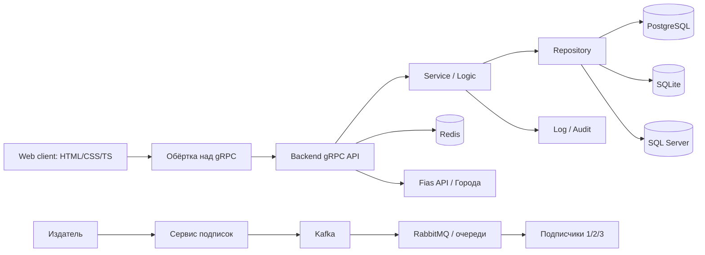

# Общая архитектура из roadmap

[← Назад к списку билетов](README.md)

В курсе рассматривается WEB-приложение на базе CRM-кластера с паттерном **Publisher/Subscriber**.

Главная логика курса: клиент не работает с БД напрямую. Он обращается к backend через gRPC, backend вызывает бизнес-логику и Repository, а асинхронные события идут через Kafka/RabbitMQ к подписчикам.
