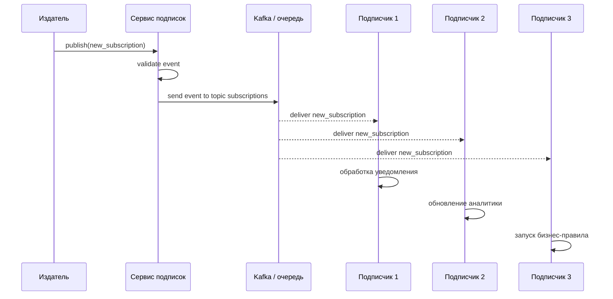

# Билет №1. Функциональные требования, Издатель, Подписчики

[← Назад к списку билетов](../README.md)

---

## 1. Сам билет

### Теоретический вопрос 1

Что такое функциональные требования (ФТ) в контексте WEB-приложения подписок? Перечислите ключевые ФТ для роли «Издатель» и опишите его место в архитектуре pub/sub.

### Теоретический вопрос 2

Чем отличаются роли «Подписчик 1», «Подписчик 2» и «Подписчик 3» в системе? Какие типы событий или данных может получать каждый из них?

### Практический вопрос

Опишите пошаговый сценарий: Издатель публикует событие «новая подписка», событие доставляется трём подписчикам. Укажите участников и направление сообщений.

---

## 2. Ответы на вопросы

### Теоретический вопрос 1

#### Пояснение

**Функциональные требования (ФТ)** — это описание того, что система должна делать для пользователя или внешнего сервиса. В WEB-приложении подписок ФТ описывают действия, связанные с созданием подписок, публикацией событий, доставкой уведомлений, просмотром статусов и обработкой ошибок.

Для роли **«Издатель»** ключевые ФТ такие:

- создавать событие, например `new_subscription`;
- передавать данные события: id подписки, id пользователя, тип подписчика, дату создания;
- публиковать событие в сервис подписок или брокер сообщений;
- получать подтверждение, что событие принято системой;
- логировать факт публикации;
- не знать напрямую всех получателей события.

В архитектуре **pub/sub** издатель не отправляет сообщение каждому подписчику вручную. Он публикует событие в общий канал, topic или exchange. Дальше система доставки сама передаёт событие подписчикам, которые на него подписаны.

#### Как лучше ответить преподавателю

Функциональные требования — это конкретные действия, которые система должна выполнять. Для издателя главное — создать событие, заполнить данные события, опубликовать его в канал/очередь и получить подтверждение. В pub/sub издатель не знает подписчиков напрямую: он отправляет событие в брокер или сервис подписок, а доставка дальше выполняется инфраструктурой.

### Теоретический вопрос 2

#### Пояснение

**Подписчик 1, Подписчик 2 и Подписчик 3** — это разные потребители событий. Они могут получать одно и то же событие, но использовать его по-разному.

Пример различий:

| Роль | Что получает | Для чего использует |
|---|---|---|
| Подписчик 1 | событие о новой подписке | отправляет email-уведомление пользователю |
| Подписчик 2 | данные подписки и пользователя | обновляет статистику или аналитику |
| Подписчик 3 | событие и параметры подписки | запускает бизнес-правило или начисление платежа |

То есть отличие не обязательно в техническом формате события, а в назначении обработки. Один подписчик может отвечать за уведомления, второй — за аналитику, третий — за платежи или контрольные правила.

#### Как лучше ответить преподавателю

Подписчики 1, 2 и 3 — это разные потребители одного события. Они могут получать одинаковое событие `new_subscription`, но обрабатывать его по-разному: один отправляет уведомление, второй обновляет аналитику, третий запускает бизнес-правило или платёжную операцию. То есть различие в роли и бизнес-назначении обработки.

---

## 3. Практика

### Что важно показать

На практике важно показать участников и направление сообщений: издатель не вызывает подписчиков напрямую, а передаёт событие в сервис/брокер.

### Готовое решение

Текстовый sequence-сценарий:

Алгоритм словами:

1. Издатель создаёт событие `new_subscription`.
2. Сервис подписок проверяет корректность события.
3. Сервис публикует событие в Kafka/topic или очередь.
4. Каждый подписчик получает событие независимо.
5. Подписчики выполняют свою бизнес-логику.
6. Ошибки обработки логируются, при необходимости сообщение попадает в retry/dead-letter очередь.

---

## Мини-шпаргалка перед ответом

- Сначала дай определение ключевого термина из билета.
- Потом свяжи тему с общей архитектурой: **Web client → gRPC → backend → Repository/DB/Redis/Kafka**.
- На практике проговори не только код или схему, но и зачем нужен каждый шаг.
