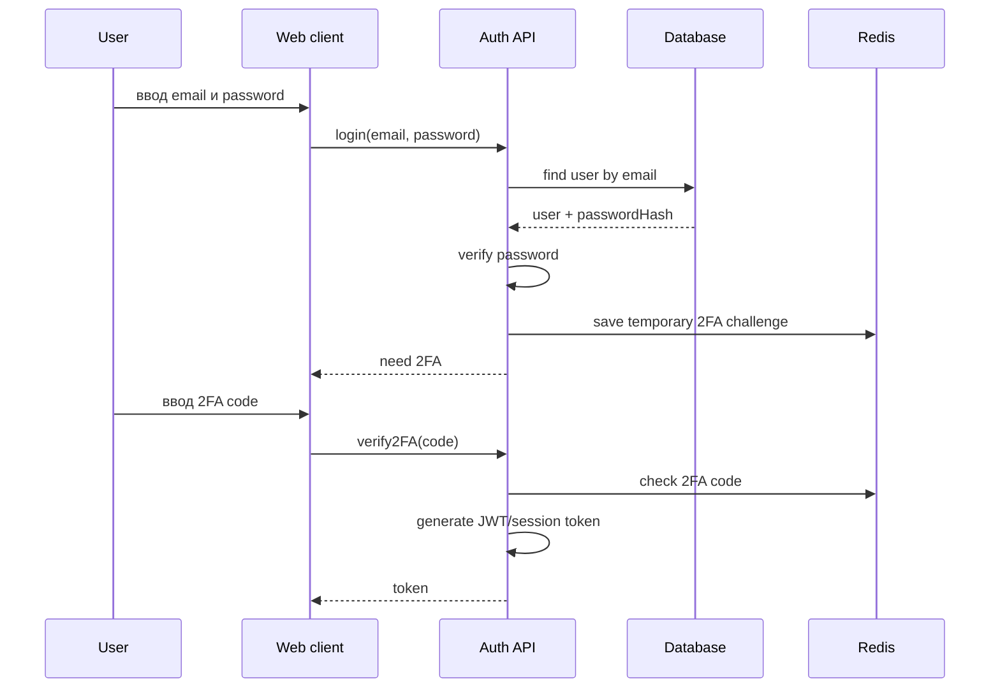

# Билет №17. Идентификация, аутентификация, авторизация

[← Назад к списку билетов](../README.md)

---

## 1. Сам билет

### Теоретический вопрос 1

Дайте определения: идентификация, аутентификация, авторизация. В каком порядке они выполняются при входе пользователя в систему?

### Теоретический вопрос 2

Опишите методы аутентификации с карты знаний: password, двухфакторная аутентификация (2FA), биометрия (2D/4D лицо, голос, ДНК). Какие из них применимы в WEB-приложении?

### Практический вопрос

Опишите flow входа пользователя (login/email + password + 2FA): шаги от формы входа до получения JWT/session token. Схема или нумерованный список.

---

## 2. Ответы на вопросы

### Теоретический вопрос 1

#### Пояснение

**Идентификация** — пользователь сообщает системе, кто он. Например, вводит email или login.

**Аутентификация** — система проверяет, действительно ли пользователь тот, за кого себя выдаёт. Например, проверяет пароль, 2FA-код или биометрию.

**Авторизация** — система проверяет, что пользователю разрешено делать. Например, может ли он читать платежи или удалять подписки.

Порядок при входе:

```text
1. Идентификация: пользователь ввёл email
2. Аутентификация: пользователь ввёл пароль и 2FA
3. Авторизация: система определила роль и права
```

#### Как лучше ответить преподавателю

Идентификация — пользователь сообщает, кто он: email/login. Аутентификация — система проверяет, что это действительно он: пароль, 2FA. Авторизация — система проверяет, что ему разрешено делать. Порядок: identification → authentication → authorization.

### Теоретический вопрос 2

#### Пояснение

Методы аутентификации:

1. **Password** — пароль. Самый базовый способ. На сервере нельзя хранить пароль в открытом виде, хранится только хэш.
2. **2FA** — двухфакторная аутентификация. Кроме пароля нужен второй фактор: код из приложения, SMS, email-код, push.
3. **Биометрия** — лицо, голос, отпечаток и другие признаки.

Для обычного WEB-приложения применимы:

- password;
- 2FA через приложение или email/SMS;
- WebAuthn/Passkeys как современный вариант.

Биометрия вроде ДНК для WEB-приложения практически не используется. Лицо/отпечаток обычно проверяются не самим сайтом, а устройством пользователя через WebAuthn/Passkeys.

#### Как лучше ответить преподавателю

В web-приложении базово применимы пароль и 2FA, например код из приложения или SMS/email. Биометрия возможна через устройства и WebAuthn, но её сложнее внедрять. ДНК для обычного web-приложения практически не применяется.

---

## 3. Практика

### Что важно показать

Flow входа должен идти от формы login/password до выдачи JWT/session token после успешного 2FA.

### Готовое решение

Flow входа `email + password + 2FA`:



Шаги:

1. Пользователь вводит email и пароль.
2. Backend ищет пользователя по email.
3. Backend сравнивает пароль с хэшем.
4. Если пароль верный, создаётся временный 2FA challenge.
5. Пользователь вводит 2FA-код.
6. Backend проверяет код.
7. Если всё верно, создаётся JWT или session token.
8. Клиент сохраняет token и использует его в следующих запросах.

---

## Мини-шпаргалка перед ответом

- Сначала дай определение ключевого термина из билета.
- Потом свяжи тему с общей архитектурой: **Web client → gRPC → backend → Repository/DB/Redis/Kafka**.
- На практике проговори не только код или схему, но и зачем нужен каждый шаг.
