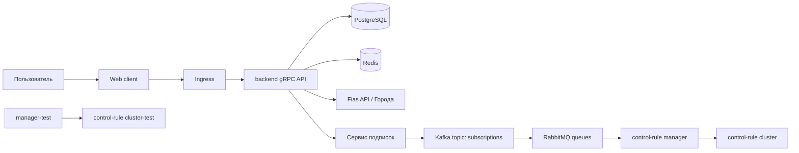

# Билет №20. Kubernetes deploy и crm-cluster

[← Назад к списку билетов](../README.md)

---

## 1. Сам билет

### Теоретический вопрос 1

Как организован деплой WEB-приложения в Kubernetes? Опишите основные ресурсы: Deployment, Service, Ingress.

### Теоретический вопрос 2

Опишите архитектуру crm-cluster: взаимодействие Kafka, RabbitMQ, Redis, сервиса подписок, control-rule cluster и control-rule manager. Зачем нужны control-rule cluster-test и manager-test?

### Практический вопрос

Нарисуйте схему деплоя: Web client → Ingress → backend grpc API → Postgres/Redis; параллельно — сервис подписок → Kafka → RabbitMQ → control-rule manager.

---

## 2. Ответы на вопросы

### Теоретический вопрос 1

#### Пояснение

Деплой WEB-приложения в Kubernetes строится вокруг нескольких ресурсов.

**Deployment** — описывает, какие контейнеры запускать, сколько реплик нужно, какой образ использовать. Если pod упал, Deployment создаст новый.

**Service** — стабильная внутренняя точка доступа к pod-ам. Pod-ы могут пересоздаваться, а Service остаётся постоянным.

**Ingress** — внешний вход в кластер. Он принимает HTTP/HTTPS-запросы и направляет их к нужному Service.

Типовая схема:

```text
User Browser
  -> Ingress
    -> Web client Service
    -> Backend gRPC Service
      -> Pods
```

Для backend также настраиваются ConfigMap, Secret, переменные окружения, health checks, ресурсы CPU/RAM.

#### Как лучше ответить преподавателю

В Kubernetes приложение разворачивается через Deployment, который управляет pod-ами и репликами. Service даёт стабильный сетевой адрес внутри кластера, а Ingress открывает внешний вход и маршрутизацию к сервисам.

### Теоретический вопрос 2

#### Пояснение

Архитектура `crm-cluster`:

- **Web client** — пользовательский интерфейс.
- **backend gRPC API** — основной backend.
- **PostgreSQL** — основная база данных.
- **Redis** — кэш, сессии, временные данные.
- **сервис подписок** — управляет подписками и публикует события.
- **Kafka** — поток событий.
- **RabbitMQ** — очередь задач для обработчиков.
- **control-rule cluster** — сервисы, которые выполняют контрольные бизнес-правила.
- **control-rule manager** — управляет выполнением этих правил.

`control-rule cluster-test` и `manager-test` нужны для тестового окружения. Там можно проверять правила, интеграции и новые сценарии без риска сломать production.

#### Как лучше ответить преподавателю

crm-cluster состоит из backend, сервиса подписок, Redis, Kafka, RabbitMQ и control-rule manager/cluster. События подписок идут через Kafka/RabbitMQ к обработчикам правил. test-кластеры нужны для проверки изменений, интеграционных тестов и безопасного прогона правил до production.

---

## 3. Практика

### Что важно показать

В схеме деплоя важно разделить пользовательский HTTP-вход через Ingress и асинхронную ветку событий через Kafka/RabbitMQ.

### Готовое решение

Mermaid-схема деплоя:



ASCII-вариант:

```text
[Web client]
     |
     v
[Ingress]
     |
     v
[backend gRPC API] -----> [PostgreSQL]
     |                    [Redis]
     |                    [Fias API]
     v
[Сервис подписок]
     |
     v
[Kafka]
     |
     v
[RabbitMQ]
     |
     v
[control-rule manager] -> [control-rule cluster]

Тестовое окружение:
[manager-test] -> [control-rule cluster-test]
```

---

## Короткая шпаргалка по главным терминам

| Термин | Коротко |
|---|---|
| ФТ | что система должна делать |
| Pub/Sub | издатель публикует событие, подписчики получают |
| Web client | frontend в браузере |
| HTML | структура страницы |
| CSS | оформление страницы |
| TypeScript | типизированный JavaScript |
| Component | независимый блок UI |
| Input | данные в дочерний компонент |
| Output | событие из дочернего компонента наружу |
| async/await | удобная работа с асинхронным кодом |
| gRPC | вызов методов backend через строгий контракт |
| Protobuf | описание сообщений и сервисов gRPC |
| DTO | объект передачи данных |
| Entity | внутренняя доменная сущность |
| Repository | слой доступа к данным через интерфейс |
| PostgreSQL | основная production-СУБД |
| SQLite | лёгкая локальная БД |
| SQL Server | корпоративная СУБД Microsoft |
| Redis | быстрый кэш и временное хранилище |
| Fias API | внешний адресный справочник |
| Logic | слой бизнес-правил |
| Save-1 | операция сохранения |
| Log | технический журнал |
| Audit | журнал важных действий пользователя |
| Identification | пользователь сообщает, кто он |
| Authentication | система проверяет личность |
| Authorization | система проверяет права |
| ACL | список прав доступа |
| REBAC | права через отношения |
| ABAC | права через атрибуты |
| Kafka | поток событий |
| RabbitMQ | очередь задач |
| Kubernetes | платформа деплоя контейнеров |
| Deployment | управляет pod-ами |
| Service | стабильный доступ к pod-ам |
| Ingress | внешний вход в кластер |
| PR/MR | запрос на слияние изменений |
| Review | проверка кода |
| Semver | версионирование MAJOR.MINOR.PATCH |

---

## Как быстро повторять перед экзаменом

1. Сначала выучи общую схему:

```text
Web client -> gRPC wrapper -> backend gRPC API -> Service/Logic -> Repository -> DB
```

2. Потом отдельно выучи инфраструктуру:

```text
Subscriptions -> Kafka -> RabbitMQ -> control-rule manager -> control-rule cluster
```

3. Для каждого билета держи в голове три части:

```text
определение -> зачем нужно -> пример/код/схема
```

4. В практических вопросах важно не написать идеально рабочий production-код, а показать понимание архитектуры: валидация, слой service, repository, DTO, обработка ошибок, audit.

---

## Как загрузить на GitHub

```bash
mkdir web-engineering-exam-prep
cd web-engineering-exam-prep

# положи этот файл как README.md

git init
git add README.md
git commit -m "docs: add web engineering exam answers"
git branch -M main
git remote add origin https://github.com/USERNAME/web-engineering-exam-prep.git
git push -u origin main
```

---

## Мини-шпаргалка перед ответом

- Сначала дай определение ключевого термина из билета.
- Потом свяжи тему с общей архитектурой: **Web client → gRPC → backend → Repository/DB/Redis/Kafka**.
- На практике проговори не только код или схему, но и зачем нужен каждый шаг.
