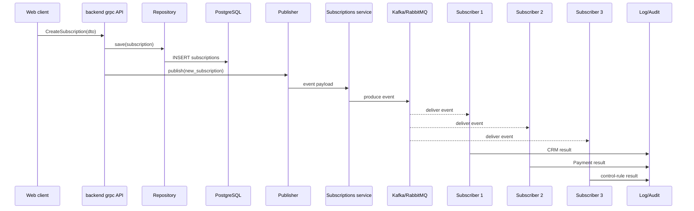
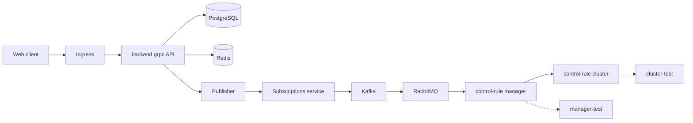

# Ответы на экзаменационные билеты
**Дисциплина:** Основы WEB-инжиниринга / Разработка WEB-приложений  
**Формат:** вопрос → краткое описание → как ответить преподавателю → практическое решение.

Документ оформлен для устной подготовки. Блоки «Как ответить преподавателю» написаны от лица студента и расширены до ответа примерно на 1–2 минуты.

---

## Архитектурная опора

`Web client → gRPC wrapper → backend grpc API → service/Logic → Repository → PostgreSQL/Redis/Fias API`

`Publisher → Subscriptions service → Kafka/RabbitMQ → Subscriber 1/2/3 → Log/Audit/control-rule manager`

---

# Билет №1

## Вопрос 1

**Вопрос:**  
Что такое функциональные требования (ФТ) в контексте WEB-приложения подписок? Перечислите ключевые ФТ для роли «Издатель» и опишите его место в архитектуре pub/sub.

**Краткое описание:**  
Функциональные требования описывают, что система должна делать: создавать подписки, менять статусы, публиковать события, доставлять их подписчикам, сохранять данные, писать Log и Audit. Издатель — источник события в pub/sub.

**Как ответить преподавателю на экзамене:**  
Функциональные требования — это описание поведения системы. В приложении подписок они отвечают на вопрос: какие действия должны выполняться. Например, пользователь создаёт подписку, backend сохраняет её через Repository в PostgreSQL, а Publisher публикует событие `new_subscription`.

Для роли Издателя ключевые требования такие: сформировать событие, добавить `userId`, `subscriptionId`, `subscriberType`, время создания, отправить событие в сервис подписок или брокер сообщений, обработать ошибку и записать Log/Audit.

В архитектуре pub/sub Publisher не вызывает подписчиков напрямую. Он публикует событие, а Подписчик 1, 2 и 3 получают его независимо. Поэтому Publisher — это точка публикации события, а не место всей бизнес-логики.

---

## Вопрос 2

**Вопрос:**  
Чем отличаются роли «Подписчик 1», «Подписчик 2» и «Подписчик 3» в системе? Какие типы событий или данных может получать каждый из них?

**Краткое описание:**  
Подписчики получают события, но выполняют разную логику: CRM-обработка, Assessment/Payment, Log/Audit/уведомления/control-rule manager.

**Как ответить преподавателю на экзамене:**  
Подписчики отличаются зоной ответственности. Они могут получить одно событие, например `new_subscription`, но каждый обработает его по-разному.

Подписчик 1 может отвечать за основную CRM-логику: обновить состояние подписки и связать её с User. Подписчик 2 может запускать Assessment и рассчитывать Payment. Подписчик 3 может записывать Audit, отправлять уведомления или передавать событие в control-rule manager.

Смысл pub/sub в том, что Publisher не знает внутреннюю логику подписчиков. Он публикует событие один раз, а каждый Subscriber сам выполняет свою часть обработки.

---

## Практический вопрос

**Вопрос:**  
Опишите пошаговый сценарий: Издатель публикует событие «новая подписка», событие доставляется трём подписчикам.

**Краткое описание:**  
Нужно показать участников и направление сообщений: Web client, backend grpc API, Repository, PostgreSQL, Publisher, Subscriptions service, Kafka/RabbitMQ, три подписчика, Log/Audit.

**Как ответить преподавателю на экзамене:**  
Сначала Web client вызывает backend grpc API для создания подписки. Backend валидирует DTO, сохраняет Subscription через Repository в PostgreSQL и вызывает Publisher.

Publisher формирует событие `new_subscription` и отправляет его в Subscriptions service. Сервис подписок публикует событие в Kafka или RabbitMQ. После этого три подписчика получают событие независимо: первый обновляет CRM-данные, второй запускает Assessment/Payment, третий пишет Audit или передаёт событие в control-rule manager.

**Готовое решение:**



---

# Билет №2

## Вопрос 1

**Вопрос:**  
Что представляет собой сущность Subscriptions в CRM-системе? Какие поля и связи должна содержать модель подписки?

**Краткое описание:**  
Subscriptions хранит факт подписки пользователя: id, user_id, subscriber_type, status, created_at, updated_at, cancelled_at. Связи: User, Payment/Assessment, Log/Audit.

**Как ответить преподавателю на экзамене:**  
`Subscriptions` — это доменная сущность CRM, которая показывает, что конкретный User оформил подписку определённого типа. Это не просто строка в таблице, а часть бизнес-логики.

Модель должна содержать `id`, `user_id`, `subscriber_type`, `status`, `created_at`, `updated_at`, возможно `cancelled_at`. `user_id` связывает подписку с User. `subscriber_type` принимает значения 1, 2 или 3. `status` показывает жизненный цикл: pending, active, cancelled, blocked.

Через эту сущность могут запускаться события Publisher, расчёты Assessment и Payment. Изменения по подписке нужно фиксировать в Audit, потому что это значимое бизнес-действие.

---

## Вопрос 2

**Вопрос:**  
Как сервис подписок взаимодействует с Kafka и очередями сообщений? Объясните, зачем нужны RabbitMQ и Kafka в crm-cluster и чем они отличаются по назначению.

**Краткое описание:**  
Subscriptions service принимает события от Publisher и отправляет их в Kafka/RabbitMQ. Kafka — поток событий, RabbitMQ — очередь задач.

**Как ответить преподавателю на экзамене:**  
Сервис подписок находится между Publisher и брокерами сообщений. Когда возникает событие, например новая подписка, Publisher передаёт его в Subscriptions service, а тот публикует сообщение в Kafka или RabbitMQ.

Kafka лучше подходит для event streaming. Она хранит события в topic, и разные подписчики могут читать один и тот же поток независимо. Это удобно для истории событий и нескольких потребителей.

RabbitMQ больше подходит для очередей задач. Он доставляет сообщение обработчику, поддерживает подтверждение обработки и распределение задач между worker-сервисами. В crm-cluster Kafka можно использовать как событийную шину, а RabbitMQ — как очередь фоновых команд.

---

## Практический вопрос

**Вопрос:**  
Спроектируйте SQL-схему таблицы subscriptions (PostgreSQL): первичный ключ, внешние ключи на User, статус подписки, дата создания, тип подписчика (1/2/3).

**Краткое описание:**  
Нужно создать PostgreSQL DDL с PK, FK, CHECK для типа и статуса, датами и индексами.

**Как ответить преподавателю на экзамене:**  
Я создаю таблицу `subscriptions`, где `id` — первичный ключ, а `user_id` — внешний ключ на `users(id)`. Тип подписчика ограничиваю значениями 1, 2, 3. Статус ограничиваю допустимыми значениями, чтобы в БД не попали случайные статусы.

Дата создания задаётся через `now()`. Индексы по `user_id` и `status` нужны для частых запросов: получить подписки пользователя или активные подписки.

**Готовое решение:**

```sql
CREATE EXTENSION IF NOT EXISTS pgcrypto;
CREATE TABLE subscriptions (
    id UUID PRIMARY KEY DEFAULT gen_random_uuid(),
    user_id UUID NOT NULL REFERENCES users(id) ON DELETE CASCADE,
    subscriber_type SMALLINT NOT NULL CHECK (subscriber_type IN (1,2,3)),
    status VARCHAR(20) NOT NULL DEFAULT 'active'
        CHECK (status IN ('pending','active','cancelled','blocked')),
    created_at TIMESTAMPTZ NOT NULL DEFAULT now(),
    updated_at TIMESTAMPTZ NOT NULL DEFAULT now(),
    cancelled_at TIMESTAMPTZ NULL
);
CREATE INDEX idx_subscriptions_user_id ON subscriptions(user_id);
CREATE INDEX idx_subscriptions_status ON subscriptions(status);
```

---

# Билет №3

## Вопрос 1

**Вопрос:**  
Опишите структуру Web client в многослойном WEB-приложении. Какие технологии и слои входят в клиентскую часть согласно карте знаний?

**Краткое описание:**  
Web client работает в браузере и включает HTML, CSS, TypeScript/JavaScript, Component, Input/Output, DTO и gRPC wrapper.

**Как ответить преподавателю на экзамене:**  
Web client — клиентский слой приложения. Он отвечает за отображение интерфейса, обработку действий пользователя и вызовы backend grpc API. HTML задаёт структуру, CSS — внешний вид, TypeScript/JavaScript — поведение.

Интерфейс делится на компоненты: формы, карточки, списки. Компоненты получают данные через Input и отправляют события через Output. Для обращения к backend используется gRPC wrapper, который возвращает DTO.

Web client не должен обращаться к PostgreSQL напрямую. Правильная цепочка такая: Web client → gRPC wrapper → backend grpc API → service/Repository → DB.

---

## Вопрос 2

**Вопрос:**  
В чём разница зон ответственности HTML и CSS? Приведите пример: что относится к разметке, а что — к оформлению формы регистрации подписчика.

**Краткое описание:**  
HTML — структура и смысл; CSS — оформление и расположение.

**Как ответить преподавателю на экзамене:**  
HTML отвечает за структуру страницы: `form`, `label`, `input`, `select`, `button`. Он показывает, какие элементы существуют и что они означают.

CSS отвечает за внешний вид: центрирование формы, ширину, отступы, цвет, фон, тень, стиль кнопки.

В форме подписки email, select и кнопка — это HTML. А расположение по центру, скругления и оформление кнопки — CSS. Такое разделение делает код понятным и поддерживаемым.

---

## Практический вопрос

**Вопрос:**  
Напишите HTML-разметку формы подписки и CSS-стили.

**Краткое описание:**  
Нужны форма email, select типа подписчика и кнопка.

**Как ответить преподавателю на экзамене:**  
Я использую `form`, потому что это семантический элемент для отправки данных. Поля связываю с `label`, а email делаю `type=email`. CSS центрирует форму и оформляет кнопку.

**Готовое решение:**

```html
<form class="subscription-form">
  <label for="email">Email</label>
  <input id="email" name="email" type="email" required>
  <label for="type">Тип подписчика</label>
  <select id="type" name="subscriberType">
    <option value="1">Подписчик 1</option>
    <option value="2">Подписчик 2</option>
    <option value="3">Подписчик 3</option>
  </select>
  <button type="submit">Подписаться</button>
</form>
```
```css
body { min-height: 100vh; display: flex; justify-content: center; align-items: center; }
.subscription-form { width: 360px; padding: 24px; border-radius: 12px; background: #fff; }
.subscription-form input, .subscription-form select { width: 100%; padding: 10px; margin: 8px 0; }
.subscription-form button { width: 100%; padding: 12px; border: 0; border-radius: 8px; cursor: pointer; }
```

---

# Билет №4

## Вопрос 1

**Вопрос:**  
Что такое асинхронное программирование (async) в JavaScript/TypeScript? Зачем оно необходимо в Web client при обращении к gRPC API?

**Краткое описание:**  
Async нужен для сетевых операций без блокировки UI.

**Как ответить преподавателю на экзамене:**  
Асинхронное программирование позволяет выполнять долгие операции без зависания интерфейса. Запрос к backend grpc API не возвращает ответ мгновенно, поэтому Web client работает через Promise и `async/await`.

Пользователь может нажать кнопку, а интерфейс продолжит работать, пока запрос выполняется. Когда ответ приходит, компонент получает DTO и обновляет состояние.

Если произошла ошибка сети, её нужно обработать через `try/catch` и показать понятное сообщение пользователю.

---

## Вопрос 2

**Вопрос:**  
Объясните работу Event Loop и механизм Promise. Чем async/await отличается от цепочки .then()/.catch()?

**Краткое описание:**  
Event Loop управляет очередями задач, Promise хранит будущий результат, async/await — синтаксис поверх Promise.

**Как ответить преподавателю на экзамене:**  
Event Loop позволяет JavaScript работать с асинхронностью в однопоточном окружении. Сначала выполняется синхронный код, затем завершённые асинхронные операции попадают в очередь задач или микрозадач.

Promise имеет состояния `pending`, `fulfilled`, `rejected`. Он представляет будущий результат запроса.

`async/await` не заменяет Promise, а делает код читабельнее. Вместо цепочки `.then().catch()` можно написать последовательный код и обработать ошибку через `try/catch`.

---

## Практический вопрос

**Вопрос:**  
Напишите TypeScript-функцию fetchSubscriptions(userId: string): Promise<Subscription[]>.

**Краткое описание:**  
Нужен async/await, запрос к backend и обработка ошибки.

**Как ответить преподавателю на экзамене:**  
Функция проверяет `userId`, выполняет запрос к backend, проверяет статус ответа, возвращает массив подписок. Ошибки сети перехватываются и превращаются в понятную ошибку для UI.

**Готовое решение:**

```ts
type Subscription = { id: string; userId: string; subscriberType: 1|2|3; status: string; createdAt: string };
async function fetchSubscriptions(userId: string): Promise<Subscription[]> {
  if (!userId) throw new Error('userId is required');
  try {
    const res = await fetch(`/api/grpc/subscriptions?userId=${encodeURIComponent(userId)}`);
    if (!res.ok) throw new Error(`Backend error: ${res.status}`);
    const data = await res.json() as { subscriptions: Subscription[] };
    return data.subscriptions;
  } catch (e) {
    console.error(e);
    throw new Error('Не удалось загрузить подписки');
  }
}
```

---

# Билет №5

## Вопрос 1

**Вопрос:**  
Component и Input/Output. Теоретический вопрос 1 из билета №5.

**Краткое описание:**  
Компонент — самостоятельная часть UI. Input передаёт данные от родителя к дочернему компоненту, Output возвращает событие наверх.

**Как ответить преподавателю на экзамене:**  
Компонент — самостоятельная часть интерфейса со своим шаблоном, стилями и поведением. Например, `SubscriptionForm` отвечает за ввод, `SubscriptionCard` — за отображение одной подписки.

Разбиение UI на компоненты упрощает поддержку, тестирование и переиспользование. Если нужно изменить карточку подписки, меняется один компонент, а не вся страница.

Input/Output снижает связанность: родитель передаёт данные через Input, дочерний компонент сообщает о действиях через Output. Например, `SubscriptionCard` получает `subscription`, а при нажатии «Отменить» отправляет событие `cancel(subscriptionId)`.

---

## Вопрос 2

**Вопрос:**  
Component и Input/Output. Теоретический вопрос 2 из билета №5.

**Краткое описание:**  
Компонент — самостоятельная часть UI. Input передаёт данные от родителя к дочернему компоненту, Output возвращает событие наверх.

**Как ответить преподавателю на экзамене:**  
Компонент — самостоятельная часть интерфейса со своим шаблоном, стилями и поведением. Например, `SubscriptionForm` отвечает за ввод, `SubscriptionCard` — за отображение одной подписки.

Разбиение UI на компоненты упрощает поддержку, тестирование и переиспользование. Если нужно изменить карточку подписки, меняется один компонент, а не вся страница.

Input/Output снижает связанность: родитель передаёт данные через Input, дочерний компонент сообщает о действиях через Output. Например, `SubscriptionCard` получает `subscription`, а при нажатии «Отменить» отправляет событие `cancel(subscriptionId)`.

---

## Практический вопрос

**Вопрос:**  
SubscriptionForm с @Input/@Output

**Краткое описание:**  
Компонент получает userId, email и subscriberType, затем эмитит данные родителю.

**Как ответить преподавателю на экзамене:**  
Форма не должна сама сохранять данные. Она собирает поля и отправляет событие родителю. Родитель вызывает gRPC wrapper и backend grpc API.

**Готовое решение:**

```ts
@Component({ selector: 'app-subscription-form', template: `...` })
export class SubscriptionFormComponent {
  @Input() userId!: string;
  @Output() onSubmit = new EventEmitter<{userId:string; email:string; subscriberType:1|2|3}>();
  email = ''; subscriberType: 1|2|3 = 1;
  submit(e: Event) { e.preventDefault(); this.onSubmit.emit({ userId: this.userId, email: this.email, subscriberType: this.subscriberType }); }
}
```

---

# Билет №6

## Вопрос 1

**Вопрос:**  
UI/UX и accessibility. Теоретический вопрос 1 из билета №6.

**Краткое описание:**  
UI/UX делает интерфейс понятным. Accessibility делает формы доступными для клавиатуры и экранных дикторов.

**Как ответить преподавателю на экзамене:**  
UI/UX отвечает за понятность и удобство. В личном кабинете подписчика пользователь должен сразу видеть активные подписки, статусы, даты и кнопку отмены.

Интерфейс должен давать обратную связь: загрузка, успех, ошибка. Действия должны быть предсказуемыми, а опасные действия — понятными и желательно подтверждаемыми.

Accessibility требует `label`, `id`, `required`, корректных типов полей, `aria-describedby` для ошибок и видимого фокуса. Форма должна работать с клавиатуры и быть понятной экранному диктору.

---

## Вопрос 2

**Вопрос:**  
UI/UX и accessibility. Теоретический вопрос 2 из билета №6.

**Краткое описание:**  
UI/UX делает интерфейс понятным. Accessibility делает формы доступными для клавиатуры и экранных дикторов.

**Как ответить преподавателю на экзамене:**  
UI/UX отвечает за понятность и удобство. В личном кабинете подписчика пользователь должен сразу видеть активные подписки, статусы, даты и кнопку отмены.

Интерфейс должен давать обратную связь: загрузка, успех, ошибка. Действия должны быть предсказуемыми, а опасные действия — понятными и желательно подтверждаемыми.

Accessibility требует `label`, `id`, `required`, корректных типов полей, `aria-describedby` для ошибок и видимого фокуса. Форма должна работать с клавиатуры и быть понятной экранному диктору.

---

## Практический вопрос

**Вопрос:**  
Wireframe личного кабинета

**Краткое описание:**  
Нужно расположить список подписок, отмену и уведомления.

**Как ответить преподавателю на экзамене:**  
Сверху заголовок и email, ниже список карточек подписок. В каждой карточке тип, статус, дата и кнопка отмены. Блок уведомлений находится справа или снизу.

**Готовое решение:**

```text
+---------------- Личный кабинет ----------------+
| user@mail.ru                                   |
| Активные подписки                              |
| [#101] Тип 1 | active | 10.06.2026 [Отменить] |
| [#102] Тип 2 | active | 09.06.2026 [Отменить] |
| Уведомления:                                  |
| - Подписка создана                            |
| - Платёж ожидает подтверждения                |
+------------------------------------------------+
```

---

# Билет №7

## Вопрос 1

**Вопрос:**  
gRPC, REST и Protocol Buffers. Теоретический вопрос 1 из билета №7.

**Краткое описание:**  
REST обычно использует HTTP/JSON и ресурсы. gRPC использует сервисы, методы, HTTP/2 и protobuf.

**Как ответить преподавателю на экзамене:**  
REST строится вокруг ресурсов: например, `GET /users/1`. Данные обычно передаются в JSON. REST прост и удобен для публичных API.

gRPC строится вокруг сервисов и методов: например, `UserService.GetUser`. Он использует Protocol Buffers, строгий контракт и генерацию клиента/сервера.

Для backend CRM выбран gRPC, потому что важны типизация, производительность и единый контракт между Web client и backend grpc API. Protobuf описывает сообщения и сервисы. gRPC поддерживает unary, server streaming, client streaming и bidirectional streaming.

---

## Вопрос 2

**Вопрос:**  
gRPC, REST и Protocol Buffers. Теоретический вопрос 2 из билета №7.

**Краткое описание:**  
REST обычно использует HTTP/JSON и ресурсы. gRPC использует сервисы, методы, HTTP/2 и protobuf.

**Как ответить преподавателю на экзамене:**  
REST строится вокруг ресурсов: например, `GET /users/1`. Данные обычно передаются в JSON. REST прост и удобен для публичных API.

gRPC строится вокруг сервисов и методов: например, `UserService.GetUser`. Он использует Protocol Buffers, строгий контракт и генерацию клиента/сервера.

Для backend CRM выбран gRPC, потому что важны типизация, производительность и единый контракт между Web client и backend grpc API. Protobuf описывает сообщения и сервисы. gRPC поддерживает unary, server streaming, client streaming и bidirectional streaming.

---

## Практический вопрос

**Вопрос:**  
user.proto

**Краткое описание:**  
Нужно описать сообщения и сервис.

**Как ответить преподавателю на экзамене:**  
Я задаю `syntax = proto3`, package, сообщения `UserRequest`, `CreateUserRequest`, `UserResponse` и сервис `UserService` с методами `GetUser` и `CreateUser`.

**Готовое решение:**

```proto
syntax = "proto3";
package crm.users;
message UserRequest { string id = 1; }
message CreateUserRequest { string email = 1; string person_id = 2; string role = 3; }
message UserResponse { string id = 1; string email = 2; string person_id = 3; string role = 4; string created_at = 5; }
service UserService {
  rpc GetUser(UserRequest) returns (UserResponse);
  rpc CreateUser(CreateUserRequest) returns (UserResponse);
}
```

---

# Билет №8

## Вопрос 1

**Вопрос:**  
gRPC wrapper и backend grpc API. Теоретический вопрос 1 из билета №8.

**Краткое описание:**  
Wrapper скрывает детали gRPC. Backend делится на transport, service, repository.

**Как ответить преподавателю на экзамене:**  
Обёртка над gRPC нужна, чтобы компоненты Web client не зависели от protobuf, metadata, status codes и сгенерированного клиента. Компонент вызывает простой метод вроде `getUser(id)`.

Wrapper добавляет token, вызывает backend grpc API, обрабатывает ошибку и маппит protobuf-ответ в DTO. Это делает UI-код чище.

Backend grpc API делится на transport, service и repository. Transport принимает gRPC-запрос. Service выполняет бизнес-логику и авторизацию. Repository работает с PostgreSQL, SQLite или SQL Server.

---

## Вопрос 2

**Вопрос:**  
gRPC wrapper и backend grpc API. Теоретический вопрос 2 из билета №8.

**Краткое описание:**  
Wrapper скрывает детали gRPC. Backend делится на transport, service, repository.

**Как ответить преподавателю на экзамене:**  
Обёртка над gRPC нужна, чтобы компоненты Web client не зависели от protobuf, metadata, status codes и сгенерированного клиента. Компонент вызывает простой метод вроде `getUser(id)`.

Wrapper добавляет token, вызывает backend grpc API, обрабатывает ошибку и маппит protobuf-ответ в DTO. Это делает UI-код чище.

Backend grpc API делится на transport, service и repository. Transport принимает gRPC-запрос. Service выполняет бизнес-логику и авторизацию. Repository работает с PostgreSQL, SQLite или SQL Server.

---

## Практический вопрос

**Вопрос:**  
UserGrpcClient

**Краткое описание:**  
Нужно показать wrapper с методом getUser.

**Как ответить преподавателю на экзамене:**  
Класс принимает gRPC service и token-provider. Метод проверяет id, добавляет Authorization metadata, вызывает gRPC и возвращает UserDto.

**Готовое решение:**

```ts
class UserGrpcClient {
  constructor(private grpc: any, private getToken: () => string | null) {}
  async getUser(id: string): Promise<UserDto> {
    if (!id) throw new Error('User id is required');
    const token = this.getToken();
    const metadata = token ? { Authorization: `Bearer ${token}` } : {};
    const r = await this.grpc.getUser({ id }, metadata);
    return { id: r.id, email: r.email, personId: r.person_id, role: r.role, createdAt: r.created_at };
  }
}
```

---

# Билет №9

## Вопрос 1

**Вопрос:**  
CRUD через backend grpc API. Теоретический вопрос 1 из билета №9.

**Краткое описание:**  
CRUD для User реализуется методами CreateUser, GetUser, UpdateUser, DeleteUser. Прямой доступ Web client к БД запрещён.

**Как ответить преподавателю на экзамене:**  
CRUD — это Create, Read, Update, Delete. Через gRPC это методы сервиса: `CreateUser`, `GetUser`, `UpdateUser`, `DeleteUser`.

Backend принимает request, валидирует данные, проверяет аутентификацию и авторизацию, вызывает Repository и возвращает DTO. Для удаления в CRM часто лучше использовать soft delete.

Web client не должен напрямую работать с PostgreSQL, потому что браузер недоверенная среда. Нельзя раскрывать строку подключения и позволять клиенту обходить backend, бизнес-логику и Audit.

---

## Вопрос 2

**Вопрос:**  
CRUD через backend grpc API. Теоретический вопрос 2 из билета №9.

**Краткое описание:**  
CRUD для User реализуется методами CreateUser, GetUser, UpdateUser, DeleteUser. Прямой доступ Web client к БД запрещён.

**Как ответить преподавателю на экзамене:**  
CRUD — это Create, Read, Update, Delete. Через gRPC это методы сервиса: `CreateUser`, `GetUser`, `UpdateUser`, `DeleteUser`.

Backend принимает request, валидирует данные, проверяет аутентификацию и авторизацию, вызывает Repository и возвращает DTO. Для удаления в CRM часто лучше использовать soft delete.

Web client не должен напрямую работать с PostgreSQL, потому что браузер недоверенная среда. Нельзя раскрывать строку подключения и позволять клиенту обходить backend, бизнес-логику и Audit.

---

## Практический вопрос

**Вопрос:**  
CreateUser pseudocode

**Краткое описание:**  
Нужно показать валидацию, сохранение и DTO.

**Как ответить преподавателю на экзамене:**  
Метод проверяет пользователя, права, email, дубликаты, создаёт Entity, сохраняет через Repository, пишет Audit и возвращает DTO.

**Готовое решение:**

```ts
async function CreateUser(req: CreateUserRequest, ctx: RequestContext): Promise<UserDto> {
  if (!ctx.currentUser) throw new GrpcError('UNAUTHENTICATED', 'Login required');
  if (!ctx.permissions.canCreateUser) throw new GrpcError('PERMISSION_DENIED', 'No permission');
  if (!req.email.includes('@')) throw new GrpcError('INVALID_ARGUMENT', 'Invalid email');
  if (await userRepository.findByEmail(req.email)) throw new GrpcError('ALREADY_EXISTS', 'User exists');
  const entity = { id: crypto.randomUUID(), email: req.email, personId: req.personId, role: req.role, createdAt: new Date() };
  const saved = await userRepository.save(entity);
  await audit.write({ action: 'CREATE_USER', entityType: 'User', entityId: saved.id, oldValue: null, newValue: saved });
  return mapUserEntityToDto(saved);
}
```

---

# Билет №10

## Вопрос 1

**Вопрос:**  
DTO, Entity, User и Person. Теоретический вопрос 1 из билета №10.

**Краткое описание:**  
DTO передаётся между слоями. Entity — внутренняя модель. User — учётная запись, Person — данные человека.

**Как ответить преподавателю на экзамене:**  
DTO — Data Transfer Object, объект передачи данных между слоями и между backend и Web client. Entity — внутренняя доменная сущность.

DTO отделяют от Entity, чтобы не отдавать клиенту лишние и чувствительные поля, например `passwordHash`. Также это сохраняет стабильный API.

User отвечает за вход и доступ: email, passwordHash, role, status, 2FA. Person отвечает за профиль: ФИО, телефон, адрес, city_id. При login используется User, при редактировании профиля и адреса — Person.

---

## Вопрос 2

**Вопрос:**  
DTO, Entity, User и Person. Теоретический вопрос 2 из билета №10.

**Краткое описание:**  
DTO передаётся между слоями. Entity — внутренняя модель. User — учётная запись, Person — данные человека.

**Как ответить преподавателю на экзамене:**  
DTO — Data Transfer Object, объект передачи данных между слоями и между backend и Web client. Entity — внутренняя доменная сущность.

DTO отделяют от Entity, чтобы не отдавать клиенту лишние и чувствительные поля, например `passwordHash`. Также это сохраняет стабильный API.

User отвечает за вход и доступ: email, passwordHash, role, status, 2FA. Person отвечает за профиль: ФИО, телефон, адрес, city_id. При login используется User, при редактировании профиля и адреса — Person.

---

## Практический вопрос

**Вопрос:**  
UserDto/PersonDto/mapEntityToDto

**Краткое описание:**  
Нужно показать безопасный DTO без passwordHash.

**Как ответить преподавателю на экзамене:**  
Функция явно выбирает только безопасные поля и преобразует дату в строку.

**Готовое решение:**

```ts
interface PersonDto { id: string; firstName: string; lastName: string; phone?: string; cityId?: string; }
interface UserDto { id: string; email: string; role: 'admin'|'subscriber'; status: string; person: PersonDto; createdAt: string; }
function mapEntityToDto(user: User): UserDto {
  return { id: user.id, email: user.email, role: user.role, status: user.status, person: user.person, createdAt: user.createdAt.toISOString() };
}
```

---

# Билет №11

## Вопрос 1

**Вопрос:**  
Repository, interface, source. Теоретический вопрос 1 из билета №11.

**Краткое описание:**  
Repository скрывает БД от service. Интерфейс задаёт контракт. Source — драйвер/подключение.

**Как ответить преподавателю на экзамене:**  
Repository отделяет бизнес-логику от работы с базой данных. Service не пишет SQL, а вызывает методы репозитория.

Интерфейс, например `IUserRepository`, задаёт контракт: `findById`, `save`, `delete`. Реализации могут быть разными: Postgres, SQLite, SQL Server.

Source — низкоуровневый источник данных: connection pool, database client или драйвер. Repository использует source внутри, но service зависит только от интерфейса. Поэтому можно менять БД без переписывания бизнес-логики.

---

## Вопрос 2

**Вопрос:**  
Repository, interface, source. Теоретический вопрос 2 из билета №11.

**Краткое описание:**  
Repository скрывает БД от service. Интерфейс задаёт контракт. Source — драйвер/подключение.

**Как ответить преподавателю на экзамене:**  
Repository отделяет бизнес-логику от работы с базой данных. Service не пишет SQL, а вызывает методы репозитория.

Интерфейс, например `IUserRepository`, задаёт контракт: `findById`, `save`, `delete`. Реализации могут быть разными: Postgres, SQLite, SQL Server.

Source — низкоуровневый источник данных: connection pool, database client или драйвер. Repository использует source внутри, но service зависит только от интерфейса. Поэтому можно менять БД без переписывания бизнес-логики.

---

## Практический вопрос

**Вопрос:**  
IUserRepository/PostgresUserRepository

**Краткое описание:**  
Нужно показать интерфейс и класс.

**Как ответить преподавателю на экзамене:**  
Service работает с интерфейсом, а PostgreSQL-реализация использует pool и SQL внутри методов.

**Готовое решение:**

```ts
interface IUserRepository {
  findById(id: string): Promise<UserEntity | null>;
  save(user: UserEntity): Promise<UserEntity>;
  delete(id: string): Promise<void>;
}
class PostgresUserRepository implements IUserRepository {
  constructor(private pool: { query: Function }) {}
  async findById(id: string) { throw new Error('SELECT ... WHERE id=$1'); }
  async save(user: UserEntity) { throw new Error('INSERT/UPDATE ... RETURNING *'); }
  async delete(id: string) { throw new Error('DELETE or soft delete'); }
}
```

---

# Билет №12

## Вопрос 1

**Вопрос:**  
PostgreSQL, SQLite, SQL Server и DB. Теоретический вопрос 1 из билета №12.

**Краткое описание:**  
PostgreSQL — production, SQLite — локально/тесты, SQL Server — enterprise Microsoft. DB унифицируется через Repository.

**Как ответить преподавателю на экзамене:**  
PostgreSQL подходит для основного WEB-приложения в production: транзакции, индексы, сложные запросы, масштабируемость.

SQLite — встроенная файловая БД. Она удобна для локальной разработки, прототипов и тестов, но не как основная БД для нагруженной CRM.

SQL Server часто используется в enterprise-среде Microsoft. Узел DB на карте — слой хранения данных. Чтобы работать с разными СУБД одинаково, service использует Repository interface, а конкретная реализация выбирается под PostgreSQL, SQLite или SQL Server.

---

## Вопрос 2

**Вопрос:**  
PostgreSQL, SQLite, SQL Server и DB. Теоретический вопрос 2 из билета №12.

**Краткое описание:**  
PostgreSQL — production, SQLite — локально/тесты, SQL Server — enterprise Microsoft. DB унифицируется через Repository.

**Как ответить преподавателю на экзамене:**  
PostgreSQL подходит для основного WEB-приложения в production: транзакции, индексы, сложные запросы, масштабируемость.

SQLite — встроенная файловая БД. Она удобна для локальной разработки, прототипов и тестов, но не как основная БД для нагруженной CRM.

SQL Server часто используется в enterprise-среде Microsoft. Узел DB на карте — слой хранения данных. Чтобы работать с разными СУБД одинаково, service использует Repository interface, а конкретная реализация выбирается под PostgreSQL, SQLite или SQL Server.

---

## Практический вопрос

**Вопрос:**  
JOIN users/payments

**Краткое описание:**  
Нужно соединить users и payments.

**Как ответить преподавателю на экзамене:**  
Платежи связаны с пользователями через `payments.user_id = users.id`. Обычный JOIN выведет пользователей, у которых есть платежи.

**Готовое решение:**

```sql
SELECT
    u.id AS user_id,
    u.email,
    p.amount AS payment_amount,
    p.payment_date
FROM users AS u
JOIN payments AS p ON p.user_id = u.id
ORDER BY p.payment_date DESC;
```

---

# Билет №13

## Вопрос 1

**Вопрос:**  
Redis в WEB и crm-cluster. Теоретический вопрос 1 из билета №13.

**Краткое описание:**  
Redis — in-memory кэш, сессии, временные токены, 2FA, pub/sub, cache-aside для Fias API.

**Как ответить преподавателю на экзамене:**  
Redis — быстрое in-memory хранилище. В WEB-приложении он обычно не заменяет PostgreSQL, а ускоряет частые операции.

Redis используют для кэша, сессий, временных токенов, кодов 2FA, rate limiting и иногда pub/sub. В crm-cluster при ограниченной памяти, например 4G, нужно кэшировать только часто читаемые и восстановимые данные.

Хороший пример — справочник городов и ответы Fias API. Для таких данных задают TTL, чтобы кэш не устаревал и не занимал память бесконечно.

---

## Вопрос 2

**Вопрос:**  
Redis в WEB и crm-cluster. Теоретический вопрос 2 из билета №13.

**Краткое описание:**  
Redis — in-memory кэш, сессии, временные токены, 2FA, pub/sub, cache-aside для Fias API.

**Как ответить преподавателю на экзамене:**  
Redis — быстрое in-memory хранилище. В WEB-приложении он обычно не заменяет PostgreSQL, а ускоряет частые операции.

Redis используют для кэша, сессий, временных токенов, кодов 2FA, rate limiting и иногда pub/sub. В crm-cluster при ограниченной памяти, например 4G, нужно кэшировать только часто читаемые и восстановимые данные.

Хороший пример — справочник городов и ответы Fias API. Для таких данных задают TTL, чтобы кэш не устаревал и не занимал память бесконечно.

---

## Практический вопрос

**Вопрос:**  
Cache-aside для городов

**Краткое описание:**  
Сначала Redis, потом БД/Fias, потом запись в Redis.

**Как ответить преподавателю на экзамене:**  
Ключ можно сделать `fias:city:{cityId}`. Если город есть в Redis, возвращаем его. Если нет — ищем в PostgreSQL или Fias API, сохраняем и кладём в Redis с TTL.

**Готовое решение:**

```ts
async function getCityById(cityId: string): Promise<CityDto> {
  const key = `fias:city:${cityId}`;
  const cached = await redis.get(key);
  if (cached) return JSON.parse(cached);
  let city = await cityRepository.findByFiasId(cityId);
  if (!city) { city = await fiasApi.getCityById(cityId); await cityRepository.save(city); }
  await redis.set(key, JSON.stringify(city), { EX: 86400 });
  return city;
}
```

---

# Билет №14

## Вопрос 1

**Вопрос:**  
Fias API и города. Теоретический вопрос 1 из билета №14.

**Краткое описание:**  
Fias API нормализует адреса. Локальная таблица cities хранит часто используемые города и FIAS-id.

**Как ответить преподавателю на экзамене:**  
Fias API — API для работы с адресным справочником ФИАС. В CRM он нужен, чтобы пользовательский адрес не хранился произвольной строкой.

Например, пользователь вводит «Москва, ул. Ленина, 1». Backend обращается к Fias API и получает нормализованный город, улицу, дом и идентификаторы.

Справочник городов лучше хранить локально в PostgreSQL: `fias_id`, название, регион. Redis ускоряет повторные запросы. Если города нет локально, backend идёт во внешний Fias API, сохраняет результат и кэширует его.

---

## Вопрос 2

**Вопрос:**  
Fias API и города. Теоретический вопрос 2 из билета №14.

**Краткое описание:**  
Fias API нормализует адреса. Локальная таблица cities хранит часто используемые города и FIAS-id.

**Как ответить преподавателю на экзамене:**  
Fias API — API для работы с адресным справочником ФИАС. В CRM он нужен, чтобы пользовательский адрес не хранился произвольной строкой.

Например, пользователь вводит «Москва, ул. Ленина, 1». Backend обращается к Fias API и получает нормализованный город, улицу, дом и идентификаторы.

Справочник городов лучше хранить локально в PostgreSQL: `fias_id`, название, регион. Redis ускоряет повторные запросы. Если города нет локально, backend идёт во внешний Fias API, сохраняет результат и кэширует его.

---

## Практический вопрос

**Вопрос:**  
Нормализация адреса

**Краткое описание:**  
Разобрать строку, запросить Fias API, сохранить city_id/street/house.

**Как ответить преподавателю на экзамене:**  
Backend принимает rawAddress, разбирает на город, улицу и дом, запрашивает Fias API, проверяет результат и сохраняет нормализованные поля в Person через Repository.

**Готовое решение:**

```ts
async function normalizeAndSaveAddress(personId: string, rawAddress: string) {
  const [city, street, house] = rawAddress.split(',').map(x => x.trim());
  if (!city || !street || !house) throw new Error('Invalid address');
  const r = await fiasApi.searchAddress({ city, street, house });
  if (!r?.cityFiasId) throw new Error('Адрес не найден');
  await personRepository.updateAddress(personId, { cityId: r.cityFiasId, street: r.streetName, house: r.houseNumber });
  return { cityId: r.cityFiasId, street: r.streetName, house: r.houseNumber };
}
```

---

# Билет №15

## Вопрос 1

**Вопрос:**  
Assessment, Payment, Logic, Save-1. Теоретический вопрос 1 из билета №15.

**Краткое описание:**  
Assessment рассчитывает платежи. Logic содержит бизнес-правила. Save-1 сохраняет результат через Repository.

**Как ответить преподавателю на экзамене:**  
Assessment — модуль оценки или начисления. В системе подписок он рассчитывает Payment на основе User, типа подписчика, срока и коэффициента.

User связан с Payment отношением один-ко-многим: один пользователь может иметь много платежей. `payments.user_id` ссылается на `users.id`.

Logic — слой бизнес-правил: расчёт суммы, проверки, статусы. Save-1 — этап сохранения результата. Правильно, когда Logic считает Payment, Repository сохраняет Entity в PostgreSQL, а Audit фиксирует операцию.

---

## Вопрос 2

**Вопрос:**  
Assessment, Payment, Logic, Save-1. Теоретический вопрос 2 из билета №15.

**Краткое описание:**  
Assessment рассчитывает платежи. Logic содержит бизнес-правила. Save-1 сохраняет результат через Repository.

**Как ответить преподавателю на экзамене:**  
Assessment — модуль оценки или начисления. В системе подписок он рассчитывает Payment на основе User, типа подписчика, срока и коэффициента.

User связан с Payment отношением один-ко-многим: один пользователь может иметь много платежей. `payments.user_id` ссылается на `users.id`.

Logic — слой бизнес-правил: расчёт суммы, проверки, статусы. Save-1 — этап сохранения результата. Правильно, когда Logic считает Payment, Repository сохраняет Entity в PostgreSQL, а Audit фиксирует операцию.

---

## Практический вопрос

**Вопрос:**  
calculatePayment

**Краткое описание:**  
Формула: baseRate × months × coefficient.

**Как ответить преподавателю на экзамене:**  
Функция принимает тип подписчика и количество месяцев. Проверяет корректность месяцев, выбирает коэффициент и возвращает сумму. Затем в реальной системе создаётся Payment Entity.

**Готовое решение:**

```ts
type SubscriberType = 1|2|3;
function calculatePayment(type: SubscriberType, months: number): number {
  const baseRate = 1000;
  const k: Record<SubscriberType, number> = { 1: 1.0, 2: 1.5, 3: 2.0 };
  if (!Number.isInteger(months) || months <= 0) throw new Error('Invalid months');
  return baseRate * months * k[type];
}
```

---

# Билет №16

## Вопрос 1

**Вопрос:**  
Log и Audit. Теоретический вопрос 1 из билета №16.

**Краткое описание:**  
Log — техническая диагностика. Audit — бизнес-история изменений.

**Как ответить преподавателю на экзамене:**  
Log и Audit имеют разные задачи. Log нужен разработчикам и администраторам: ошибки, предупреждения, статусы gRPC, проблемы PostgreSQL, Redis, Kafka, RabbitMQ.

Audit фиксирует бизнес-действия: кто, когда и что изменил. Например, создание Payment или изменение Subscription — это Audit.

В приложении с платежами audit trail должен хранить `timestamp`, `userId`, `action`, `entityType`, `entityId`, `oldValue`, `newValue`, `ipAddress`, желательно `requestId`. При Save-1 важно видеть данные до и после операции.

---

## Вопрос 2

**Вопрос:**  
Log и Audit. Теоретический вопрос 2 из билета №16.

**Краткое описание:**  
Log — техническая диагностика. Audit — бизнес-история изменений.

**Как ответить преподавателю на экзамене:**  
Log и Audit имеют разные задачи. Log нужен разработчикам и администраторам: ошибки, предупреждения, статусы gRPC, проблемы PostgreSQL, Redis, Kafka, RabbitMQ.

Audit фиксирует бизнес-действия: кто, когда и что изменил. Например, создание Payment или изменение Subscription — это Audit.

В приложении с платежами audit trail должен хранить `timestamp`, `userId`, `action`, `entityType`, `entityId`, `oldValue`, `newValue`, `ipAddress`, желательно `requestId`. При Save-1 важно видеть данные до и после операции.

---

## Практический вопрос

**Вопрос:**  
JSON audit для создания платежа

**Краткое описание:**  
oldValue = null, newValue = Payment.

**Как ответить преподавателю на экзамене:**  
При создании платежа старого значения нет, поэтому `oldValue` равен null. В `newValue` помещается созданный Payment. Такая запись позволяет восстановить историю операции.

**Готовое решение:**

```json
{
  "timestamp": "2026-06-10T13:30:00.000Z",
  "userId": "8c3df9ce-2a8e-44ac-a771-7ed2d9a00001",
  "action": "CREATE_PAYMENT",
  "entityType": "Payment",
  "entityId": "4d1c8728-c7df-46ac-9f9c-1c6f3c1a0002",
  "oldValue": null,
  "newValue": { "amount": 9000, "currency": "RUB", "status": "created" },
  "ipAddress": "192.0.2.10"
}
```

---

# Билет №17

## Вопрос 1

**Вопрос:**  
Идентификация, аутентификация, авторизация. Теоретический вопрос 1 из билета №17.

**Краткое описание:**  
Идентификация — кто пользователь. Аутентификация — доказательство личности. Авторизация — проверка прав.

**Как ответить преподавателю на экзамене:**  
Идентификация отвечает на вопрос «кто пользователь?». Пользователь вводит email или login, и backend ищет User.

Аутентификация отвечает на вопрос «доказал ли пользователь личность?». Backend проверяет password hash, 2FA-код или token.

Авторизация отвечает на вопрос «что пользователю разрешено?». Например, admin может управлять платежами, а subscriber видит только свои подписки. Порядок всегда такой: идентификация → аутентификация → авторизация. Password и 2FA применимы в WEB. Биометрия применима ограниченно через устройство/passkeys, ДНК для обычного WEB-входа практически неприменима.

---

## Вопрос 2

**Вопрос:**  
Идентификация, аутентификация, авторизация. Теоретический вопрос 2 из билета №17.

**Краткое описание:**  
Идентификация — кто пользователь. Аутентификация — доказательство личности. Авторизация — проверка прав.

**Как ответить преподавателю на экзамене:**  
Идентификация отвечает на вопрос «кто пользователь?». Пользователь вводит email или login, и backend ищет User.

Аутентификация отвечает на вопрос «доказал ли пользователь личность?». Backend проверяет password hash, 2FA-код или token.

Авторизация отвечает на вопрос «что пользователю разрешено?». Например, admin может управлять платежами, а subscriber видит только свои подписки. Порядок всегда такой: идентификация → аутентификация → авторизация. Password и 2FA применимы в WEB. Биометрия применима ограниченно через устройство/passkeys, ДНК для обычного WEB-входа практически неприменима.

---

## Практический вопрос

**Вопрос:**  
Login flow

**Краткое описание:**  
email + password + 2FA → JWT/session token.

**Как ответить преподавателю на экзамене:**  
Пользователь вводит email/password, backend ищет User, проверяет password hash, создаёт 2FA challenge, проверяет код и выдаёт token. Token используется в gRPC metadata.

**Готовое решение:**

```text
1. Email + password отправляются в backend grpc API.
2. Backend ищет User по email.
3. Проверяется password hash.
4. Создаётся 2FA challenge.
5. Пользователь вводит 2FA-код.
6. Backend проверяет код.
7. Выдаётся JWT/session token.
8. Token передаётся в Authorization metadata следующих gRPC-вызовов.
```

---

# Билет №18

## Вопрос 1

**Вопрос:**  
ACL, WL/BL, REBAC, ABAC, linux rwx. Теоретический вопрос 1 из билета №18.

**Краткое описание:**  
ACL — список прав. WL разрешает, BL запрещает. REBAC основан на отношениях, ABAC — на атрибутах, rwx — простая файловая модель.

**Как ответить преподавателю на экзамене:**  
ACL показывает, кто и что может делать с ресурсом. Для Subscription admin может иметь read/create/update/delete, а subscriber — только свои подписки.

WL — white list, список явно разрешённых субъектов. BL — black list, список явно запрещённых субъектов или IP.

REBAC даёт доступ по отношению к ресурсу: пользователь может читать подписку, если он её владелец. ABAC использует атрибуты: роль, статус, IP, время. Linux rwx — read/write/execute, простая модель для файлов, но для CRM её недостаточно. В CRM часто комбинируют ACL, REBAC и ABAC.

---

## Вопрос 2

**Вопрос:**  
ACL, WL/BL, REBAC, ABAC, linux rwx. Теоретический вопрос 2 из билета №18.

**Краткое описание:**  
ACL — список прав. WL разрешает, BL запрещает. REBAC основан на отношениях, ABAC — на атрибутах, rwx — простая файловая модель.

**Как ответить преподавателю на экзамене:**  
ACL показывает, кто и что может делать с ресурсом. Для Subscription admin может иметь read/create/update/delete, а subscriber — только свои подписки.

WL — white list, список явно разрешённых субъектов. BL — black list, список явно запрещённых субъектов или IP.

REBAC даёт доступ по отношению к ресурсу: пользователь может читать подписку, если он её владелец. ABAC использует атрибуты: роль, статус, IP, время. Linux rwx — read/write/execute, простая модель для файлов, но для CRM её недостаточно. В CRM часто комбинируют ACL, REBAC и ABAC.

---

## Практический вопрос

**Вопрос:**  
Матрица прав

**Краткое описание:**  
Admin полный доступ, subscriber только свои данные.

**Как ответить преподавателю на экзамене:**  
Admin может выполнять все операции. Subscriber читает свои User/Payment/Subscription, создаёт подписку только для себя, не создаёт Payment напрямую, удаление лучше заменить на soft-cancel.

**Готовое решение:**

| Роль | Ресурс | read | create | update | delete |
|---|---|---|---|---|---|
| admin | User | разрешено | разрешено | разрешено | разрешено |
| admin | Payment | разрешено | разрешено | разрешено | разрешено |
| admin | Subscription | разрешено | разрешено | разрешено | разрешено |
| subscriber | User | только свой профиль | запрещено | только свой профиль | запрещено |
| subscriber | Payment | только свои платежи | запрещено | запрещено | запрещено |
| subscriber | Subscription | только свои подписки | только для себя | отмена своей подписки | soft-cancel |

---

# Билет №19

## Вопрос 1

**Вопрос:**  
Git workflow, PR/MR, review, merge, semver. Теоретический вопрос 1 из билета №19.

**Краткое описание:**  
Feature-ветка → commits → push → PR/MR → review → merge. Semver: MAJOR.MINOR.PATCH, alfa/beta/release.

**Как ответить преподавателю на экзамене:**  
Git-workflow с feature-ветками нужен, чтобы изменения не ломали main. Разработчик создаёт ветку, например `feat_add_subscription`, делает commits, пушит ветку и создаёт PR/MR.

На review lead или reviewer проверяет код, архитектуру, стиль и соответствие задаче. Frontender отвечает за Web client: компоненты, HTML/CSS, TypeScript, gRPC wrapper. Lead отвечает за качество и решение о merge.

Merge conflict возникает, когда Git не может автоматически объединить изменения. Нужно вручную исправить файл, удалить маркеры конфликта, проверить сборку и сделать commit. Semver — `MAJOR.MINOR.PATCH`; alfa — ранняя версия, beta — тестовая, release — стабильная.

---

## Вопрос 2

**Вопрос:**  
Git workflow, PR/MR, review, merge, semver. Теоретический вопрос 2 из билета №19.

**Краткое описание:**  
Feature-ветка → commits → push → PR/MR → review → merge. Semver: MAJOR.MINOR.PATCH, alfa/beta/release.

**Как ответить преподавателю на экзамене:**  
Git-workflow с feature-ветками нужен, чтобы изменения не ломали main. Разработчик создаёт ветку, например `feat_add_subscription`, делает commits, пушит ветку и создаёт PR/MR.

На review lead или reviewer проверяет код, архитектуру, стиль и соответствие задаче. Frontender отвечает за Web client: компоненты, HTML/CSS, TypeScript, gRPC wrapper. Lead отвечает за качество и решение о merge.

Merge conflict возникает, когда Git не может автоматически объединить изменения. Нужно вручную исправить файл, удалить маркеры конфликта, проверить сборку и сделать commit. Semver — `MAJOR.MINOR.PATCH`; alfa — ранняя версия, beta — тестовая, release — стабильная.

---

## Практический вопрос

**Вопрос:**  
Git-команды

**Краткое описание:**  
Создать ветку, 2 commit, PR, merge, tag.

**Как ответить преподавателю на экзамене:**  
Сначала обновляю main, создаю feature-ветку, делаю два commit, пушу ветку. PR создаётся в GitHub/GitLab. После review делаю merge и tag.

**Готовое решение:**

```bash
git checkout main
git pull origin main
git checkout -b feat_add_subscription

git add src/app/subscriptions/subscription-form.ts
git commit -m "feat: add subscription form"
git add src/app/api/subscription-grpc-client.ts
git commit -m "feat: add subscription grpc client"

git push -u origin feat_add_subscription
# PR/MR: feat_add_subscription -> main

git checkout main
git pull origin main
git merge --no-ff feat_add_subscription
git push origin main

git tag 0.0.0-alfa.1
git push origin 0.0.0-alfa.1
```

---

# Билет №20

## Вопрос 1

**Вопрос:**  
Kubernetes deploy и crm-cluster. Теоретический вопрос 1 из билета №20.

**Краткое описание:**  
Deployment запускает pod, Service даёт стабильный адрес, Ingress открывает внешний доступ. crm-cluster включает Kafka, RabbitMQ, Redis, subscriptions и control-rule.

**Как ответить преподавателю на экзамене:**  
Deployment описывает контейнер, image, количество реплик и переменные окружения. Kubernetes следит, чтобы нужные pod работали.

Service даёт стабильный внутренний адрес для pod, потому что pod могут пересоздаваться и менять IP. Ingress принимает внешний HTTP/HTTPS-трафик и направляет его на Service.

В crm-cluster backend grpc API работает с PostgreSQL и Redis. Сервис подписок отправляет события в Kafka или RabbitMQ. Kafka — поток событий, RabbitMQ — очередь задач. Control-rule manager управляет правилами, control-rule cluster выполняет их. Test-компоненты нужны для проверки без влияния на production.

---

## Вопрос 2

**Вопрос:**  
Kubernetes deploy и crm-cluster. Теоретический вопрос 2 из билета №20.

**Краткое описание:**  
Deployment запускает pod, Service даёт стабильный адрес, Ingress открывает внешний доступ. crm-cluster включает Kafka, RabbitMQ, Redis, subscriptions и control-rule.

**Как ответить преподавателю на экзамене:**  
Deployment описывает контейнер, image, количество реплик и переменные окружения. Kubernetes следит, чтобы нужные pod работали.

Service даёт стабильный внутренний адрес для pod, потому что pod могут пересоздаваться и менять IP. Ingress принимает внешний HTTP/HTTPS-трафик и направляет его на Service.

В crm-cluster backend grpc API работает с PostgreSQL и Redis. Сервис подписок отправляет события в Kafka или RabbitMQ. Kafka — поток событий, RabbitMQ — очередь задач. Control-rule manager управляет правилами, control-rule cluster выполняет их. Test-компоненты нужны для проверки без влияния на production.

---

## Практический вопрос

**Вопрос:**  
Схема деплоя

**Краткое описание:**  
Web client → Ingress → backend → Postgres/Redis; события → Kafka/RabbitMQ/control-rule.

**Как ответить преподавателю на экзамене:**  
Пользовательский поток идёт от Web client через Ingress к backend grpc API, затем к PostgreSQL и Redis. Событийный поток идёт от Publisher к Subscriptions service, Kafka, RabbitMQ и control-rule manager/cluster.

**Готовое решение:**



---

# Финальная памятка

На экзамене держи структуру ответа:

1. Дать определение.
2. Показать место темы в архитектуре.
3. Привести пример из CRM/Subscriptions.
4. Закончить практическим элементом: SQL, TypeScript, proto, DTO, Repository, Redis, Kafka/RabbitMQ, Audit или Kubernetes.
