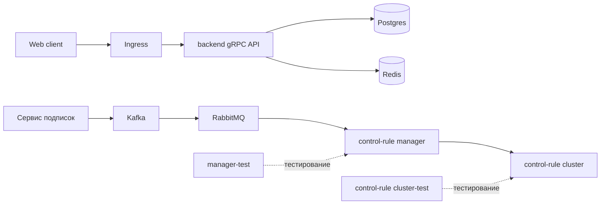

# Билет №20 — Kubernetes deploy, crm-cluster, Kafka, RabbitMQ, control-rule manager

## 0. Как понять этот билет простыми словами

Билет про развёртывание и инфраструктуру.

```text
Ingress → Service → Deployment → Pods
```

crm-cluster — набор backend, Redis, Kafka, RabbitMQ, сервиса подписок и control-rule компонентов.

---

## 1. Теоретический вопрос 1

**Вопрос:** Как организован деплой WEB-приложения в Kubernetes? Опишите Deployment, Service, Ingress.

### Простое объяснение

Deployment запускает pod'ы и управляет количеством реплик. Service даёт стабильный сетевой адрес для pod'ов. Ingress принимает внешний HTTP/HTTPS-трафик и направляет его внутрь.

```text
Пользователь → Ingress → Service → Pods
```

### Готовый ответ на 1 вопрос

Деплой WEB-приложения в Kubernetes организуется через набор ресурсов. Deployment описывает, какой контейнер нужно запустить, сколько реплик должно работать и как обновлять приложение. Он управляет pod'ами и следит, чтобы нужное количество экземпляров было доступно.

Service предоставляет стабильную точку доступа к pod'ам, потому что сами pod'ы могут пересоздаваться и менять IP-адреса. Ingress принимает внешний HTTP/HTTPS-трафик и направляет его на нужный Service.

---

## 2. Теоретический вопрос 2

**Вопрос:** Опишите архитектуру crm-cluster: Kafka, RabbitMQ, Redis, сервис подписок, control-rule cluster/manager. Зачем нужны test-компоненты?

### Простое объяснение

Компоненты:

| Компонент | Назначение |
|---|---|
| Redis | кэш, сессии, временные данные |
| Kafka | поток событий |
| RabbitMQ | очередь задач |
| Сервис подписок | управляет подписками и публикует события |
| control-rule manager | управляет правилами |
| control-rule cluster | применяет правила |
| test-компоненты | проверка до production |

### Готовый ответ на 2 вопрос

Архитектура crm-cluster включает backend gRPC API, сервис подписок, Redis, Kafka, RabbitMQ и компоненты control-rule. Сервис подписок обрабатывает события подписок и публикует их в брокеры сообщений. Kafka используется как поток событий, а RabbitMQ — как очередь задач для обработки сообщений. Redis используется для кэширования, сессий и временных данных.

Control-rule manager управляет правилами обработки или контроля, а control-rule cluster применяет эти правила в работе системы. `control-rule cluster-test` и `manager-test` нужны для проверки правил и изменений в тестовой среде перед применением в основной системе, чтобы не сломать production.

---

## 3. Практическое задание

**Задание:** Нарисуйте схему деплоя.

### Решение

```text
                         +----------------+
                         |   Web client   |
                         +--------+-------+
                                  |
                                  v
                         +----------------+
                         |    Ingress     |
                         +--------+-------+
                                  |
                                  v
                         +----------------+
                         | backend gRPC   |
                         |      API       |
                         +---+--------+---+
                             |        |
                             v        v
                      +----------+  +-------+
                      | Postgres |  | Redis |
                      +----------+  +-------+


+---------------------+
| Сервис подписок     |
+----------+----------+
           |
           v
+---------------------+
| Kafka               |
+----------+----------+
           |
           v
+---------------------+
| RabbitMQ            |
+----------+----------+
           |
           v
+---------------------+
| control-rule manager|
+----------+----------+
           |
           v
+---------------------+
| control-rule cluster|
+---------------------+
```

Mermaid:



---

## 4. Краткая версия для устного пересказа

В Kubernetes Deployment запускает pod'ы, Service даёт стабильный доступ, Ingress принимает внешний трафик. В crm-cluster backend работает с PostgreSQL и Redis, сервис подписок публикует события в Kafka, RabbitMQ передаёт задачи, control-rule manager управляет правилами для control-rule cluster. Test-компоненты нужны для безопасной проверки.

---

## 5. Что обязательно сказать

- Deployment управляет pod'ами.
- Service даёт стабильный адрес.
- Ingress принимает внешний трафик.
- Kafka = поток событий.
- RabbitMQ = очередь задач.
- Redis = кэш.
- Test-кластеры нужны до production.

---

## 6. Типичные ошибки

1. Перепутать Deployment и Service.
2. Сказать, что Ingress запускает контейнеры.
3. Не упомянуть Redis.
4. Перепутать Kafka и RabbitMQ.
5. Не объяснить test-компоненты.

---

## 7. Мини-тренировка

1. Что делает Deployment?
2. Что делает Service?
3. Что делает Ingress?
4. Как связаны Kafka и RabbitMQ?
5. Зачем control-rule test?
